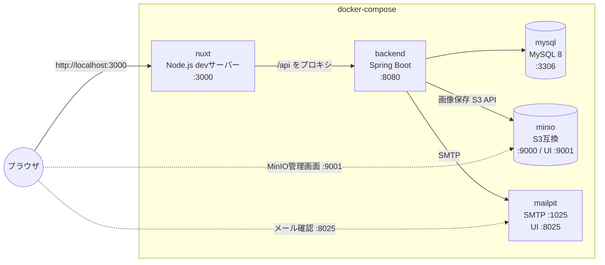

# 開発環境構成(docker-compose)

ローカル開発環境は docker-compose で構築する。本番(AWS)の各サービスに対応するコンテナをローカルに用意する。

## 構成図



## コンテナ一覧

| コンテナ | イメージ / ベース | ポート | 役割 | 本番での対応 |
|---|---|---|---|---|
| nuxt | Node 22(docker/ の Dockerfile) | 3000 | Nuxt dev サーバー(HMR 付き) | Spring Boot の static/ 配信に置き換え |
| backend | Java 21(docker/ の Dockerfile) | 8080 | REST API | ECS Fargate |
| mysql | mysql:8 | 3306 | データベース | RDS (MySQL) |
| minio | minio/minio | 9000 (API) / 9001 (管理UI) | S3 互換の画像保存 | S3 + CloudFront |
| minio-init | minio/mc | - | 起動時に `images` バケットを自動作成して終了する一発ジョブ(`--ignore-existing` で冪等) | - |
| mailpit | axllent/mailpit | 1025 (SMTP) / 8025 (Web UI) | メールの受信・確認 | SES |

Dockerfile は `docker/` ディレクトリに置き(`docker/frontend/`、`docker/backend/`)、`docker-compose.yml` はリポジトリ直下に置く。開発用 Dockerfile は「実行環境(Node / JDK)だけ」を持ち、ソースコードは volumes でマウントする方式。本番用 Dockerfile は AWS 構築時に別途作成する。

### 永続化と環境変数

- MySQL(`mysql-data`)、MinIO(`minio-data`)、Gradle キャッシュ(`gradle-cache`)は named volume で永続化。`docker compose down` してもデータは残る
- 環境変数は**リポジトリ直下の `.env` で一元管理**する(`.env` は gitignore、テンプレートの `.env.example` をコミット)。1枚のファイルを二役で使う:
  - **backend**: `env_file: .env` で全変数を丸ごと注入。**変数が増えても `.env` に追記するだけ**で compose の変更は不要
  - **mysql / minio / minio-init**: 公式イメージが決めた変数名(`MYSQL_USER` など)しか受け取れないため、compose 内の `${...}` 展開で必要な値だけマッピング(compose はリポジトリ直下の `.env` を自動で読む)
  - この構成により、backend と mysql が同じ DB 認証情報を参照するため値の食い違いが起きない
- 本番は ECS タスク定義側で別の値を注入する

## 開発時のリクエストフロー

開発中は本番と異なり、**Nuxt dev サーバーが入口**になる。

1. ブラウザは `http://localhost:3000`(Nuxt dev サーバー)にアクセスする
2. ページは Nuxt dev サーバーが HMR(ホットリロード)付きで返す
3. `/api/**` へのリクエストは、Nuxt の dev プロキシ(`nuxt.config.ts` の `nitro.devProxy`)で `backend:8080` に転送する

これによりフロントは本番と同じ「同一オリジンの `/api`」を呼ぶコードのままで開発でき、CORS 設定も不要になる。

### 本番との違い

| 項目 | 開発 | 本番 |
|---|---|---|
| 入口 | Nuxt dev サーバー (:3000) | ALB → Spring Boot |
| フロント配信 | Nuxt dev サーバー(HMR) | Spring Boot の static/(SSG 済み) |
| /api の到達方法 | Nuxt dev プロキシ経由 | 同一オリジンなのでそのまま Spring Boot へ |

## MinIO / Mailpit の使い方

### MinIO(S3 代替)

- Spring Boot からは **S3 互換 API** で接続する(AWS SDK の S3 クライアントのエンドポイントを `http://minio:9000` に向ける)
- 環境変数でエンドポイント・認証情報を切り替えることで、本番ではコード変更なしに実際の S3 を使う
- 管理画面: `http://localhost:9001`(バケットの中身を確認できる)

### Mailpit(SES 代替)

- Spring Boot からは **SMTP** で `mailpit:1025` に送信する
- 送信されたメールは `http://localhost:8025` の Web UI で確認できる
- 本番では Spring の Mail 設定を SES(SMTP エンドポイントまたは SDK)に切り替える

## 環境変数の方針

開発と本番の接続先の違いは環境変数で吸収する(値は `docker-compose.yml` / ECS タスク定義で注入)。

| 変数(例) | 開発 | 本番 |
|---|---|---|
| DB 接続先 | `mysql:3306` | RDS エンドポイント |
| S3 エンドポイント | `http://minio:9000` | (未指定 = 本物の S3) |
| SMTP ホスト | `mailpit:1025` | SES |

仕組みの解説(そもそも環境変数とは・`.env` を誰が読むか・Docker なし / EC2 での渡し方)→ [notes/env-vars-basics.md](../notes/env-vars-basics.md)

## 起動方法

```bash
cp .env.example .env        # 初回のみ: 環境変数ファイルを作成
docker compose up -d        # 全コンテナ起動(初回はイメージビルドも走る)
docker compose logs -f      # ログ確認
docker compose down         # 停止(named volume のデータは残る)
```

- **初回起動は backend に数分かかる。** コンテナ内で `gradlew` が Gradle 本体と依存ライブラリをダウンロードするため。2回目以降は `gradle-cache` volume が効いて速くなる
- **backend のコード変更は、VS Code の Dev Container(`.devcontainer/`)で backend コンテナに入って開発すると保存だけで反映される。** コンテナ内の VS Code が保存時に自動コンパイルし、spring-boot-devtools がアプリを再起動する(手順 → [setup/backend.md](../setup/backend.md)、採用理由 → [手法比較メモ](../notes/java-dev-env-comparison.md))。Dev Container を使っていないときや `build.gradle` の依存を変更したときは従来どおり `docker compose restart backend`
- 動作確認 URL: アプリ `http://localhost:3000`、API 直叩き `http://localhost:8080`、MinIO 管理画面 `http://localhost:9001`、メール確認 `http://localhost:8025`
- **テストを実行する前に、テスト専用 database `app_test` の作成が 1 回だけ必要。** テストは開発 DB(`app`)ではなくこちらを使うので、テストが開発中のデータを壊すことはない。手順と実行コマンド → [docs/test/README.md](../test/README.md)

具体的な `docker-compose.yml` とアプリの初期構築手順は以下を参照:

- [Nuxt 環境構築手順](../setup/frontend.md)
- [Spring Boot 環境構築手順](../setup/backend.md)
