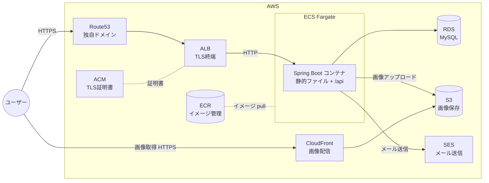

# インフラ構成(AWS)

本番(検証公開)環境の AWS 構成と、Terraform + GitHub Actions による構築・撤収フローをまとめる。

## 方針

- **常時公開しない。** 検証したいときだけ GitHub Actions 経由で Terraform を実行して環境を構築し、終わったら撤収する
- アプリケーションコンテナは **Spring Boot の 1 種類のみ**(Nuxt は SSG ビルドして Spring Boot の static/ に同梱)
- Nginx は使わない(TLS 終端・負荷分散は ALB が担当)

## 構成図



## 各サービスの役割

| サービス | 役割 |
|---|---|
| Route53 | 独自ドメインの DNS。ALB と CloudFront にルーティング |
| ACM | TLS 証明書の発行・管理(ALB / CloudFront 用) |
| ALB | TLS 終端、ヘルスチェック、ECS タスクへの負荷分散 |
| ECS (Fargate) | Spring Boot コンテナの実行基盤。サーバー管理不要の Fargate 起動タイプを使う |
| ECR | Docker イメージのレジストリ。GitHub Actions からビルド & push |
| RDS (MySQL) | アプリケーションデータの永続化 |
| S3 | ユーザーアップロード画像の保存(フロントエンド配信には使わない) |
| CloudFront | S3 上の画像の CDN 配信 |
| SES | メール送信。独自ドメインでドメイン認証(SPF/DKIM)する |

## リクエストの流れ

1. **ページ表示**: ユーザー → Route53 → ALB(TLS 終端)→ ECS の Spring Boot → `static/` 内の SSG 済み HTML/JS/CSS を返す
2. **API 呼び出し**: ブラウザの JS → `https://ドメイン/api/**` → ALB → Spring Boot の REST API → RDS
3. **画像アップロード**: ブラウザ → `/api` → Spring Boot → S3 に保存
4. **画像表示**: ブラウザ → CloudFront(画像用 URL)→ S3
5. **メール送信**: Spring Boot → SES

## Terraform + GitHub Actions 運用

### 状態管理

- Terraform の state は **S3 バックエンド** に保存する(state 用の S3 バケットは事前に手動または bootstrap 用スクリプトで作成)
- state 用バケットは destroy の対象外とし、環境を撤収しても state は残す

### AWS 認証(OIDC)

GitHub Actions から AWS への認証は、アクセスキーではなく **OIDC(OpenID Connect)** を使う。

- IAM に GitHub の OIDC プロバイダーと、リポジトリを信頼する IAM ロールを作成
- ワークフローは `aws-actions/configure-aws-credentials` でそのロールを AssumeRole する
- 長期クレデンシャルを GitHub Secrets に置かなくて済む

### 構築・撤収フロー

GitHub Actions のワークフローは `workflow_dispatch`(手動トリガー)で実行する。

```
[環境を建てるとき]
1. workflow_dispatch で「apply」ワークフローを実行
   - terraform plan → apply で AWS リソース一式を構築
2. アプリのイメージをビルドして ECR に push、ECS にデプロイ
3. 検証する

[撤収するとき]
1. workflow_dispatch で「destroy」ワークフローを実行
   - terraform destroy でリソースを削除(state 用 S3 は残す)
```

### コストに関する注意

- 撤収し忘れると ALB・RDS・NAT Gateway 等で課金が続くため、検証後は必ず destroy する
- Route53 のホストゾーンとドメイン代は環境の有無にかかわらず発生する

## ディレクトリ

Terraform のコードは リポジトリ直下の `terraform/` に配置する(構成は実装時に設計)。
