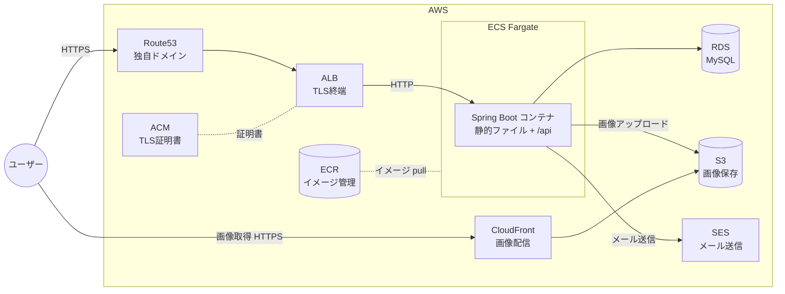

# インフラ構成(AWS)

検証環境の AWS 構成と、CloudFormation + GitHub Actions による構築・撤収フローをまとめる。

IaC に Terraform ではなく素の CloudFormation YAML を選んだ理由 → [ADR-0001](../adr/0001-cloudformation-yaml-over-terraform.md)

## 方針

- **常時公開しない。** 検証したいときだけ GitHub Actions 経由で CloudFormation を実行して環境を構築し、終わったら撤収する
- IaC は **素の CloudFormation YAML**(AWS CDK は使わない)
- アプリケーションコンテナは **Spring Boot の 1 種類のみ**(Nuxt は SSG ビルドして Spring Boot の static/ に同梱)
- Nginx は使わない(TLS 終端・負荷分散は ALB が担当)
- リージョンは **ap-northeast-1** に統一する

## 構成図



## 各サービスの役割

| サービス | 役割 |
|---|---|
| Route53 | 独自ドメインの DNS。ALB と CloudFront にルーティング |
| ACM | TLS 証明書の発行・管理(ALB / CloudFront 用) |
| ALB | TLS 終端、ヘルスチェック、ECS タスクへの負荷分散 |
| ECS (Fargate) | Spring Boot コンテナの実行基盤。サーバー管理不要の Fargate 起動タイプを使う |
| ECR | Docker イメージのレジストリ。GitHub Actions からビルド & push |
| RDS (MySQL) | アプリケーションデータの永続化 |
| S3 | ユーザーアップロード画像の保存(フロントエンド配信には使わない) |
| CloudFront | S3 上の画像の CDN 配信 |
| SES | メール送信。独自ドメインでドメイン認証(SPF/DKIM)する |

## ドメインと管理範囲

ドメインは **`mylabinfra.com`**(X-Server で取得)。Route53 にホストゾーンを作成し、**X-Server 側のネームサーバーを Route53 のものに設定済み**。

CloudFormation で管理するもの / しないものを、ライフサイクルで分けている。

| リソース | 管理方法 | 理由 |
|---|---|---|
| **Route53 ホストゾーン** | **手動**(作成済み) | 削除して作り直すと **NS レコードが変わり、X-Server 側の再設定と DNS 伝播待ちが発生する**。撤収のたびにこれをやるのは現実的でない |
| **ECR リポジトリ** | **手動** | スタック作成時にタスク定義がイメージを参照するため、**スタックより先に存在していないと push もデプロイもできない** |
| ACM 証明書 | CloudFormation | ホストゾーンが Route53 にあるため DNS 検証はすぐ通る。撤収のたびに作り直しても実用上の問題は出ない |
| Route53 の A レコード(ALB 向け) | CloudFormation | ゾーンは手動管理のまま、**中身のレコードだけ**をスタックが出し入れする |
| 上記以外すべて | CloudFormation | VPC / サブネット / NAT GW / SG / ALB / ECS / RDS / S3 / CloudFront / IAM ロール |

手動管理のホストゾーン ID と ECR リポジトリ URI は、スタックの `Parameters` として渡す。

**画像配信の CloudFront には独自ドメインを割り当てない。** CloudFront が払い出す `dxxxxxxxx.cloudfront.net` をそのまま使う。CloudFront 用の ACM 証明書は **us-east-1 にしか置けず**、CloudFormation スタックは 1 リージョンに閉じるため、独自ドメインを使うとクロスリージョンのスタック分割が必要になる。学習コストに見合わないので採らない(画像 URL はオブジェクトキーと環境ごとのドメインから組み立てる設計なので、アプリ側は影響を受けない)。

## リクエストの流れ

1. **ページ表示**: ユーザー → Route53 → ALB(TLS 終端)→ ECS の Spring Boot → `static/` 内の SSG 済み HTML/JS/CSS を返す
2. **API 呼び出し**: ブラウザの JS → `https://ドメイン/api/**` → ALB → Spring Boot の REST API → RDS
3. **画像アップロード**: ブラウザ → `/api` → Spring Boot → S3 に保存
4. **画像表示**: ブラウザ → CloudFront(画像用 URL)→ S3
5. **メール送信**: Spring Boot → SES

## CloudFormation + GitHub Actions 運用

### 状態管理 — Terraform との最大の違い

**state ファイルの管理は不要。** CloudFormation ではスタック自体が状態を持ち、AWS 側で管理される。Terraform で必要だった state 用 S3 バケット・ロック機構の設計が丸ごと不要になる。

反面、`terraform state rm` / `mv` のように状態を直接いじる手段がない点は注意。

### 環境の考え方

実際に建てるのは **`stg` のみ**(prod は作らない)。ただし **prod が存在する前提の構成**にしておき、環境固有の値と共通部分を分離する。

- リソース名・スタック名に環境名を含める(例: スタック名 `mylabinfra-stg`)
- 環境差分はテンプレートに直書きせず、外から与える

なお **CloudFormation には Terraform の modules に直接相当する仕組みがない。** 環境差分の吸収は `Parameters` / `Mappings` / `Conditions` が基本で、共通化の手段としてはネストスタックなどがある。どの方式を採るかは、テンプレート実装時に別途設計する。

### AWS 認証(OIDC)

GitHub Actions から AWS への認証は、アクセスキーではなく **OIDC(OpenID Connect)** を使う。

- IAM に GitHub の OIDC プロバイダーと、リポジトリを信頼する IAM ロールを作成
- ワークフローは `aws-actions/configure-aws-credentials` でそのロールを AssumeRole する
- 長期クレデンシャルを GitHub Secrets に置かなくて済む

### スタック構成

**使い捨て部分は 1 スタックにまとめる。** VPC・サブネット・NAT GW・SG・ALB・ACM・ECS・RDS・S3・CloudFront・Route53 の A レコード・IAM ロールを 1 本のテンプレートに置く。

分割しない理由:

- **削除が確実に終わる。** CloudFormation には「他スタックから `ImportValue` で参照されている値をエクスポートしているスタックは削除できない」という仕様があり、分割すると撤収のたびに削除順序の問題を踏む
- **依存関係を CloudFormation が自動で解決する。** 1 スタック内なら `!Ref` / `!GetAtt` で参照するだけで、作成順序も削除順序も自動で決まる
- **リソース数の上限(1 テンプレート 500)に遠く届かない。** この構成はせいぜい 50〜60 個

代わりにテンプレートは 600〜900 行程度になる見込み。

### 構築・撤収フロー

GitHub Actions のワークフローは `workflow_dispatch`(手動トリガー)で実行する。

```
[環境を建てるとき]
1. アプリのイメージをビルドして ECR に push(ECR は手動作成済み)
2. workflow_dispatch でスタックを作成・更新
   - Change Set で差分を確認 → 実行
3. 検証する

[撤収するとき]
1. workflow_dispatch でスタックを削除
   - ホストゾーンと ECR は手動管理なので残る
```

### 削除まわりの注意(Terraform と挙動が違う)

「終わったら全部消す」運用なので、ここを外すと課金が残る。

- **RDS の `DeletionPolicy` は既定が `Delete` ではなく `Snapshot`。** 明示的に `Delete` を指定しないと、スタックを消してもスナップショットが残り課金され続ける
- **S3 バケットはオブジェクトが残っていると削除に失敗する。** 素の CloudFormation にバケットを空にする仕組みはないため、画像用バケットは削除前に空にする運用か、カスタムリソースが必要
- **Termination protection を有効にしたスタックは削除できない。** このリポジトリでは有効にしない
- 削除が `DELETE_FAILED` で詰まったら `delete-stack --deletion-mode FORCE_DELETE_STACK` や `--retain-resources` で対処する

### コストに関する注意

- 撤収し忘れると ALB・RDS・NAT Gateway 等で課金が続くため、検証後は必ずスタックを削除する
- Route53 のホストゾーンとドメイン代は環境の有無にかかわらず発生する(手動管理で常駐するため)
- ACM の証明書は発行済みで放置しても無料

## ディレクトリ

CloudFormation のテンプレートはリポジトリ直下の `cloudformation/` に配置する(**ファイル分割と共通化の方式は未確定。テンプレート実装時に別途設計する**)。
