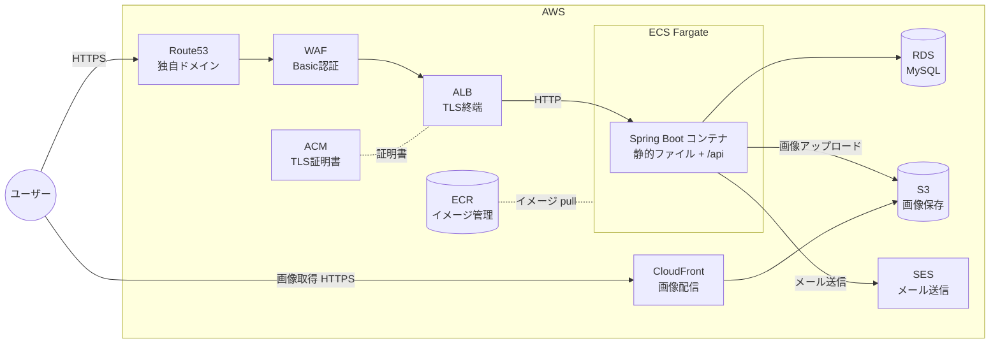

# インフラ構成(AWS)

検証環境の AWS 構成と、CloudFormation + GitHub Actions による構築・撤収フローをまとめる。

IaC に Terraform ではなく素の CloudFormation YAML を選んだ理由 → [ADR-0001](../adr/0001-cloudformation-yaml-over-terraform.md)

## 方針

- **常時公開しない。** 検証したいときだけ GitHub Actions 経由で CloudFormation を実行して環境を構築し、終わったら撤収する
- IaC は **素の CloudFormation YAML**(AWS CDK は使わない)
- アプリケーションコンテナは **Spring Boot の 1 種類のみ**(Nuxt は SSG ビルドして Spring Boot の static/ に同梱)
- Nginx は使わない(TLS 終端・負荷分散は ALB が担当)
- リージョンは **ap-northeast-1** に統一する

## 構成図



## 各サービスの役割

| サービス | 役割 |
|---|---|
| Route53 | 独自ドメインの DNS。ALB と CloudFront にルーティング |
| ACM | TLS 証明書の発行・管理(ALB / CloudFront 用) |
| ALB | TLS 終端、ヘルスチェック、ECS タスクへの負荷分散 |
| ECS (Fargate) | Spring Boot コンテナの実行基盤。サーバー管理不要の Fargate 起動タイプを使う |
| ECR | Docker イメージのレジストリ。GitHub Actions からビルド & push |
| RDS (MySQL) | アプリケーションデータの永続化 |
| S3 | ユーザーアップロード画像の保存(フロントエンド配信には使わない) |
| CloudFront | S3 上の画像の CDN 配信 |
| SES | メール送信。独自ドメインで DKIM 認証する。**アプリは SMTP ではなく API 経路で送る**(SMTP 認証は IAM ユーザーの長期クレデンシャルが必要になるため) |
| WAF | 検証環境の Basic 認証。ALB に関連付ける。ALB の `fixed-response` は `WWW-Authenticate` を付けられないので WAF でしか実現できない(→ [ADR-0006](../adr/0006-basic-auth-with-waf.md)) |
| Secrets Manager | RDS のマスターパスワード。RDS が生成・保持し、DB を削除すると一緒に消える |
| SSM Parameter Store | `app` / `migrate` の DB パスワードと Google の資格情報(手動作成・常駐) |

## ドメインと管理範囲

ドメインは **`mylabinfra.com`**(X-Server で取得)。Route53 にホストゾーンを作成し、**X-Server 側のネームサーバーを Route53 のものに設定済み**。

CloudFormation で管理するもの / しないものを、ライフサイクルで分けている。

| リソース | 管理方法 | 理由 |
|---|---|---|
| **Route53 ホストゾーン** | **手動**(作成済み) | 削除して作り直すと **NS レコードが変わり、X-Server 側の再設定と DNS 伝播待ちが発生する**。撤収のたびにこれをやるのは現実的でない |
| **ECR リポジトリ** | **手動** | スタック作成時にタスク定義がイメージを参照するため、**スタックより先に存在していないと push もデプロイもできない** |
| **IAM の OIDC プロバイダ + GitHub Actions 用ロール** | **手動** | ECR に push するロールをスタックに入れると**循環依存**になる。push にはロールが要る → ロールを作るスタックは ECS がイメージを引けず ROLLBACK → 作られかけたロールごと消える、で永久に push できない。作成手順 → [github-actions-oidc.md](./github-actions-oidc.md) |
| ACM 証明書 | CloudFormation | ホストゾーンが Route53 にあるため DNS 検証はすぐ通る。撤収のたびに作り直しても実用上の問題は出ない |
| Route53 の A レコード(ALB 向け) | CloudFormation | ゾーンは手動管理のまま、**中身のレコードだけ**をスタックが出し入れする |
| 上記以外すべて | CloudFormation | VPC / サブネット / NAT GW / SG / ALB / ECS / RDS / S3 / CloudFront / IAM ロール |

手動管理のホストゾーン ID と ECR リポジトリ URI は、スタックの `Parameters` として渡す。

**画像配信の CloudFront には独自ドメインを割り当てない。** CloudFront が払い出す `dxxxxxxxx.cloudfront.net` をそのまま使う。CloudFront 用の ACM 証明書は **us-east-1 にしか置けず**、CloudFormation スタックは 1 リージョンに閉じるため、独自ドメインを使うとクロスリージョンのスタック分割が必要になる。学習コストに見合わないので採らない(画像 URL はオブジェクトキーと環境ごとのドメインから組み立てる設計なので、アプリ側は影響を受けない)。

## リクエストの流れ

1. **ページ表示**: ユーザー → Route53 → ALB(TLS 終端)→ ECS の Spring Boot → `static/` 内の SSG 済み HTML/JS/CSS を返す
2. **API 呼び出し**: ブラウザの JS → `https://ドメイン/api/**` → ALB → Spring Boot の REST API → RDS
3. **画像アップロード**: ブラウザ → `/api` → Spring Boot → S3 に保存
4. **画像表示**: ブラウザ → CloudFront(画像用 URL)→ S3
5. **メール送信**: Spring Boot → SES

## CloudFormation + GitHub Actions 運用

### 状態管理 — Terraform との最大の違い

**state ファイルの管理は不要。** CloudFormation ではスタック自体が状態を持ち、AWS 側で管理される。Terraform で必要だった state 用 S3 バケット・ロック機構の設計が丸ごと不要になる。

反面、`terraform state rm` / `mv` のように状態を直接いじる手段がない点は注意。

**より大きな違いは「差分を出すときに実物を読むか」。** Terraform は既定で読み、CloudFormation の Change Set は読まない(前回のテンプレートと今回のテンプレートを比べる)。ここから `ignore_changes` の有無まで派生する → [Terraform 経験者のための CloudFormation](../notes/cloudformation/terraform-to-cloudformation.md)。

### 環境の考え方

実際に建てるのは **`stg` のみ**(prod は作らない)。ただし **prod が存在する前提の構成**にしておき、環境固有の値と共通部分を分離する。

- リソース名・スタック名に環境名を含める(例: スタック名 `mylabinfra-stg`)
- 環境差分はテンプレートに直書きせず、外から与える

なお **CloudFormation には Terraform の modules に直接相当する仕組みがない。** テンプレートは 1 ファイルで自己完結する必要があり、ファイルを分ける手段は `AWS::Include` transform・ネストスタック・スタック自体の分割の 3 つ。**前 2 つは子テンプレートを S3 に置くことが必須**で、S3 が要らないのはスタック分割だけ(そのかわり `Export` / `ImportValue` の削除順序に縛られる)。手段ごとの代償 → [テンプレートの分割と置き場](../notes/cloudformation/templates-and-prerequisites.md)。

**採った方式: 1 テンプレート + 環境ごとのパラメータファイル。** 環境差分は全部 `Parameters` に平坦化して `cloudformation/params/<env>.json` から渡す。`Mappings` を使わないのは、prod を追加するときに共通部分を編集しなくて済む状態を保つため。詳細と却下した案 → [フェーズ13 設計書](../superpowers/specs/2026-08-19-phase13-cloudformation-design.md) の決定1・決定2。

### AWS 認証(OIDC)

GitHub Actions から AWS への認証は、アクセスキーではなく **OIDC(OpenID Connect)** を使う。

- IAM に GitHub の OIDC プロバイダーと、リポジトリを信頼する IAM ロールを作成
- ワークフローは `aws-actions/configure-aws-credentials` でそのロールを AssumeRole する
- 長期クレデンシャルを GitHub Secrets に置かなくて済む

**ロールは用途ごとに分ける。** CloudFormation でこの構成を作るロールは `iam:CreateRole` / `iam:PassRole` を含む管理者権限(実装は `AdministratorAccess`)になるため、「イメージを push するだけ」のワークフローには持たせない。OIDC プロバイダだけはアカウントに 1 つで共有する。

| 用途 | IAM ロール名 | GitHub Secrets 名 | 状態 |
|---|---|---|---|
| ECR にイメージを push | `nuxt-java-practice-gha-ecr-push` | `AWS_ECR_PUSH_ROLE_ARN`(リポジトリ) | 作成手順 → [github-actions-oidc.md](./github-actions-oidc.md) |
| CloudFormation を叩く | `nuxt-java-practice-gha-cfn-stg` | `AWS_CFN_DEPLOY_ROLE_ARN`(Environment) | 作成手順 → [cloudformation-operations.md](./cloudformation-operations.md) §2-2 |
| DB タスクを Run Task する | `nuxt-java-practice-gha-dbtask-stg` | `AWS_DB_TASK_ROLE_ARN`(Environment) | 作成手順 → [cloudformation-operations.md](./cloudformation-operations.md) §2-3 |
| CloudFormation がリソースを作る | `nuxt-java-practice-cfn-service-stg` | `AWS_CFN_SERVICE_ROLE_ARN`(Environment) | 作成手順 → [cloudformation-operations.md](./cloudformation-operations.md) §2-1 |

**サービスロール方式**を採っている。Actions が持つのは「CloudFormation を叩く権限」だけで、リソースを作るのは CloudFormation が引き受けるロール。Actions の一時クレデンシャルが漏れても、**テンプレートに書かれていないことはできない**。

**`db-task.yml` は別のロールを使う。** 任意 SQL を流せるワークフローに `cloudformation:*` を持つクレデンシャルを降ろさないため、Run Task に必要な 5 つの権限だけを持つロールを分けている。

**Secrets は Environment secrets に置く。** GitHub Free のプライベートリポジトリでも Environment と Environment secrets は使えるが、**protection rules(required reviewers・ブランチ制限)は使えない**。そのためブランチ制限は IAM の信頼ポリシー(`token.actions.githubusercontent.com:ref` 条件)で掛けている。

### スタック構成

**使い捨て部分は 1 スタックにまとめる。** VPC・サブネット・NAT GW・SG・ALB・ACM・ECS・RDS・S3・CloudFront・Route53 の A レコード・IAM ロールを 1 本のテンプレートに置く。

分割しない理由:

- **削除が確実に終わる。** CloudFormation には「他スタックから `ImportValue` で参照されている値をエクスポートしているスタックは削除できない」という仕様があり、分割すると撤収のたびに削除順序の問題を踏む
- **依存関係を CloudFormation が自動で解決する。** 1 スタック内なら `!Ref` / `!GetAtt` で参照するだけで、作成順序も削除順序も自動で決まる
- **リソース数の上限(1 テンプレート 500)に遠く届かない。** この構成はせいぜい 50〜60 個

代わりにテンプレートは 1 ファイルに集まる。**書き上げた `app.yml` は 1365 行・54,178 バイトで、「リクエストに直接載せられるテンプレートの上限 51,200 バイト」を超えた。** そのためテンプレート置き場の S3 バケットが手動管理の常駐リソースとして 1 つ増えている(CloudFormation がテンプレートを読める場所は S3 か SSM ドキュメントだけで、GitHub の raw URL は渡せない)。決定の理由と却下案 → [ADR-0008](../adr/0008-template-bucket-as-resident-resource.md)。

### 構築・反映・撤収フロー

GitHub Actions のワークフローは `workflow_dispatch`(手動トリガー)で実行する。

```
[環境を建てるとき]
1. ecr-push.yml を実行。ジョブサマリに出るイメージタグ(短縮 SHA)を控える
2. cfn-deploy.yml を実行(env / image_tag / dry_run)。中で 5 段動く:
     deploy-zero    … cfn-apply.yml を呼んで DesiredCount=0 でスタック作成
     create-db-users … db-task.yml を呼んで app / migrate ユーザーを作る
     migrate        … db-task.yml を呼んで Flyway を流す
     deploy-service … cfn-apply.yml を呼んで DesiredCount を params の値に上げる
     summary        … 締めのサマリ(AWS は叩かない)
3. SES の検証が通るのを待つ(初回のみ)。スタックの成功とは無関係
4. Basic 認証を通してブラウザで確認

[変更を反映するとき(既に建っている環境に対して)]
1. cfn-apply.yml を実行(env / image_tag / dry_run / allow_replacement)
     Change Set を作る → 差分をジョブサマリに出す → 実行
   image_tag を空にすると、今デプロイされているタグを維持したまま
   テンプレートと params の変更だけが反映される

[撤収するとき]
1. cfn-destroy.yml を実行(stg 専用。confirm に destroy と入力)
     画像バケットを空にする → delete-stack + wait
   ホストゾーン・ECR・IAM・SSM・テンプレート置き場は手動管理なので残る
```

**構築と反映を分けている。** `cfn-deploy.yml` の段取りは「何も無い状態から建てる」ための順序で、動いている環境に対して `DesiredCount` を 0 に落として上げ直すのはサービスの停止に等しい。既存環境への反映は `cfn-apply.yml` が担う(→ [ADR-0007](../adr/0007-app-deploy-inside-cloudformation.md))。

**ただし CloudFormation を実際に叩くのは `cfn-apply.yml` だけ。** `cfn-deploy.yml` に aws コマンドは 1 つも無く、`workflow_call` で `cfn-apply.yml` と `db-task.yml` を呼ぶ**順序だけ**を持っている。「テンプレートを S3 経由で渡す」「params を jq で組み立てる」といった知識が 2 ファイルに重複していたのを 1 か所に寄せた。構築フローだけが `cfn-apply.yml` の guard(スタックが無い / `DesiredCount` が 0 なら弾く)を開けられ、その鍵は `workflow_call` にしか宣言されていないので Actions の UI からは触れない → [ADR-0009](../adr/0009-cfn-apply-as-the-single-cloudformation-caller.md)。

**アプリのイメージ更新も CloudFormation 経由で行う。** Terraform 時代のように GitHub Actions から `ecs update-service` を直接叩く経路は作らない。CloudFormation は実リソースを読み直さないので外での更新は即座には戻らないが、次にテンプレート側で ECS サービスかタスク定義に差分が出た瞬間に巻き戻るため。理由と検討した代替(ECS サービスから family だけ参照する方法)→ [ADR-0007](../adr/0007-app-deploy-inside-cloudformation.md)

**なぜ 2 段階デプロイなのか。** DB ユーザーを分離した(→ [ADR-0005](../adr/0005-separate-db-users-for-app-and-migration.md))ため、ユーザーを作る Run Task を回さないとアプリが起動できない。しかし CloudFormation には「タスクを流してからサービスを起動する」を表現する手段が無く、**ECS サービスは安定するまで最大 3 時間ポーリングされる**ので、起動できない状態で作るとスタックが失敗する。`DesiredCount=0` なら即座に安定するので、その間に Run Task を回す。

**Change Set は必ず作るが、承認は挟まない。** 構築も反映も `create-change-set` → 差分をジョブサマリ → `execute-change-set` の順で進む。毎回人の承認を挟むと 1 回建てるのに 2 回必要になるので、記録だけ残して実行する。**新規作成時の差分は「全リソース Add」で見る価値が乏しい**ので、そのときは表を出さず「新規作成: N リソース」の 1 行にする。

`dry_run=true` にすると Change Set を作って実行せずに削除して終わる。構築側での狙いは差分の中身ではなく **pre-flight**(テンプレートが CloudFormation 側の検証を通るか + サービスロールで作れるか)で、15〜25 分かかる作成の前に数十秒で確かめられる。

**反映では毎回 Change Set を作る。** 差分が意味を持つのは既存スタックを更新するときだから。`cfn-apply.yml` は `create-change-set` → 差分をジョブサマリに出す → `execute-change-set` の順に進み、**`Replacement: True`(リソースの作り直し)が含まれていたら実行せずに失敗する。** RDS が作り直されると新しい空のインスタンスになるため、`allow_replacement=true` を明示しない限り止める。

### 削除まわりの注意(Terraform と挙動が違う)

「終わったら全部消す」運用なので、ここを外すと課金が残る。

- **RDS の `DeletionPolicy` は既定が `Delete` ではなく `Snapshot`。** 明示的に `Delete` を指定しないと、スタックを消してもスナップショットが残り課金され続ける
- **S3 バケットはオブジェクトが残っていると削除に失敗する。** 素の CloudFormation に Terraform の `force_destroy` 相当は無い(ドキュメントに明記されている)。**撤収ワークフローが `aws s3 rm --recursive` してから `delete-stack` する**ことで解決している。カスタムリソース(CDK の `autoDeleteObjects` の中身)は書いていない → [ADR-0006](../adr/0006-basic-auth-with-waf.md) ではなく[設計書](../superpowers/specs/2026-08-19-phase13-cloudformation-design.md)の決定14
- **Termination protection を有効にしたスタックは削除できない。** このリポジトリでは有効にしない
- **ECS サービスは安定するまで最大 3 時間ポーリングされる。** タスクが起動できない状態で作ると、3 時間待たされた末に `Service ARN did not stabilize` で失敗する。これが 2 段階デプロイを採った理由
- **CloudFormation は実リソースの状態を読み直さない。** 更新時に比較するのは「前回のテンプレート」と「今回のテンプレート」だけ。ECS が Blue/Green で ALB のリスナールールの重みを書き換えても追従しないので、Terraform の `ignore_changes` に相当する指定は要らない。ただし**そのリソースの定義を後で編集すると、そのとき重みもテンプレートの値に戻る**。なお既定の Change Set に限った話で、`create-change-set --deployment-mode REVERT_DRIFT`(drift-aware change set)は実物を読んで三方比較する。このリポジトリでは使っていない
- 削除が `DELETE_FAILED` で詰まったら `delete-stack --deletion-mode FORCE_DELETE_STACK` や `--retain-resources` で対処する

### コストに関する注意

- 撤収し忘れると ALB・RDS・NAT Gateway 等で課金が続くため、検証後は必ずスタックを削除する
- Route53 のホストゾーンとドメイン代は環境の有無にかかわらず発生する(手動管理で常駐するため)
- ACM の証明書は発行済みで放置しても無料

## ディレクトリ

```
cloudformation/
├── app.yml            共通。全リソースの定義
├── params/
│   ├── stg.json       stg の環境差分(tfvars 相当)
│   └── prod.json      prod のひな形
└── README.md
```

手順書 → [cloudformation-operations.md](./cloudformation-operations.md)
