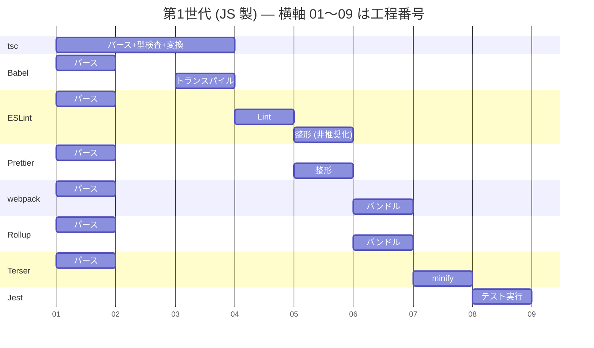
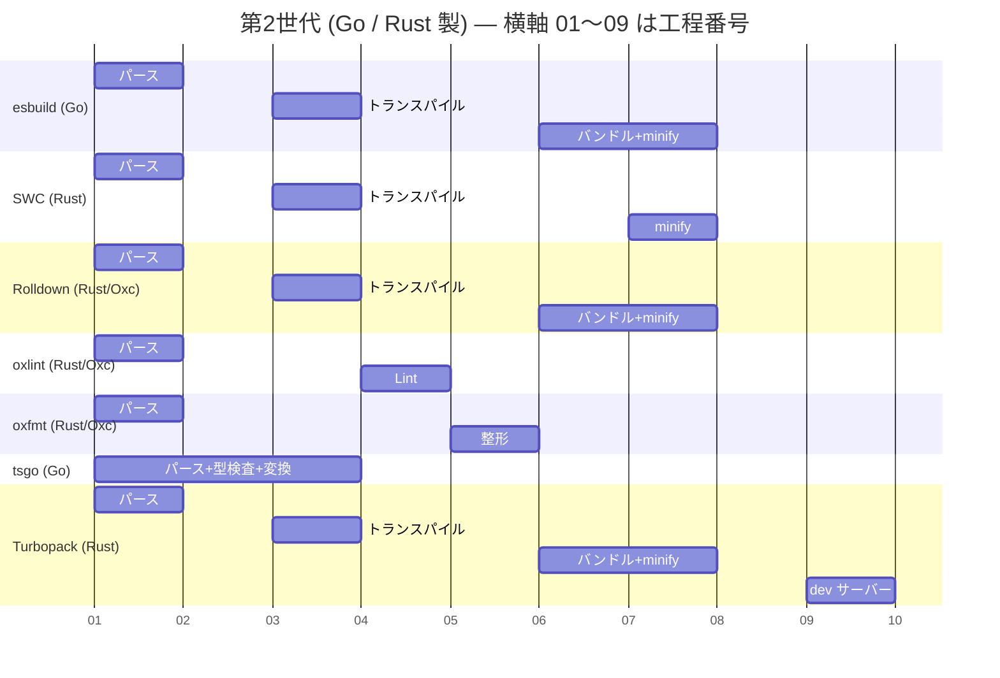
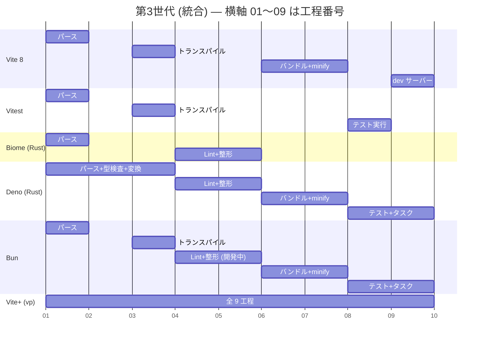

# フロントエンドのツールチェーン地図 — 9 工程を誰が担当しているのか

ESLint / Prettier / esbuild / oxlint / Vite+ …… フロントエンドには似た名前のツールが大量にある。それらが**同じ仕事を競っているのか、違う仕事を分担しているのか**を一枚の地図にするメモ。

将来このリポジトリに Lint / 整形を導入するときの判断材料にすることが目的なので、**設定ファイルの書き方や導入手順は書かない**。「何がどの工程を担当しているか」だけに集中する。

- void0(VoidZero)と Vite+ そのものの解説 → [voidzero-and-vite-plus.md](./voidzero-and-vite-plus.md)
- Java / Laravel / Hono では事情がどう違うか → [lint-and-format-by-language.md](./lint-and-format-by-language.md)

結論を先に言うと:

- **工程は 9 つある。** パース → 型検査 → トランスパイル → Lint → 整形 → バンドル → minify → テスト → dev サーバー。ツールの違いは「このうちどこを担当するか」の違いにほぼ還元できる。
- **「トランスパイル」は 2 つの別作業の寄せ集めで、型検査を含まない。** esbuild が爆速なのは型検査をやっていないからで、`tsc` が別に必要な理由もここにある。
- **世代が上がるほどバーが横に伸びる。** 第1世代は 1 ツール 1 工程、第2世代(Go / Rust 製)は複数工程を兼ね、第3世代は全工程を 1 コマンドに束ねる。
- **高速化の本質は言語(Rust)ではなく「AST を 1 回しか作らないこと」。** 従来は ESLint も Prettier も tsc も esbuild も、同じファイルを**それぞれ独立にパースし直していた**。
- **このリポジトリは「何も入れていない」わけではない。** 変換・バンドル・minify は Vite が黙って全部やっている。入っていないのは **Lint と整形の 2 工程だけ**。

## まず現状 — このリポジトリの実測

`frontend/package.json` の `devDependencies` は空で、ESLint も Prettier も入っていない。ただし `node_modules` を実測すると、ビルド系のツールは**すでに全部揃っている**。

```
frontend/node_modules(実測)

nuxt 4.4.8
  └─ oxc-parser 0.133.0          ← Oxc(void0 製のパーサー)。すでに動いている

@nuxt/vite-builder
  ├─ vite ^7.3.3 → 7.3.6         ← 実際のビルドを担うのはこちら
  │   ├─ rollup 4.62.2           ← ⑥バンドル
  │   └─ esbuild 0.28.1          ← ③トランスパイル / ⑦minify
  └─ rolldown ^1.0.0-beta.38     ← Rolldown も引いている

vite 8.1.5 (トップレベル)
  └─ rolldown ~1.1.5             ← Vite 8 は Rollup を捨てて Rolldown に移った
```

読み取れることが 3 つある。

1. **Oxc はもう動いている。** Nuxt 本体が `oxc-parser` に依存している。自動インポート(`unimport` / `oxc-walker`)がソースを走査して「`ref` はどこから来るか」を解決するのに使っている。あなたが `import { ref } from 'vue'` を書かなくて済んでいるのは、void0 製のパーサーが裏で走っているから。
2. **実ビルドは Vite 7.3.6 = Rollup + esbuild。** トップレベルに `vite 8.1.5` が居るが、`@nuxt/vite-builder` の要求は `^7.3.3` なので、Nuxt がビルドに使うのは入れ子側の 7.3.6。つまり **Vite 8 = Rolldown への移行はまだこのリポジトリには来ていない**。
3. **未導入なのは ④Lint と ⑤整形だけ。** 残り 7 工程は Nuxt が同梱するツールが既に埋めている。「開発環境を実務同様にする」という話は、実質この 2 工程の話に絞られる。

## 9 工程とは何か

### ① パース(AST 化)

ソースコードという**ただの文字列**を、構造化されたデータ(抽象構文木 = AST)に変換する。`const x = 1` を「宣言文である／変数名は x／初期値は数値リテラル 1」という木にする作業。

全ツールの入口であり、**全ツールが同じ仕事をしている唯一の工程**。ここが後半の「なぜ統合できたのか」の伏線になる。

### ② 型検査(type check)

TypeScript の型が矛盾していないかを検証する。`string` を受け取る関数に `number` を渡していないか、存在しないプロパティを読んでいないか。

**この工程はコードを 1 文字も書き換えない。** 検査に落ちても、出力される JavaScript は完全に同じものが動く。だから「型検査をスキップしてビルドする」ことが技術的に可能で、実際に esbuild はそうしている。

担当できるのは `tsc`(と、その Go 移植である `tsgo`)、および Deno に内蔵された `deno check` のみ。**Rust / Go 製の高速ツール群はこの工程を持っていない。** 型検査は他の工程と違い、1 ファイルだけ見れば済む仕事ではなく、依存先の型定義を全部辿る必要があり、根本的に重い。

### ③ トランスパイル(型注釈削除 + ダウンレベル)

名前が 1 つだが、中身は独立した 2 作業。

- **型注釈の削除** — `const x: string = "a"` から `: string` を消して `.js` にする。型が正しいかは**見ない**。構文的に取り除くだけ
- **ダウンレベル** — `a?.b` や `async/await` のような新しい構文を、古いブラウザが解釈できる形に書き換える。どこまで古い形にするかは対象ブラウザ(`browserslist` など)で決まる

②型検査を含まないのがポイント。**esbuild が「TypeScript を扱える」のは「型注釈を捨てられる」という意味であって、「型エラーを見つける」という意味ではない**。esbuild は公式に型検査をしないと明言している。

だから実務では `tsc --noEmit`(型検査だけして出力しない)を CI で別に走らせる構成になる。

### ④ Lint(静的解析)

「動くが良くない」コードを検出する。未使用変数、`await` を忘れた Promise、`useEffect` の依存配列漏れ、`==` と `===` の混在。

⑤整形との違いは**意味に踏み込むかどうか**。Lint は「このコードは間違っているかもしれない」と言い、整形は「意味は変えないが見た目を揃える」と言う。

### ⑤ 整形(format)

インデント、クォートの種類、行末セミコロン、改行位置を機械的に揃える。**意味は絶対に変えない。**

この工程の価値は「読みやすくなる」ことより「**議論しなくて済む**」ことにある。コードレビューでインデントの話をしないために入れる。

### ⑥ バンドル

`import` を辿って依存を全部解決し、大量のファイルを少数の `.js` にまとめる。同時に、どこからも参照されていないコードを落とす(Tree Shaking)。

**なぜ必要か**: ブラウザは `import` 文を解釈できるが、ファイル 1 つごとに HTTP リクエストが発生する。数千ファイルを個別に取りに行かせるのは現実的ではない。

### ⑦ minify(縮小)

変数名を 1 文字にし、空白と改行とコメントを消し、到達不能なコードを削る。**転送するバイト数を減らすため**の工程。

**gzip / brotli とは別物。** よく混同されるが:

| | いつ | 誰が | 何をする |
|---|---|---|---|
| **minify** | ビルド時 | esbuild / Terser / oxc-minify | ソースを短く**書き換える** |
| **gzip / brotli** | 配信時 | ALB / CloudFront / Tomcat | バイト列を**圧縮して送る**(受け取り側が展開する) |

minify した後の JS をさらに gzip して送るので、両方やるのが普通。このリポジトリでは minify が Vite の担当、gzip は ALB + CloudFront の担当で、**ビルドツールの地図には gzip は載らない**。

### ⑧ テスト実行

テストランナー。TypeScript のテストを動かすには③トランスパイルが必要になるので、テストランナーは必ず変換系ツールを内部に抱える(Jest は Babel、Vitest は Vite)。これが「Vitest が Vite の設定をそのまま使える」ことの利点になっている。

### ⑨ dev サーバー / HMR / タスク実行

開発中の即時反映(HMR = 変更したモジュールだけ差し替えてページを再読み込みしない)と、`npm scripts` やモノレポのタスク実行。

**ビルドの工程ではないが、統合ツールの価値はここに一番出る。** 「dev サーバーが使う変換器と本番ビルドの変換器が別物で挙動が違う」という事故が、統合によって消える。

## 図① 第1世代 — 1 ツール 1 工程

JavaScript で書かれ、1 つの工程だけを担当する世代。**バーが短く、横に並ばない**のが特徴。

> 横軸の目盛り 01〜09 は**工程番号**で、時間ではない。ガントチャートの記法を借りて「担当範囲の幅」を見るための図。



この世代の設計思想は **UNIX 的な責務分離**で、それ自体は正しかった。問題は 2 つ。

- **①パースが 8 回走る。** どのツールも自分専用のパーサーを持っている
- **全部 JavaScript で書かれている。** ツール自身が Node.js の上で動くので、CPU バウンドな木の走査が遅い

webpack と Rollup が③トランスパイル⑦minify(縮小)を自前で持たず、`babel-loader` や `terser-webpack-plugin` のような**プラグイン経由で他ツールを呼ぶ**構造になっていたのも、この世代の特徴。設定ファイルが膨れ上がった原因でもある。

## 図② 第2世代 — Go / Rust 製、複数工程を兼ねる

実装言語をネイティブに変え、**ついでに隣の工程も飲み込んだ**世代。バーが横に伸び始める。



- **esbuild(Go 製)** が最初の衝撃だった。③トランスパイル⑥バンドル⑦minify(縮小)をまとめて、しかも桁違いに速い。ただし②型検査は持たない
- **SWC(Rust 製)** は Next.js が Babel を捨てて採用したことで一気に広まった。バンドラ(`spack`)は事実上停止し、変換と minify に絞られている
- **Rolldown** は void0 製で **Rollup の API 互換**を狙っている。Vite 8 のバンドラがこれに切り替わった
- **oxlint / oxfmt** は ESLint / Prettier の位置を Rust で置き換えるもの。**oxlint は 870 以上のルールを内蔵**しつつ、ESLint 互換 API の JS プラグインも動かせる
- **tsgo** は TypeScript 本体の Go 移植。**②型検査を高速化できるのは今のところこれだけ**
- **Turbopack** は Vercel 製で Next.js 専用。Next.js 16 では `next dev` と `next build` の**両方で既定かつ stable** になった。void0 とは別系統の勢力

## 図③ 第3世代 — 統合

複数工程を「兼ねる」のではなく、**1 つのコマンドの下に全部束ねる**世代。バーが全幅に近づく。



統合には**方向が 2 つ**あることに注意。

- **ランタイムごと統合した勢** — Deno / Bun。「Node.js を置き換える」ところから始めて、そのついでに fmt / lint / test / bundle を内蔵した。乗り換えコストが最大
- **ツールチェーンだけ統合した勢** — Biome / Vite+。Node.js の上に乗ったまま、ツール群だけを束ねる。乗り換えコストが小さい

Deno は `deno check`(型検査) / `deno lint` / `deno fmt` / `deno test` を最初から内蔵しており、**②型検査まで自前で持つ唯一の統合ツール**。`deno bundle` は一度削除されたが、内部を esbuild に置き換えて Deno 2.4 で復活した(実験的)。

Bun は `bun build` / `bun test` は確立しているが、**`bun fmt` は開発途上**(2026 年初頭時点で Prettier のスナップショットテスト通過率 85% 程度)で、内蔵 Lint の安定提供は情報が錯綜している。使う前に公式リリースノートを確認したほうがよい工程。

## 全ツール × 9 工程 マトリクス

図で潰れる「一部だけ担当」「兼ねているが本業ではない」を拾うための総決算。

**◎** 本業として担当 / **○** 兼ねている / **△** 一部のみ・非推奨・実験的 / **–** 担当しない

| ツール | ①パース | ②型検査 | ③変換 | ④Lint | ⑤整形 | ⑥バンドル | ⑦minify | ⑧テスト | ⑨dev/タスク |
|---|---|---|---|---|---|---|---|---|---|
| **tsc** | ○ | ◎ | ◎ | – | – | – | – | – | – |
| **Babel** | ○ | – | ◎ | – | – | – | △ | – | – |
| **ESLint** | ○ | – | – | ◎ | △ | – | – | – | – |
| **Prettier** | ○ | – | – | – | ◎ | – | – | – | – |
| **webpack** | ○ | – | △ | – | – | ◎ | △ | – | ○ |
| **Rollup** | ○ | – | △ | – | – | ◎ | △ | – | – |
| **Terser** | ○ | – | – | – | – | – | ◎ | – | – |
| **Jest** | ○ | – | △ | – | – | – | – | ◎ | – |
| **esbuild** | ○ | – | ◎ | – | – | ◎ | ◎ | – | △ |
| **SWC** | ○ | – | ◎ | – | – | △ | ◎ | – | – |
| **Rolldown** | ○ | – | ○ | – | – | ◎ | ◎ | – | – |
| **oxlint** | ○ | – | – | ◎ | – | – | – | – | – |
| **oxfmt** | ○ | – | – | – | ◎ | – | – | – | – |
| **tsgo** | ○ | ◎ | ◎ | – | – | – | – | – | – |
| **Turbopack** | ○ | – | ◎ | – | – | ◎ | ◎ | – | ◎ |
| **Vite 8** | ○ | – | ○ | – | – | ◎ | ◎ | – | ◎ |
| **Vitest** | ○ | – | ○ | – | – | ○ | – | ◎ | ○ |
| **Biome** | ○ | – | – | ◎ | ◎ | – | – | – | – |
| **Deno** | ○ | ◎ | ◎ | ◎ | ◎ | △ | ○ | ◎ | ◎ |
| **Bun** | ○ | – | ◎ | △ | △ | ◎ | ◎ | ◎ | ◎ |
| **Vite+ (`vp`)** | ○ | ○ | ◎ | ◎ | ◎ | ◎ | ◎ | ◎ | ◎ |

表から読めること:

- **②型検査の列がほぼ空。** `tsc` / `tsgo` / `Deno` しか埋まっていない。高速ツール群が避けて通った工程で、**ここだけは今も遅い**
- **①パースの列は全部○。** 全ツールが同じ仕事を重複してやっている
- **Vite+ の②型検査が○(◎でない)** のは、自前実装ではなく `tsgo` に委譲しているから。統合ツールの「統合」は必ずしも自前実装を意味しない
- **Biome の行が短い。** Biome は④Lint⑤整形に絞った統合で、ビルドはやらない。Vite+ とは競合しているように見えて、**担当範囲が違う**

## なぜ速くなったのか — 理由は 3 つある

「Rust だから速い」で片付けると、Vite+ の「統合」がなぜ意味を持つのかが説明できなくなる。速度改善は 3 段構えになっている。

### 理由1: AST を 1 回しか作らない(最大の理由)

第1世代の構成では、ツールごとに独立したパーサーが同じファイルを読み直していた。

```
【従来】同じ仕事を 5 回

  app.ts ─┬→ ESLint   → 自前パーサー → AST 1 → Lint
          ├→ Prettier → 自前パーサー → AST 2 → 整形
          ├→ tsc      → 自前パーサー → AST 3 → 型検査
          ├→ esbuild  → 自前パーサー → AST 4 → 変換+バンドル
          └→ Terser   → 自前パーサー → AST 5 → minify

  → 同じ内容の木を 5 個作って、4 個捨てている
```

Oxc の設計はここに手を入れた。**パーサーとリゾルバ(`import` の解決器)を 1 つにして、その上に各工程を載せる。**

```
【Oxc / void0】パーサーを 1 つに

  app.ts ─→ Oxc parser ─→ AST (1 個) ─┬→ oxlint   (Lint)
                                       ├→ oxfmt    (整形)
                                       ├→ Rolldown (バンドル)
                                       └→ minifier (minify)

  → パース 1 回。木を共有する
```

これが「統合」の正体で、**CLI を 1 個にまとめたという話ではない**。Rolldown / oxlint / oxfmt が「1 つのパーサー・1 つのリゾルバ・1 つのモジュール相互運用層」を共有しているという意味。

副作用として**挙動の一貫性**も得られる。「Lint は通ったのにビルドが `import` の解決に失敗する」といった、パーサーやリゾルバの実装差に起因する事故が原理的に消える。

### 理由2: 実行環境がネイティブになった

JavaScript で書かれたツールは、Node.js(V8)の上で動く。V8 は JIT があるので決して遅い言語処理系ではないが、**GC の圧力**と**起動コスト**が効く。Lint のような「大量の小さいオブジェクトを作って捨てる」処理では差が出る。

Go(esbuild)や Rust(SWC / Oxc / Turbopack / Biome)にすると、この層のオーバーヘッドが消える。

### 理由3: 並列化できるようになった

Node.js は基本的にシングルスレッドで、`worker_threads` はあるが AST のような複雑なオブジェクトをスレッド間で受け渡すのが高コストになる。Rust ならファイル単位の Lint を CPU コア数だけ並列に走らせるのが自然に書ける。

**3 つの効果は掛け算になる。** 「ESLint の数十倍」という数字は、単一要因ではなくこの積み上げ。

## 補足: ESLint はなぜ整形をやめたのか

④Lint と⑤整形が別工程として分かれていることには経緯がある。

かつて ESLint は `indent` や `quotes` のような**整形ルールも持っていた**。しかし Prettier が「整形は議論せず機械的に決める」というアプローチで普及すると、両者が同じコードを別基準で書き換えて衝突する事故が頻発した(`eslint-config-prettier` で ESLint 側の整形ルールを全部無効化する、という定番の回避策が生まれたのはこのため)。

ESLint は **v8.53(2023年)で整形系ルールをまとめて非推奨化**し、④Lint に専念する道を選んだ。マトリクス表で ESLint の⑤整形が△なのはこの経緯を表している。

**この分離が「ESLint + Prettier」という 2 ツール構成の理由**であり、Biome / Vite+ が「Lint と整形を 1 つに」と言えるのは、**最初から 1 つの実装として設計したので衝突しない**からである。「2 ツールに分けるのが正しかった」のではなく「2 実装が衝突したから分けるしかなかった」というのが実態に近い。

## このリポジトリで将来選ぶなら

**今は導入しない**が、判断材料だけ残しておく。

採用実績(2026年5月時点の週間 npm ダウンロード数):

```
  ESLint   約 1.34 億   ← 桁が 1 つ違う
  Biome    約  880 万
  oxlint   約  670 万
```

Rust 勢は 1 年で数倍に伸びているが、ESLint は横綱のまま。ここから導ける方針:

- **実務の定石はまだ ESLint + Prettier。** 「実務と同じ環境にする」が目的なら、まずこちらを通るのが素直。求人・レビュー・既存プロジェクトで遭遇する確率が圧倒的に高い
- **Nuxt なら公式の `@nuxt/eslint` が入口。** Nuxt のプロジェクト構造(自動インポート、`pages/` の規約)を理解した Flat Config を生成してくれる。素の ESLint を手で組むより先にこれを見る
- **oxlint は「置き換え」より「併用」が実務的。** `eslint-plugin-oxlint` で「oxlint が既にカバーしているルール」を ESLint 側から消し、速い oxlint を先に走らせて、残りを ESLint に任せる。プラグイン資産を捨てずに速度を得る構成
- **Biome は「新規プロジェクトなら」有力。** ESLint + Prettier を 1 依存で置き換えられるが、整形の流儀が Prettier と完全一致ではなく、プラグイン資産も引き継げない。既存プロジェクトへの後付けほど不利になる
- **Vite+ はまだ beta。** 学習対象として追う価値は高いが、「実務と同じ」を目的にするなら現時点では主軸にしない。ただし**このリポジトリの Nuxt は Vite ベースなので、将来最も相性が良いのはこの系統**

導入を決めるときは ADR(`docs/adr/`)を書く。現時点では**何も決めていないので ADR は作らない**。

## 用語集

- **AST(抽象構文木)** — ソースコードを構造化データに変換したもの。全ツールの共通の入口。Abstract Syntax Tree
- **パーサー** — 文字列を AST に変換するプログラム。従来はツールごとに自前で持っていた
- **リゾルバ** — `import './foo'` がディスク上のどのファイルを指すかを解決するプログラム。パーサーと並ぶ「共有される部品」
- **トランスパイル** — 型注釈の削除とダウンレベルの総称。**型検査は含まない**
- **ダウンレベル** — 新しい構文を古いブラウザ向けの構文に書き換えること
- **Tree Shaking** — どこからも参照されていないコードをバンドルから落とすこと
- **minify** — 変数名短縮・空白削除でソースのバイト数を削ること。ビルド時の工程
- **gzip / brotli** — 配信時にバイト列を圧縮する仕組み。minify とは別工程で、ALB / CloudFront の担当
- **HMR(Hot Module Replacement)** — 変更したモジュールだけ差し替え、ページを再読み込みせず反映する dev サーバーの機能
- **Flat Config** — ESLint v9 以降の既定となった設定形式(`eslint.config.js`)。従来の `.eslintrc` を置き換えた
- **Oxc** — void0 製の Rust 言語ツールチェーン。パーサー / リゾルバ / oxlint / oxfmt / minifier の集合
- **tsgo** — TypeScript コンパイラの Go 移植。②型検査を高速化する系統

## 関連

- void0(会社)/ Oxc / Rolldown / Vite+ の関係と、Next.js で使えるかの検証 → [voidzero-and-vite-plus.md](./voidzero-and-vite-plus.md)
- Java / Laravel / Hono では工程の埋まり方がどう違うか → [lint-and-format-by-language.md](./lint-and-format-by-language.md)
- そもそも「なぜ言語によってビルドが要る/要らないが変わるのか」(実行モデルの話) → [../build-and-tooling-by-language.md](../build-and-tooling-by-language.md)
- Nuxt が SSG で何を出力しているか → [../vue/data-fetching-and-ssg.md](../vue/data-fetching-and-ssg.md)
- Nuxt と Next.js の設計の違い → [../vue/nuxt-vs-nextjs.md](../vue/nuxt-vs-nextjs.md)
