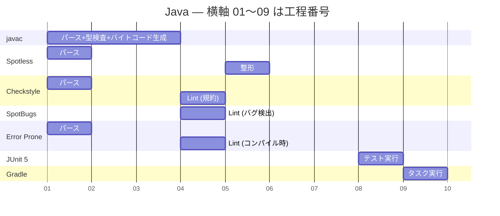
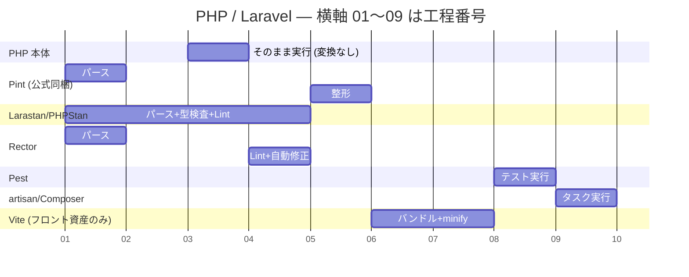
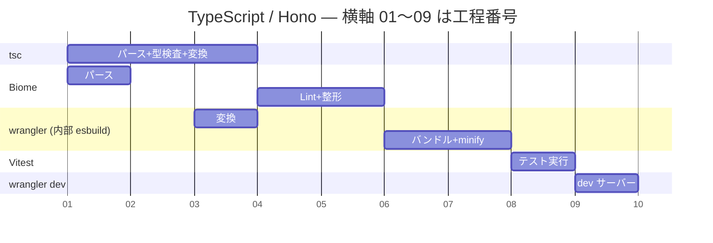

# 言語・フレームワーク別の Lint / 整形ツール — Java / Laravel / Hono / Nuxt

同じ「Lint と整形を入れる」という作業が、言語によってまったく違う形になる。Java では当たり前に必要な工程が PHP では存在せず、Laravel では公式が答えを出している工程を JavaScript では自分で選ばされる。

これまで触った Java(Spring Boot)/ PHP(Laravel)/ TypeScript(Hono)/ フロントエンド(Nuxt)を並べて、**どの工程を言語が埋め、どの工程をツールが埋めるのか**を比較するメモ。

- 9 工程の定義そのもの → [frontend-toolchain-map.md](./frontend-toolchain-map.md)
- 「なぜ言語によってビルドが要る/要らないが変わるのか」(実行モデルの話) → [../build-and-tooling-by-language.md](../build-and-tooling-by-language.md)

結論を先に言うと:

- **工程の数がそもそも違う。** Java と PHP には⑥バンドルと⑦minify(縮小)が**存在しない**。フロントエンドだけ 9 工程フルで走る。
- **②型検査を誰がやるかが最大の分岐点。** Java は `javac` が**強制する**、PHP は**誰もやらない**(PHPStan を任意で足す)、TypeScript は**外付けだが事実上必須**。
- **Laravel だけ整形ツールが公式同梱。** Pint が最初から入っているので「何を使うか」の議論が発生しない。JavaScript に公式ツールが無かったことが、ツール乱立の直接の原因。
- **Hono は TypeScript なのでフロントとほぼ同じ 9 工程を踏む。** サーバーサイドなのに⑥バンドルが必要なのは、Cloudflare Workers に配置するため。
- **「Lint を入れる」の難易度は Java < Laravel < TypeScript。** 前 2 つは定番が決まっており、TypeScript だけ選択が要る。

## 大前提 — 工程の数が言語ごとに違う

9 工程は「フロントエンドの工程」として定義したものだが、他の言語に当てると**空欄が出る**。空欄の出方に法則がある。

| 工程 | Java | PHP / Laravel | TypeScript / Hono | フロント / Nuxt |
|---|---|---|---|---|
| ① パース | あり | あり | あり | あり |
| ② 型検査 | **言語が強制** | 外付け・任意 | 外付け・事実上必須 | 外付け・事実上必須 |
| ③ 変換 | **必須**(バイトコード) | **不要** | **必須** | **必須** |
| ④ Lint | あり | あり | あり | あり |
| ⑤ 整形 | あり | **公式同梱** | あり | あり |
| ⑥ バンドル | **不要** | 不要(フロント資産のみ) | Workers なら**必須** | **必須** |
| ⑦ minify | **不要** | 不要(フロント資産のみ) | Workers なら必須 | **必須** |
| ⑧ テスト | あり | あり | あり | あり |
| ⑨ dev / タスク | あり | あり | あり | あり |

**①パース④Lint⑤整形⑧テスト実行⑨dev サーバーは全言語共通で、③トランスパイル⑥バンドル⑦minify(縮小)が言語によって出たり消えたりする。** これは偶然ではなく、③トランスパイル⑥バンドル⑦minify(縮小)がすべて**「実行系に届けるための変換」**だから。実行系が何を受け付けるかで必要性が決まる。

## Java (Spring Boot)



**⑥バンドル⑦minify(縮小)の位置が完全に空いている**のが特徴。SpotBugs だけ①パースのバーが無いのは、**ソースではなくコンパイル後のバイトコードを読む**ため。他のツールと入口が違う。

### 定番セット

| 工程 | ツール | 位置づけ |
|---|---|---|
| ②型検査 + ③変換 | **`javac`** | 言語に内蔵。**逃げられない** |
| ⑤整形 | **Spotless**(Gradle プラグイン) | `google-java-format` などを呼ぶ枠。実務でほぼこれ |
| ④Lint(規約) | **Checkstyle** | 命名規則・行長・import 順など「書き方」を見る |
| ④Lint(バグ) | **SpotBugs** | **バイトコードを解析**して null 参照やリソースリークを探す |
| ④Lint(バグ) | **Error Prone** | `javac` に相乗りしてコンパイル時に警告を出す(Google 製) |
| ⑧テスト | **JUnit 5** | Spring Boot Starter Test に同梱 |
| ⑨タスク | **Gradle** + Spring Boot DevTools | ビルド・テスト・再起動 |

### Java の特異点

**1. ②型検査から逃げられない。** `javac` は型検査を通らないと `.class` を出力しない。JavaScript 界の「型エラーがあってもビルドは通る」という状況が原理的に発生しない。この結果、**型に関する Lint ルールが不要**になる。ESLint に `no-implicit-any` 的なルールが必要な理由は、TypeScript の型検査がビルドと分離しているから。

**2. ⑥バンドルが不要。** jar はクラスファイルを ZIP でまとめた「運ぶための箱」で、依存を解決して 1 ファイルに畳み込む JavaScript のバンドルとは別の概念。JVM が実行時に classpath を辿るので、事前に結合する必要がない。

ただし Spring Boot の実行可能 jar(`bootJar`)は依存ライブラリごと 1 ファイルになるため、見た目はバンドルと紛らわしい。中身は `BOOT-INF/lib/` に**依存の jar を jar のまま並べた入れ子**で(このリポジトリの `app-0.0.1-SNAPSHOT.jar` は 152 個)、コードの結合も未使用コードの削除(tree shaking)も名前の書き換えも行わない。だからサイズは依存の足し算のまま 75MB になり、JS のバンドルのように元より小さくはならない。実行時も展開せず、必要になったクラスのエントリだけを ZIP から直接読む(そのため入れ子の jar は無圧縮で格納されている)。

**3. ⑦minify が不要。** サーバー上で動くコードをネットワーク越しに送らないため、バイト数を削る動機がない。

**4. ④Lint が 3 系統に分かれている。** 「規約(Checkstyle)」「バグ検出(SpotBugs)」「コンパイル時警告(Error Prone)」が別ツール。JavaScript では ESLint 1 つが全部やる。これは Java の Lint 文化が**バイトコードを解析する系統**と**ソースを解析する系統**に分かれて発展したため。

**5. このリポジトリの backend には⑤整形も④Lint も入っていない。** `backend/build.gradle` の `plugins` は `java` / `spring-boot` / `dependency-management` のみ。実務なら Spotless + Checkstyle が入る。

## PHP (Laravel)



**③変換が空いている**のが最大の特徴。そして**②型検査のバーが④Lint と繋がっている**。

### 定番セット

| 工程 | ツール | 位置づけ |
|---|---|---|
| ③変換 | **なし** | PHP は `.php` をそのまま実行する |
| ⑤整形 | **Pint** | **Laravel に公式同梱**。PHP-CS-Fixer のラッパー |
| ②型検査 + ④Lint | **PHPStan / Larastan** | 実行せずに型の矛盾・未定義メソッドを検出。Larastan は Laravel の動的な書き方(ファサード、Eloquent の magic method)を理解させる拡張 |
| ④Lint + 自動修正 | **Rector** | 「PHP 8.1 → 8.3」「Laravel 10 → 11」のような機械的な書き換えを自動実行する。Lint というより自動リファクタ |
| ⑧テスト | **Pest**(または PHPUnit) | Pest は PHPUnit の上に載る書きやすい記法 |
| ⑥⑦バンドル・minify | **Vite** | **PHP コードではなく、フロント資産(JS/CSS)に対してのみ**。Laravel は公式にこれを Vite に任せている |
| ⑨タスク | **artisan** + Composer scripts | |

### PHP / Laravel の特異点

**1. ⑤整形が公式同梱。** Laravel には Pint が最初から入っている。**これが決定的に楽**で、「Prettier か Biome か oxfmt か」という議論が発生しない。プロジェクトを跨いでも整形の流儀が同じになる。

**2. ②型検査が「オプトイン」。** PHP は実行時に型を見る言語で、型検査は**やらなくても動く**。だから PHPStan は「レベル」という概念を持ち、レベル 0(緩い)から max(厳しい)まで段階的に上げていく運用をする。既存コードに後付けする場合は `baseline` で既存エラーを凍結してから新規分だけ厳しくする、という手が定番。

**Java との対比が鮮やか**: Java は型検査が最初から max で強制、PHP はゼロから任意に上げていく。

**3. ②型検査と④Lint の境界が曖昧。** PHPStan は「型が合わない」も「到達しないコードがある」も同じツールで報告する。JavaScript で `tsc` と ESLint に分かれている仕事が 1 つになっている。

**4. Laravel だけ「フロント資産の工程」を抱えている。** Blade テンプレートに `@vite` ディレクティブを書くと、Vite がビルドした JS/CSS を読み込む。Laravel 9 系の途中で Laravel Mix(webpack ベース)から Vite に公式移行した。**つまり Laravel エンジニアも Vite のユーザーであり、Vite+ の射程に入る**。

## TypeScript (Hono / Cloudflare Workers)



**フロントエンドとほぼ同じ形**になる。サーバーサイドなのに⑥バンドル⑦minify(縮小)が必要なのが特徴。

### 定番セット

| 工程 | ツール | 位置づけ |
|---|---|---|
| ②型検査 | **`tsc --noEmit`** | 変換系ツールがやらないので別に走らせる |
| ③変換 | **wrangler / tsdown / tsx** | 何に配置するかで変わる |
| ④Lint + ⑤整形 | **Biome**(または ESLint + Prettier、oxlint + oxfmt) | Workers 系のテンプレートでは Biome をよく見る |
| ⑥⑦バンドル・minify | **wrangler**(内部で esbuild) | Workers ではバンドル済み 1 ファイルを配置する |
| ⑧テスト | **Vitest** | |
| ⑨dev | **`wrangler dev`** または **`@hono/vite-dev-server`** | |

### Hono / Workers の特異点

**1. サーバーサイドなのに⑥バンドルが必須。** Cloudflare Workers は Node.js のように `node_modules` を持ち込んで実行時に `require` する環境ではない。**バンドル済みの 1 ファイル**をアップロードして動かす。だから「サーバーコードだからバンドル不要」という Java / PHP の常識が通らない。

**2. ⑦minify にも意味がある。** Workers にはスクリプトサイズの上限があるため、バイト数を削ることが**動くかどうか**に直結する。ブラウザ向けの「速く届ける」とは違う動機。

**3. ②型検査を自分で走らせる必要がある。** `wrangler` は内部で esbuild を使うので**型検査をしない**。型エラーがあってもデプロイが通る。CI に `tsc --noEmit` を入れるのが必須になる。この構造はフロントエンドとまったく同じ。

**4. Hono は公式に Vite プラグインを持っている。** `honojs/vite-plugins` リポジトリに `@hono/vite-dev-server` / `@hono/vite-build` / `@hono/vite-ssg` がある。**つまり Hono プロジェクトは Vite ベースにできるので、Vite+ の射程に入る**。Next.js が入れないのと対照的。

**5. ④Lint⑤整形の選択肢が最も多い。** ESLint + Prettier / Biome / oxlint + oxfmt / Deno 内蔵 / Bun 内蔵。**唯一「選ばなければならない」言語**。

## フロントエンド (Nuxt = このリポジトリ)

9 工程フルで走る。詳細 → [frontend-toolchain-map.md](./frontend-toolchain-map.md)

現状は**④Lint と⑤整形だけが空白**で、残りは Nuxt が同梱する Vite が埋めている。

## なぜここまで違うのか — 3 つの軸

### 軸1: 実行系が何を受け付けるか(③⑥⑦の有無を決める)

| | 実行系が受け付けるもの | 結果 |
|---|---|---|
| **PHP** | `.php` ソースそのまま | ③不要。⑥⑦も不要 |
| **Java** | バイトコード(`.class`)のみ | ③必須。ただし classpath を実行時に辿るので⑥不要 |
| **TypeScript** | `.js`(ブラウザ / Node / Workers) | ③必須。**さらに送り先の制約で⑥⑦も必須** |

**フロントエンドが一番厳しい。** 「変換が必要」かつ「ネットワーク越しに送る」かつ「送り先(ブラウザ)のバージョンがバラバラ」という 3 重の制約がかかる唯一の環境。工程が最も多いのはこのため。

### 軸2: 型検査が言語に組み込まれているか(②の性質を決める)

```
  Java        型検査 ─┬─ 通らないとビルドできない
                     └─ 「型検査を入れる」という作業が存在しない

  PHP         型検査 ─── そもそも無い
                     └─ PHPStan を入れ、レベルを 0 から上げていく

  TypeScript  型検査 ─── 言語仕様としてはある
                     └─ しかしビルドと分離しているので、
                        自分で tsc を走らせないと誰も見ない
```

**TypeScript の位置が一番ややこしい。** 「型がある言語」なのに「型検査を忘れるとビルドが通ってしまう」。esbuild / SWC / wrangler が型検査をしないことを知らないと事故る構造で、これは Java にも PHP にも無い落とし穴。

### 軸3: 公式が整形ツールを持っているか(⑤の難易度を決める)

| | 公式の姿勢 | 結果 |
|---|---|---|
| **Laravel** | **Pint を同梱** | 議論が発生しない。プロジェクト間で流儀が揃う |
| **Java** | 公式ツールは無いが `google-java-format` が事実上の標準 | Spotless で呼ぶ形に収束 |
| **JavaScript / TypeScript** | **公式ツールが無い** | Prettier / Biome / oxfmt / dprint が並立 |
| **Nuxt** | `@nuxt/eslint` を公式提供(④のみ) | ④は道が示されているが⑤は自分で選ぶ |

**「フロントエンドはツールが多すぎる」という感覚の正体はこれ。** 工程数が最多(軸1)で、型検査が外付け(軸2)で、公式標準が無い(軸3)。3 つが重なっているのはフロントエンドだけ。

逆に言えば、**Rust 製ツールの統合(Biome / Vite+)は「他の言語では既に解決していた問題」を JavaScript が後追いで解決している**という話でもある。Laravel の Pint がやっていることを、JavaScript は 2026 年にようやく標準化しようとしている。

## このリポジトリへの含意

このリポジトリは frontend(Nuxt)+ backend(Spring Boot)の 2 言語構成なので、**Lint / 整形を入れるなら 2 系統必要**になる。

| | 現状 | 実務なら入るもの |
|---|---|---|
| **frontend** | ④⑤が空白 | `@nuxt/eslint` + Prettier(または Biome) |
| **backend** | ④⑤が空白 | Spotless + Checkstyle |
| **両方** | — | CI(GitHub Actions)で落とす設定 |

順序としては **backend の方が簡単**。定番が Spotless + Checkstyle で決まっており、Gradle プラグインを 2 行足すだけで、選択の余地がほとんどない。frontend は「ESLint + Prettier か Biome か oxlint 併用か」を決める必要がある。

ただし**今は導入しない**方針なので、決めるのはその時点で。決めたら ADR(`docs/adr/`)に残す。

## 用語集

- **`javac`** — Java コンパイラ。②型検査と③バイトコード生成を**必ずセットで**行う
- **Spotless** — Gradle / Maven の整形プラグイン。`google-java-format` などを呼ぶ枠組み
- **Checkstyle** — Java の規約チェッカ。命名・行長・import 順を見る
- **SpotBugs** — **バイトコードを解析**してバグを探す Java の静的解析ツール
- **Error Prone** — `javac` に相乗りしてコンパイル時に警告を出す Google 製ツール
- **Pint** — Laravel 公式同梱の PHP 整形ツール。PHP-CS-Fixer のラッパー
- **PHPStan** — PHP の静的解析ツール。②型検査と④Lint を兼ねる。「レベル」で厳しさを段階的に上げる
- **Larastan** — PHPStan の Laravel 拡張。ファサードや Eloquent の動的な書き方を理解させる
- **Rector** — PHP の自動リファクタツール。バージョン移行の機械的な書き換えを担う
- **Pest** — PHPUnit の上に載る PHP のテストフレームワーク
- **baseline** — 既存のエラーを「既知」として凍結し、新規分だけ検出させる仕組み。後付け導入の定番手法
- **wrangler** — Cloudflare Workers の CLI。内部で esbuild を使い③トランスパイル⑥バンドル⑦minify(縮小)を担うが、**②型検査はしない**
- **`@hono/vite-dev-server` / `@hono/vite-build`** — Hono 公式の Vite プラグイン。Hono を Vite ベースで開発・ビルドできる

## 関連

- 9 工程の定義と、フロントエンドツールの全体マトリクス → [frontend-toolchain-map.md](./frontend-toolchain-map.md)
- void0(会社)/ Oxc / Vite+ の関係と Next.js での可否 → [voidzero-and-vite-plus.md](./voidzero-and-vite-plus.md)
- 実行モデルの違い(なぜ jar は「箱」でバンドルではないのか、PHP がそのまま動く理由) → [../build-and-tooling-by-language.md](../build-and-tooling-by-language.md)
- Gradle のタスクとプラグインの仕組み(Spotless / Checkstyle を足す土台) → [../gradle-basics.md](../gradle-basics.md)
- テストの実行方法と方針 → [../../test/README.md](../../test/README.md)
