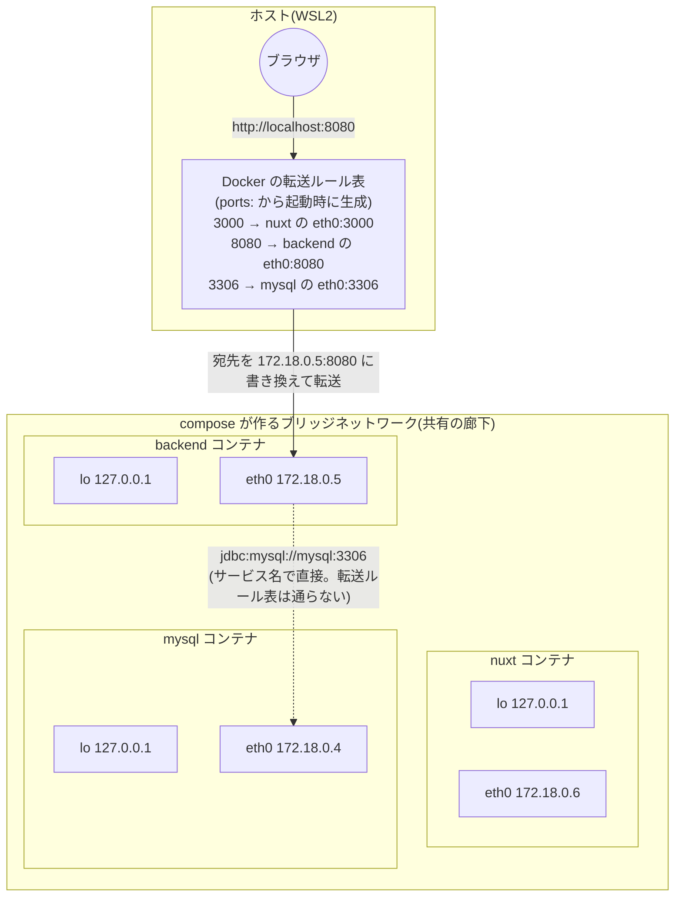

# 開発用コンテナの設計 — 実行環境だけのイメージ + ソースはマウント

`docker/frontend/Dockerfile` と `docker/backend/Dockerfile` の読み解き。2 つは**同じ設計パターンの Node 版 / Java 版**である、という話。

## 共通の設計パターン

どちらの Dockerfile にも `COPY` や `npm install` / ビルド手順がありません。イメージが持つのは**実行環境（Node / JDK）だけ**で、ソースコードは `docker-compose.yml` の `volumes:` でホストのフォルダをそのままマウントします。

| | frontend | backend |
|---|---|---|
| ベースイメージ | `node:22-slim`（Node だけ） | `eclipse-temurin:21-jdk`（JDK だけ） |
| ソースの入手 | `./frontend:/app` をマウント | `./backend:/app` をマウント |
| 起動コマンド | `npm run dev ...`（dev サーバー） | `sh ./gradlew bootRun` |

この方式の利点は、**エディタで保存した変更が即コンテナ内に見える**こと（ホットリロードの土台）と、コードを変えてもイメージの作り直しが不要なことです。本番はどちらも別の配布形態（Nuxt は SSG 出力を Spring Boot の `static/` へ、backend は AWS 構築時に本番用 Dockerfile を別途作成）なので、このコンテナは**開発専用**です。

## CMD の読み解き

`CMD` は「コンテナ起動時に実行するデフォルトのコマンド」です。イメージのビルド時ではなく `docker compose up` の瞬間に実行されます。お弁当箱に書いた「食べるときはレンジで 2 分」のメモと同じで、書いた時点では何も起きません。

`["npm", "run", "dev"]` という JSON 配列の書き方は **exec 形式**と呼ばれ、シェルを介さずコマンドを直接実行します。停止シグナル（`docker compose down` の合図)がプロセスに直接届くので、コンテナが素直に止まります。

### frontend: `CMD ["npm", "run", "dev", "--", "--host", "0.0.0.0", "--port", "3000"]`

```
npm run dev -- --host 0.0.0.0 --port 3000
└──┬─────┘ ┬  └──────────┬───────────────┘
   ①       ②             ③
```

- ① `npm run dev` — package.json の `dev` スクリプト（= `nuxt dev`）を実行
- ② `--` — 「ここから先は npm へのオプションではなく**スクリプト（nuxt dev）に渡す**」という区切り記号。封筒の宛名（npm 宛）と中身の手紙（nuxt 宛）を分ける封筒の役割
- ③ `--host 0.0.0.0 --port 3000` — nuxt dev への引数。`--port 3000` はデフォルト値の明示（EXPOSE や compose の ports と突き合わせて読めるようにする守りの書き方）

### backend: `CMD ["sh", "./gradlew", "bootRun"]`

- `./gradlew` — Gradle Wrapper。Gradle 本体を自動ダウンロードして実行するスクリプト（本体は `gradle-cache` ボリュームにキャッシュされ再ダウンロードされない）
- `bootRun` — コンパイル → Spring Boot アプリ起動を一気にやる Gradle タスク（詳細は [java-build-and-run.md](./java-build-and-run.md)）。フロントの `npm run dev` に相当
- **先頭の `sh` は実行権限の保険。** `./gradlew` と直接実行するにはファイルに実行権限（プログラムとして起動してよいという Linux のフラグ）が必要だが、ホストからマウントされるファイルはホスト側の事情（Windows のファイルシステムは実行権限を保持しない等）で権限が落ちていることがある。`sh ./gradlew` は「sh にこのファイルを台本として読ませる」形なので**読み取り権限さえあれば動く**

## なぜ `--host 0.0.0.0` が必須なのか

サーバーは待ち受け時に「どの玄関（ネットワークインターフェース）宛の接続を受けるか」を選びます。コンテナには玄関が複数あります:

```
コンテナの中
├── lo   (127.0.0.1)   … 自分専用の勝手口。コンテナ内からの接続だけが来る
└── eth0 (172.x.x.x)   … 表玄関。ポート転送された接続は必ずここに届く
```

ホストのブラウザから `localhost:3000` にアクセスすると、Docker のポート転送はその接続を**コンテナの eth0 に**届けます。デフォルト（localhost = 127.0.0.1 待ち受け）のままだと、表玄関のチャイムが鳴っても誰も出ない状態になり、「起動しているのに繋がらない（接続が拒否されました）」という症状になります。

- **必須なのは「eth0 に届く接続を受けること」。** eth0 の IP を直書きしても動くが、コンテナの IP は起動のたびに変わりうるので固定で書けない。「どの玄関でも受ける」を意味する `0.0.0.0` が、変化する値を書かずに済む唯一の安定した書き方
- **コンテナを使わずホストで直接 `npm run dev` するなら不要。** ブラウザとサーバーが同じマシンにいるので勝手口（localhost）同士で会話が成立する。つまりこの指定は Nuxt の要件ではなく**コンテナ越しに使うことから生まれた要件**
- **CLI フラグ以外の書き方もある。** `nuxt.config.ts` の `devServer: { host: '0.0.0.0' }` でも同じ。このリポジトリが CLI フラグ方式なのは「コンテナ都合の設定は Dockerfile 側、アプリ都合の設定は nuxt.config.ts 側」という置き場所の整理（ホストで直接 dev する人に 0.0.0.0 を強制しない副次効果もある）
- **`0.0.0.0` はブラウザに入力する URL ではない。** 待ち受け側の設定値であり、アクセスは `localhost:3000`。ターミナルの `http://0.0.0.0:3000` 表示をそのまま開こうとするのは頻出の混乱ポイント
- IPv6 版は `::`

ここまでは「コンテナが接続を**受ける側**(待ち受け)」の話。接続がそもそもどうやって eth0 まで**届く**のかは次セクションで。

## コンテナのネットワーク全体像 — ポート転送とコンテナ間通信

通信の経路は 2 本あり、仕組みがまったく違います。

1. **ホスト → コンテナ**(ブラウザから `localhost:8080` など)… Docker の**ポート転送**を経由する
2. **コンテナ → コンテナ**(backend から mysql など)… ポート転送は**一切通らず**、サービス名で直接届く

### 全体図



- minio / mailpit も同じ構造(図では省略)
- IP(172.18.0.x)は執筆時の実測値。**起動のたびに変わりうる**ので、値そのものに意味はない
- 各コンテナの lo がどこにも線で繋がっていないのは作図の省略ではなく、**本当にどこにも繋がっていない**(次項)

### lo の 127.0.0.1 は「同じ値」だが「同じ場所」ではない

コンテナはそれぞれ隔離された**ネットワーク名前空間**(lo・eth0・ルーティング表などネットワーク設備一式の個室)を持ちます。127.0.0.1 という*アドレスの値*はどのコンテナでも同じですが、それぞれの lo は独立した別の勝手口です。

「どの家にも『玄関から入って左の部屋』はあるが、隣の家のその部屋には繋がっていない」という関係で、nuxt コンテナの 127.0.0.1 と backend コンテナの 127.0.0.1 は互いに一切届きません。ホストの 127.0.0.1 ともまた別物です。

一方 eth0 は compose が作る共有のブリッジネットワーク(同じ廊下)に面していて、コンテナごとに重複しない IP が振られます。**外と会話できるのは eth0 だけ**——これが前セクション「eth0 で受けられないと繋がらない」の裏側の理由です。

この使い分けの実例が docker-compose.yml 内にあります。mysql のヘルスチェック `mysqladmin ping -h 127.0.0.1` は **mysql コンテナの中で**実行されるコマンドなので、自分の勝手口(lo)への接続で足りる、という書き方です。

### 「8080 なら backend へ」を決めているのは ports: の対応表

Docker が賢く推測しているのではなく、docker-compose.yml のこの行が対応表そのものです:

```yaml
  backend:
    ports:
      - "8080:8080"   # 左 = ホスト側の受け口、右 = コンテナ内で待つポート
```

左右の数字は独立していて、たまたま同じ値なだけです。`"18080:8080"` と書けば「ホストの 18080 → コンテナの 8080」になります。

`docker compose up` の瞬間、Docker はこの行ごとに転送ルールをホスト側に登録します。以後の流れ:

```
ブラウザ → http://localhost:8080
  ① ホストの 8080 番で転送ルールが接続を受ける
  ② 宛先を backend の eth0(172.18.0.5:8080)に書き換える
  ③ backend コンテナの eth0 に到着 → 0.0.0.0 で待つサーバーが応答
```

コンテナの IP は起動のたびに変わりえますが、対応表は起動時にその時の IP で作り直されます。だからユーザーは IP を意識しなくてよい——前セクションの「IP は固定で書けないから 0.0.0.0 で受ける」と対になる、届ける側の解決策です。

### 転送の実体 — DNAT と docker-proxy の二段構え

②の「宛先書き換え」の正式名は **DNAT**(Destination NAT)。Linux カーネルのパケット処理ルール表 **iptables** の nat テーブルに、Docker が公開ポートごとのルールを登録します(`DOCKER` という専用チェーン)。カーネルがパケットを転送する途中で宛先の IP とポートだけ書き換える、荷物の宛名シールの貼り替えです。

ただし DNAT だけでは足りない穴が 1 つあります。ホスト自身が発する `127.0.0.1:8080` 宛の接続です。127.0.0.1 宛のパケットがループバックの外(ブリッジの先のコンテナ)へ転送されることをカーネルは原則拒否するため(不正なパケットの混入を防ぐ安全弁)、素の DNAT が効きません。そこで Docker は公開ポートごとに **docker-proxy** という小さな中継プロセスをホスト側で待ち受けさせ、localhost 発の接続はカーネルの転送ではなくこのプロセスが受け取ってコンテナへ繋ぎ直します。

- 外(LAN 等)から来る接続 → **DNAT**(カーネル内で書き換え、高速)
- ホスト自身の localhost 発 → **docker-proxy**(ユーザー空間で中継)

なお **Docker Desktop(この環境)では、エンジン一式が専用の VM の中で動く**ため、iptables ルールも docker-proxy もこの WSL ディストロの `ps` や `iptables` コマンドからは見えません(さらに Windows 側で Docker Desktop 自身がポートを開けて VM へ中継する層が挟まる)。ネイティブ Linux の Docker(EC2 など)なら `sudo iptables -t nat -nL DOCKER` で登録済みルールを直接観察できます。

### コンテナ間通信に ports: は関係ない

コンテナ同士は同じブリッジネットワーク(廊下)にいるので、相手の eth0 へ**直接**届きます。転送ルール表は通りません。宛先はサービス名で書き、compose 内蔵の DNS がその時の eth0 の IP に解決してくれます(IP が起動ごとに変わる問題への、コンテナ間側の解決策)。

このリポジトリの実例:

- backend → mysql: `.env` の `DB_HOST=mysql` が application.yml の `jdbc:mysql://${DB_HOST}:...` に入る
- minio-init → minio: `mc alias set local http://minio:9000 ...`

つまり `ports:` は**ホスト⇔コンテナ専用の公開設定**です。試しに全サービスの `ports:` を消しても、コンテナ間通信(backend→mysql 等)は全部動きます。ホストのブラウザや GUI クライアントから見えなくなるだけです。mysql の `"3306:3306"` も backend のためではなく、ホストの GUI クライアント用(compose のコメントどおり)です。

### 手を動かして確かめる

いずれもこの環境で動作確認済み(compose 起動中に実行):

```bash
# 各コンテナの eth0 の IP 一覧(全体図の 172.18.0.x はこれで採った)
docker network inspect nuxt-java-practice_default \
  --format '{{range .Containers}}{{.Name}}  {{.IPv4Address}}{{"\n"}}{{end}}'

# backend から見た「mysql」「minio」という名前の解決先(サービス名 DNS の実演)
docker compose exec backend getent hosts mysql minio
# → 172.18.0.4  mysql
#    172.18.0.3  minio

# backend 自身の eth0 の IP
docker compose exec backend hostname -i

# ports: の対応表のホスト側受け口
docker compose port backend 8080
# → 0.0.0.0:8080(ホストのどのインターフェース宛でも受ける、の意)
```

`docker compose down && up -d` の前後で 1 つ目のコマンドを比べると「IP は起動のたびに変わりうる」を実際に観察できます(変わらないこともある)。

## 別解: compose の `command:` で起動時に npm ci する方式

別プロジェクトでよく見る次の書き方も正当なパターンです:

```yaml
    command:
      - /bin/bash
      - -c
      - |
        npm ci
        npm run dev -- --host --port 5173
```

読み解き: compose の `command:` は **Dockerfile の CMD を上書きする**設定（CMD は「デフォルト値」であって強制ではない）。YAML の `|` は複数行をひとつの文字列にする記法で、`bash -c "文字列"` がそれをシェルスクリプトとして実行します。exec 形式の CMD は「コマンド 1 個」しか表現できないので、「npm ci してから dev サーバー起動」という **2 ステップの手順**を書くにはシェルに台本を渡すしかない、という理屈です。（`--port 5173` は Vite のデフォルトポート。裸の `--host` は Vite では `0.0.0.0` の省略記法）

### このリポジトリ方式との比較

| | 起動時に `npm ci` 方式 | ホストで npm install 済み前提（このリポジトリ） |
|---|---|---|
| ホストに Node は | **不要**（コンテナが全部やる） | 必要（node_modules をホストで作る） |
| 起動速度 | 遅い（毎回依存を検証・展開） | 速い（即 dev サーバー起動） |
| 依存のズレ | 起きにくい（毎回 lockfile に同期） | ブランチ切替後の npm install 忘れで事故りうる |

- どちらが正しいではなく**トレードオフの選択**。ホストに Node を入れない運用なら npm ci 方式、ホストでも開発するなら現方式が快適
- `bash -c` 方式は主プロセス（PID 1）が bash になり、停止シグナルの転送が律儀でないため `docker compose down` が猶予時間（10 秒）待ちになることがある。exec 形式はこれを避けられる
- 注意: 今の構成（ホストの node_modules をマウント）にそのまま `npm ci` を足すと、**ホスト側の node_modules も毎回ゼロから作り直される**。移行するなら node_modules を匿名ボリュームで分離する等、volumes 側の設計とセットで

## 用語集

- **CMD** — コンテナ起動時のデフォルトコマンド。compose の `command:` や起動時引数で上書き可能
- **exec 形式** — `CMD ["a", "b"]` の JSON 配列記法。シェルを介さず、停止シグナルが直接届く
- **`--`（ダブルダッシュ）** — 「ここから先の引数はスクリプト側に渡す」という npm の区切り記号
- **ネットワークインターフェース** — マシンの通信の「玄関」。ループバック（lo）と外向き（eth0）が別々にある
- **0.0.0.0** — 「すべてのインターフェースで待ち受け」を意味する特殊なアドレス。IPv6 版は `::`
- **ボリュームマウント** — ホストのフォルダをコンテナ内に重ね合わせる仕組み。ホットリロードの土台
- **`bash -c`** — 文字列をシェルスクリプトとして実行する。複数コマンドを 1 コマンドに包む手段
- **`npm ci`** — lockfile どおりに node_modules をゼロから作り直す clean install
- **PID 1** — コンテナの主プロセス。停止シグナルはここに届く
- **実行権限** — 「このファイルをプログラムとして起動してよい」という Linux のフラグ
- **ネットワーク名前空間** — コンテナごとに隔離されたネットワーク設備一式（lo・eth0・ルーティング表）。127.0.0.1 が「同じ値でも別物」になる理由
- **ブリッジネットワーク** — compose がプロジェクトごとに作る仮想スイッチ（共有の廊下）。各コンテナの eth0 はここに接続される
- **DNAT（宛先 NAT）** — パケットの宛先 IP・ポートを書き換える仕組み。`ports:` によるポート転送の実体
- **iptables** — Linux カーネルのパケット処理ルール表。Docker が転送ルール（DOCKER チェーン）を登録する先
- **docker-proxy** — 公開ポートごとにホスト側で待ち受ける小さな中継プロセス。DNAT が効かない localhost 発の接続を担当
- **サービス名 DNS** — compose 内蔵の DNS がサービス名（`mysql` 等）を相手コンテナの eth0 の IP に解決する仕組み。コンテナ間通信の宛先解決

## 関連

- backend の CMD が起動する `bootRun` の中身、JDK・コンパイルの話 → [java-build-and-run.md](./java-build-and-run.md)
- サービス名とコンテナ名の違い、`container_name` を付けない理由 → [docker-container-names.md](./docker-container-names.md)
- `gradle-cache` ボリュームの中身、「バインドマウントではなく named volume」の理由、マウントの重ね掛け（マスキング）の性質、実務での「ホストに見せる/見せない」比較 → [gradle-basics.md](./gradle-basics.md)
