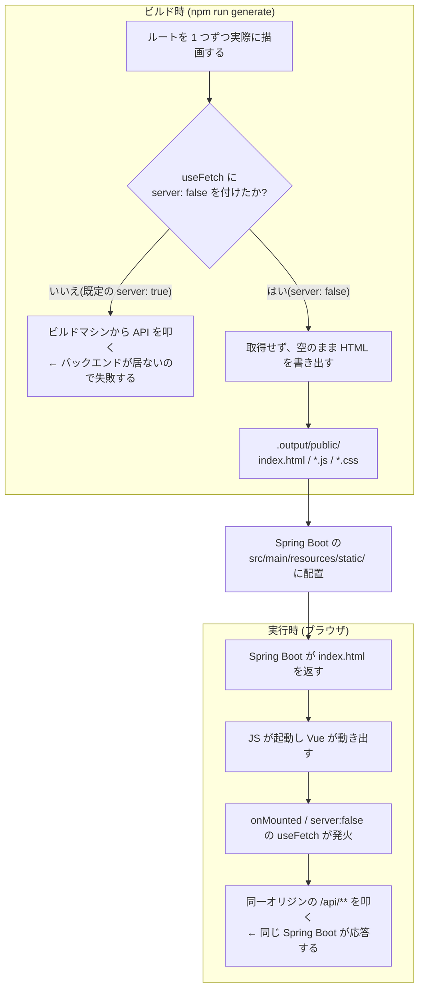

# データ取得と SSG — RSC のない世界でどう取るか

`$fetch` / `useFetch` / `useAsyncData` の 3 つをどう使い分けるか、そして `nuxt generate`(SSG)という制約がその選択をどう縛っているかをまとめるメモ。

このリポジトリの `useCategories` と `usePosts` は、同じ `composables/` にありながら片方が `useFetch`、もう片方が `$fetch` を使っている。この非対称の理由まで説明する。

結論を先に言うと:

- **Nuxt に React Server Components はない。** 代わりに「この取得をサーバーで走らせるか」を `server` オプションで指定する。
- **`$fetch` は素の HTTP クライアント。`useFetch` はそれに「SSR で取得して結果を HTML に埋め込む」機能と状態管理を足したもの。**
- **`nuxt generate` はビルド時にページを実際に描画する。** このリポジトリはその時点でバックエンドが起動していないため、**API 取得は全部ブラウザ側**に倒している。
- **画面表示時に 1 回取るだけなら `useFetch`、ボタン操作やページ送りで何度も呼ぶなら `$fetch`。** これがこのリポジトリの非対称の正体。
- **投稿詳細ページは事前生成されない。** 静的ファイルとして存在しないパスをどう配信するかは、フェーズ 11 で扱う SPA フォールバックの課題。

---

## 0. 対応表

| Next.js (App Router) | Nuxt 4 | 実行される場所 |
|---|---|---|
| Server Component 内で `await fetch()` | `useFetch()` / `useAsyncData()` | サーバー(SSR / ビルド時)+ 必要ならクライアント |
| Client Component + `useEffect` + `fetch` | `useFetch(..., { server: false })` | ブラウザのみ |
| Client Component + SWR / TanStack Query | `useFetch()`(`refresh` / `status` 付き) | ブラウザのみ |
| イベントハンドラ内の `fetch()` | `$fetch()` | 呼ばれた場所 |
| Server Action | (なし) | — |
| `generateStaticParams()` | `nitro.prerender.routes` | ビルド時 |
| `fetch` のキャッシュ制御 | (なし。Nitro のルートルールで指定) | — |

## 1. RSC がないというのはどういうことか

Next の App Router では、コンポーネント自体がサーバーとクライアントに分かれていた。

```tsx
// Next.js: このコンポーネントはサーバーでだけ実行される
export default async function Page() {
  const posts = await fetch('http://backend:8080/api/posts').then(r => r.json())
  return <PostList posts={posts} />
}
```

Nuxt にはこの分割がない。**すべてのコンポーネントはブラウザで動く前提のコンポーネント**で、SSR のときはそれをサーバー上でも一度実行して HTML を作る、という Next の Pages Router に近いモデルになっている。

そのため「サーバーでだけ実行される」という区別は、コンポーネント単位ではなく**取得関数のオプション**として表現される。

```ts
useFetch('/api/posts')                    // 既定(server: true)。サーバーで取得 → HTML に結果を埋め込む → ブラウザでは再取得しない
useFetch('/api/posts', { server: false }) // サーバーでは取得しない → ブラウザで取得する
```

実務上の違いとしては、**バックエンドの秘密情報(API キー、DB 接続)をコンポーネントに書けない**という点が大きい。Next の Server Component はブラウザに送られないコードだったが、Nuxt のコンポーネントは全部バンドルに含まれてブラウザへ届く。秘密を扱う処理は `server/`(Nitro)側に置くことになる — そしてこのリポジトリでは、その役割を Spring Boot が担っている。

## 2. `$fetch` — 素の HTTP クライアント

```ts
// app/composables/usePosts.ts
const fetchTimeline = (params: { cursor?: number; categoryId?: number; limit?: number }) =>
  $fetch<Timeline>('/api/posts', { params })

const createPost = (body: string, categoryId: number) =>
  $fetch<Post>('/api/posts', { method: 'POST', body: { body, categoryId } })

const deletePost = (id: number) => $fetch<void>(`/api/posts/${id}`, { method: 'DELETE' })
```

素の `fetch` との違い。

- **JSON を自動で解析する。** `.then(r => r.json())` が要らない。
- **`body` にオブジェクトを渡せる。** `JSON.stringify` と `Content-Type` の指定が要らない。
- **`params` にオブジェクトを渡せる。** クエリ文字列に組み立ててくれる。`?cursor=12&categoryId=3` を手で作らなくてよい。`undefined` の項目は自動で省かれる(上の `cursor: nextCursor.value ?? undefined` はこれを利用している)。
- **エラーステータスで例外を投げる。** 素の `fetch` は 404 や 500 でも `resolve` するため `if (!res.ok)` の分岐が必須だったが、`$fetch` は throw する。
- **レスポンスボディが `error.data` に入る。**

最後の性質をこのリポジトリは使っている。

```ts
// app/components/post/Form.vue
try {
  const post = await createPost(body.value, categoryId.value)
  // ...
} catch (e: any) {
  // バックエンドの ErrorResponse(message / fieldErrors)を表示する
  const data = e?.data
  errorMessage.value =
    (data?.fieldErrors && Object.values(data.fieldErrors as Record<string, string>)[0]) ||
    data?.message ||
    '投稿に失敗しました'
}
```

Spring Boot のバリデーションエラー(400)が投げられ、レスポンスボディが `e.data` から読める。**`$fetch` はコンポーネントの文脈に依存しないので、イベントハンドラの中から呼べる**([composables.md](./composables.md) §4)。書き込み系の処理はすべてこの形になる。

## 3. `useFetch` / `useAsyncData`

```ts
// app/composables/useCategories.ts
export function useCategories() {
  return useFetch<Category[]>('/api/categories', { server: false })
}
```

```ts
// app/pages/index.vue
const { data: categories } = useCategories()
```

`useFetch` が返すのはデータそのものではなく、**リアクティブな状態のまとまり**。

| 戻り値 | 型 | 意味 |
|---|---|---|
| `data` | `Ref<T \| null>` | 取得結果。取得前は `null` |
| `status` | `Ref<'idle' \| 'pending' \| 'success' \| 'error'>` | 状態 |
| `error` | `Ref<Error \| null>` | エラー |
| `refresh()` | 関数 | 取り直す |
| `clear()` | 関数 | 状態を初期化する |

React で言えば SWR / TanStack Query の `useQuery` に近い。だから `index.vue` のテンプレートは、取得完了を待たずに書ける。

```vue
<PostForm v-if="categories" :categories="categories" @created="onPostCreated" />
<button v-for="category in categories ?? []" :key="category.id">
```

`categories` は最初 `null` で、取得できたら中身が入って再描画される。`v-if` と `?? []` はそのための備え。

### `useAsyncData` との関係

`useFetch` は `useAsyncData` と `$fetch` を組み合わせた短縮形で、おおよそ次と等価。**`useAsyncData` のほうが下の層にある。**

```ts
useFetch('/api/categories')
// ≒
useAsyncData('自動生成されたキー', () => $fetch('/api/categories'))
```

**戻り値は同じ。** どちらも `data` / `status` / `error` / `refresh()` / `clear()` を返す。状態管理の機能に差はない。

| | `useFetch` | `useAsyncData` |
|---|---|---|
| 第 1 引数 | **URL** | **キー**(省略可)。第 2 引数に**取得処理の関数** |
| 何を取るか | その URL を `$fetch` する | **自分で書いた関数の戻り値**。何でもよい |
| `$fetch` のオプション | `method` / `body` / `params` などをそのまま渡せる | 関数の中で自分で書く |
| **URL や params が変わったとき** | **自動で取り直す** | **取り直さない**(`watch` を自分で指定する) |
| キー | URL とオプションから自動生成 | 省略すると呼び出し位置から自動生成。明示もできる |
| 戻り値 | 同じ | 同じ |

効いてくるのは 2 行目と 4 行目。

#### 取得処理を自分で書けるかどうか

`useFetch` は URL を渡す形なので、**既にある関数を経由できない**。

```ts
const { fetchPost } = usePosts()

// useFetch では書けない。fetchPost は URL ではなく関数
// useAsyncData なら書ける
const { data: post } = await useAsyncData(() => fetchPost(route.params.id as string))
```

複数の API をまとめて呼ぶ、結果を加工してから返す、といったこともできる。

```ts
const { data } = await useAsyncData(async () => {
  const [posts, categories] = await Promise.all([
    $fetch('/api/posts'),
    $fetch('/api/categories'),
  ])
  return { posts, categories }
})
```

#### 自動で取り直すかどうか

`useFetch` は **URL やオプションに含まれるリアクティブな値を見ていて、変わると自動で取り直す。**

```ts
const keyword = ref('')

useFetch('/api/search', { params: { q: keyword } })
// keyword が変われば自動で再取得される
```

`useAsyncData` にこの自動追従はない。同じことをしたければ明示する。

```ts
useAsyncData(() => $fetch('/api/search', { params: { q: keyword.value } }), {
  watch: [keyword],
})
```

**便利さでは `useFetch`、挙動の明示性では `useAsyncData`。** `watch` と `watchEffect` の対比([lifecycle-and-watch.md](./lifecycle-and-watch.md) §3)と同じ構図になっている。

#### 使い分け

**URL を渡すだけで済むなら `useFetch`、それ以外は `useAsyncData`。**

このリポジトリの `useCategories` は前者。

```ts
return useFetch<Category[]>('/api/categories', { server: false })
```

§5 で挙げる `[id].vue` の書き換え案が `useFetch` ではなく `useAsyncData` なのは、**`usePosts()` の `fetchPost` を再利用したいから**。URL を直接書けば `useFetch` でも書けるが、そうすると **API 呼び出しを `usePosts` に集約している設計が崩れる**(ページに URL が直書きされる)。

### キーとペイロード

`useAsyncData` の第 1 引数のキーには役割がある。SSR のとき、**サーバーで取得した結果を HTML に JSON として埋め込み、ブラウザ側は同じキーでそれを拾って再取得を省く**。この埋め込みデータをペイロードと呼ぶ。

これがないと「サーバーで取得 → HTML を返す → ブラウザで同じ API をもう一度叩く」という二重取得になる。`useFetch` はキーを自動生成するため、通常は意識しなくてよい。

**キーにはもう 1 つ役割がある — 同じキーなら状態を共有する。**

```ts
// 別々のコンポーネントで呼んでも、data / status / error は 1 つ
useAsyncData('categories', () => $fetch('/api/categories'))
```

意図すれば「重複リクエストの排除」として使えるが、**意図せず同じキーを付けると、無関係な取得同士が状態を共有して壊れる**。`useAsyncData` でキーを明示するときは、他と衝突しない名前にする。

`useFetch` は URL とオプションからキーを自動生成するので通常は衝突しない。ただし裏を返すと、**同じ URL を 2 か所で呼べば自動的に共有される**。`useCategories()` を複数のページから呼ぶようになったときに効いてくる性質。

### 主なオプション

| オプション | 既定値 | 効果 |
|---|---|---|
| `server` | **`true`** | `false` にすると、サーバー側(SSR / ビルド時)では取得せずブラウザでだけ取得する |
| `lazy` | `false` | `true` にすると、取得完了を待たずにページ遷移する。`status` を見て自分で読み込み表示を出す |
| `immediate` | `true` | `false` にすると、すぐには取得しない。`refresh()` で手動実行する |
| `watch` | なし | `[x]` を渡すと `x` が変わったときに自動で取り直す |
| `transform` | なし | 取得結果を加工してから `data` に入れる |
| `default` | なし | 取得前の `data` の初期値 |

**`server` の既定値が `true`** である点に注意。**何も指定しなければサーバー側でも取得しにいく**ので、SSG では `{ server: false }` を明示しない限りビルド時に API を叩く(→ §4)。

## 4. `nuxt generate` で何が起きるか

ここが本題。



**`nuxt generate` はページを実際に描画して HTML を書き出す。** ここが「テンプレートを機械的に HTML に変換する」だけの静的サイトジェネレータとの違いで、`useFetch` があればビルドマシンから本当に HTTP リクエストが飛ぶ。

このリポジトリの構成では、ビルドは CI かローカルで走り、**そのときバックエンドの Spring Boot も MySQL も起動していない**。だから取得は必ず失敗する。

対処は 2 つある。

1. **ビルド時にバックエンドを起動しておく。** 取得済みの HTML が作れるので初回表示が速く、SEO にも強い。ただしビルド手順に DB とバックエンドの起動が加わり、データが更新されるたびに再ビルドが要る。
2. **ビルド時には取得せず、ブラウザで取る。** `server: false` / `onMounted`。ビルドが単純になるかわりに、初回表示で一瞬空になる。

**このリポジトリは 2 を選んでいる。** 学習用で常時公開しない前提であり、投稿は随時増えるため事前生成した HTML はすぐ古くなる。SEO も要件にない。

```ts
/**
 * カテゴリー一覧の取得。
 * SSG(nuxt generate)ではビルド時にバックエンドが居ないため、
 * server: false でクライアント側でのみ取得する(このアプリの API 取得は全てこの方針)。
 */
```

`useCategories` のこのコメントが、その方針を宣言している。

## 5. なぜ `useCategories` と `usePosts` で書き方が違うのか

同じ `composables/` に並んでいるのに中身が違う。

```ts
// useCategories.ts — useFetch を返す
return useFetch<Category[]>('/api/categories', { server: false })

// usePosts.ts — $fetch を包んだ関数を返す
const fetchTimeline = (params) => $fetch<Timeline>('/api/posts', { params })
return { fetchTimeline, fetchPost, createPost, deletePost }
```

**取得の「回数」と「きっかけ」が違うから。**

| | カテゴリー一覧 | 投稿一覧 |
|---|---|---|
| いつ取るか | ページを開いたとき 1 回 | 開いたとき + スクロール + カテゴリー切替 |
| 引数 | なし | カーソルと絞り込みが毎回変わる |
| 結果の扱い | そのまま表示 | 既存の配列に追加していく |
| 向いている道具 | `useFetch`(宣言的) | `$fetch`(命令的) |

`useFetch` は「この URL の内容を、この画面はこう持っている」という**宣言**を書くもの。一方、投稿一覧は「今の状態から次のページを取ってきて、末尾に足す」という**手続き**であり、結果は `useFetch` が管理する `data` ではなく、自前の `posts` ref に蓄積される。

```ts
// app/pages/index.vue
const posts = ref<Post[]>([])
const nextCursor = ref<number | null>(null)

async function loadMore() {
  if (loading.value || reachedEnd.value) return
  loading.value = true
  try {
    const timeline = await fetchTimeline({
      cursor: nextCursor.value ?? undefined,
      categoryId: selectedCategoryId.value ?? undefined,
    })
    posts.value.push(...timeline.posts)
    nextCursor.value = timeline.nextCursor
    reachedEnd.value = timeline.nextCursor === null
  } finally {
    loading.value = false
  }
}
```

**判断の目安**: 画面を開いたときに 1 回取って表示するだけなら `useFetch`。ボタン・スクロール・送信をきっかけに呼ぶなら `$fetch`。

### 投稿詳細は第 3 のパターン

```ts
// app/pages/posts/[id].vue
onMounted(async () => {
  try {
    post.value = await fetchPost(route.params.id as string)
  } catch {
    notFound.value = true
  }
})
```

こちらは「開いたとき 1 回」なので `useFetch` が向く条件を満たしているのに、`onMounted` で手書きしている。

**`useAsyncData` を使えばこう書ける。**

```ts
// 採用していない書き方
const { data: post, error } = await useAsyncData(
  () => fetchPost(route.params.id as string),
  { server: false, lazy: true },
)
```

`notFound` の ref が `error` に置き換わり、`onMounted` が消える。**比較対象は `useFetch` ではなく、いまの「`onMounted` + 自前の ref」**である点に注意(`useFetch` を使わない理由は §3「使い分け」のとおり、`fetchPost` を経由したいから)。トレードオフは次のとおり。

- **`useAsyncData` の利点**: 自前で用意していた状態(`post` / `notFound`)が `data` / `status` / `error` に置き換わる。`watch: [() => route.params.id]` を足せば URL 変更時の取り直しも自動になる。
- **`onMounted` の利点**: 何が起きるかがコードの見た目どおり。`server: false` と `lazy: true` の意味を知らなくても読める。

このリポジトリが `onMounted` を選んでいるのは、**「ビルド時には絶対に走らない」がコードから明白**であることを優先したため。`server: false` はオプション名を知らないと読み取れないが、`onMounted` は「マウント後、つまりブラウザで」としか読めない。

`usePosts` の関数群が `$fetch` を返す設計とも噛み合っている。`fetchPost` は詳細ページからも、将来モーダルからでも同じように呼べる。

## 6. 投稿詳細ページは事前生成されない

`nuxt generate` は、既定で次のルートを生成する。

- `/`(ルート)
- 生成した HTML の中に含まれるリンクを辿って発見できるルート(クロール)

`/posts/1` のような動的ルートは、**ID の一覧を知らなければ生成のしようがない**。Next の `generateStaticParams()` に当たるのは Nuxt では `nitro.prerender.routes` で、ここに URL を列挙すれば生成される。

```ts
// 例。このリポジトリでは使っていない
nitro: {
  prerender: {
    routes: ['/posts/1', '/posts/2'],
  },
}
```

しかしこの一覧を得るにはビルド時に API を叩く必要があり、そのバックエンドが居ないので不可能。**しかも、このリポジトリではクロールでも発見されない。** ビルド時のタイムラインはデータが空のまま描画されるため、HTML の中に `/posts/1` へのリンクが 1 本も存在しないからだ。

結果として、`/posts/1` に対応する静的ファイルは出力に含まれない。ブラウザのアドレスバーに直接 `/posts/1` と打つと、Spring Boot はそのパスのファイルを見つけられない。

**タイムラインからリンクを踏む分には動く。** その場合はページ全体を読み込み直さず、Vue Router がクライアント側で `[id].vue` に切り替えるだけだからだ。壊れるのは直接アクセスとリロードのとき。

これを解決するのが **SPA フォールバック** — 「静的ファイルが見つからないパスは、とりあえず入口の HTML を返す」という配信側の設定。Spring Boot 側の対応が必要で、[implementation-progress.md](../../development/implementation-progress.md) のフェーズ 11 で扱う。

---

## 7. プリレンダしたページをクエリ付きで開くと `route.query` が一拍遅れる

メール確認のリンク `https://stg.njp.mylabinfra.com/verify-email?token=...` を開くと、STG では
「リンクにトークンが含まれていません」と表示されて認証できなかった。**ローカルでは同じコードが動く。**

### 何が起きているか

`/verify-email` はプリレンダ済みのページで、出力された HTML には「プリレンダしたときの URL」が
埋め込まれている(`__NUXT_DATA__` の `path`。クエリは付いていない)。

```html
<script type="application/json" data-nuxt-data="nuxt-app" data-ssr="true" id="__NUXT_DATA__">
[{"...":"...","path":7,"prerenderedAt":15},...,"\u002Fverify-email",...]
</script>
```

ブラウザ側の Nuxt は、この `path` と実際の URL が食い違っていることに気づくと、
**ハイドレーションの食い違いを避けるために一度「プリレンダ時の URL」でルーティングしてから、
ハイドレーションが終わったあとで本来の URL に差し替える**
(`nuxt/dist/pages/runtime/plugins/router.js` の `hasDeferredRoute`)。

```js
// nuxt/dist/pages/runtime/plugins/router.js(抜粋)
nuxtApp.hooks.hookOnce("app:created", async () => {
  if (hasDeferredRoute) {
    const payloadRoute = router.resolve(nuxtApp.payload.path);   // ← クエリ無しの /verify-email
    await router.replace({ ...payloadRoute, force: true });
    nuxtApp.hooks.hookOnce("app:suspense:resolve", async () => {
      await router.replace({ ...resolvedInitialRoute, force: true }); // ← ここで ?token= が載る
    });
  }
  ...
});
```

`router.replace` は `history.replaceState` を呼ぶので、**アドレスバーごと書き換わる**。
つまりクエリが消えるのは `route.query` だけではなく `window.location` も同じ。時系列はこうなる。

| 時点 | `route.query.token` / `window.location.search` |
| --- | --- |
| プラグインの実行(`applyPlugins`) | **あり** |
| `app:created`(ここで差し替え) | ここで消える |
| マウント(`onMounted` が走る) | **無し** |
| `app:suspense:resolve` の後(本来の URL に戻る) | あり |

`onMounted` はクエリが消えている間に走るので、トークンを取りこぼす。しかも差し替えはパスが
同じままなので**ページのコンポーネントは作り直されず、`onMounted` は二度と走らない**。

### なぜローカルでは動くのか

この回り道が起きる条件は `payload.prerenderedAt` と `payload.path` が両方あること、つまり
**SSG でプリレンダされたページであること**。開発サーバー(SSR)ではリクエストのたびに
クエリ付きの URL で描画されるので条件が成立せず、`route.query` のままで正しく動く。
**SSG でビルドした STG / 本番でだけ壊れる**ので、`docker compose` の開発環境では再現しない。

### 対処

クライアントの起動順は `applyPlugins` → `callHook('app:created')` → `mount` なので
(`nuxt/dist/app/entry.js`)、**プラグインの中ならまだ元の URL が残っている**。
そこで開かれた URL のクエリをプラグインで控えておき、ページはそれを読む。

```ts
// app/plugins/link-query.client.ts
export default defineNuxtPlugin(() => {
  const initialQuery = new URL(window.location.href).searchParams
  return { provide: { linkQuery: (name: string) => initialQuery.get(name) ?? '' } }
})
```

```ts
// app/pages/verify-email.vue
const { $linkQuery } = useNuxtApp()
onMounted(async () => {
  const token = $linkQuery('token')
  ...
})
```

**`onMounted` の中で `window.location` を読むのでは直らない。** 上の表のとおり、その時点では
アドレスバーからもクエリが消えている(実機で確認済み)。

控えるのは「そのタブで最初に開いた URL」なので、アプリ内のページ遷移では変わらない。
メールのリンクの着地点のように「どの URL で開かれたか」を見たい場面だけで使い、
middleware が付ける `?redirect=` のような普通のクエリは `useRoute().query` のままでよい。

`computed` で包んで**リアクティブに**読んでいる場合は、差し替え後に値が入り直すので最終的には
動く。ただし差し替えまでの一瞬だけ「トークン無し」の表示が出る。

ページをプリレンダの対象から外す(`nitro.prerender.ignore`)のも手で、そうすると SPA
フォールバックの `200.html` が返るようになり `payload.path` が無くなるので差し替え自体が起きない。
このリポジトリでは事前生成した HTML を活かしたいので採らなかった(§6・フェーズ11)。

### 再現と確認

開発サーバーでは再現しないので、SSG の出力を直接配信して確かめる。

```bash
cd frontend && npm run generate && npx serve .output/public
# http://localhost:<表示されたポート>/verify-email?token=dummy を開く
```

`/api` は Spring Boot に届かない(`devProxy` は `nuxt dev` 専用)ので API 呼び出しは 404 になるが、
判定はそれで足りる。**修正前は「リンクにトークンが含まれていません」で API を叩きにいかない。
修正後は API を叩いて 404 で失敗する**(DevTools の Network に `POST /api/auth/verify-email` が出る)。


---

## 落とし穴

- **イベントハンドラの中で `useFetch` を呼ぶ。** 動かない。`$fetch` を使う([composables.md](./composables.md) §4)。
- **`useFetch` の `data` を値として扱う。** `data` は ref。スクリプトでは `data.value`。
- **`server: false` を付け忘れる。** `server` の既定は `true` なので、**書かなければサーバー側でも取得する**。ビルド時にバックエンドを叩きにいって `nuxt generate` が失敗する。
- **取得完了を前提にテンプレートを書く。** `data` は最初 `null`。`v-if` や `?? []` で備える。
- **`useFetch` を無限スクロールに使おうとする。** 蓄積型の取得には向かない。`$fetch` + 自前の ref。
- **`useFetch` には状態管理がないと思う。** `useAsyncData` と戻り値は同じ。違うのは「URL を渡すか関数を渡すか」と「自動で取り直すかどうか」→ §3。
- **`useAsyncData` のキーを適当に付ける。** 同じキーは状態を共有する。無関係な取得同士が混ざる → §3。
- **`$fetch` のエラーを `e.message` で読む。** レスポンスボディは `e.data`。
- **絶対 URL を書く。** `http://localhost:8080/api/posts` と書くと本番で壊れる。常に相対パス `/api/...`。
- **動的ルートが静的生成されると思う。** されない。直接アクセスにはフォールバック設定が要る。
- **プリレンダしたページで `onMounted` から `route.query` を読む。** マウント時点ではまだ空。`window.location` も同じく空なので、プラグインで開かれた URL を控えておく → §7。

## 用語集

- **`$fetch`** — Nuxt の HTTP クライアント(ofetch)。JSON 解析・エラー時の throw・クエリ組み立てを備える。どこからでも呼べる
- **`useFetch`** — `$fetch` に SSR 対応と状態管理を足したコンポーザブル。setup の同期実行中にしか呼べない
- **`useAsyncData`** — 取得処理を自分で書ける版。`useFetch` はこれの短縮形で、戻り値は同じ。既存の関数を経由したいときや、複数の API をまとめたいときに使う
- **ペイロード(payload)** — サーバーで取得した結果を HTML に埋め込んだ JSON。ブラウザ側の二重取得を防ぐ
- **ハイドレーション** — サーバーが返した HTML に、ブラウザ側で JS を結びつけて操作可能にすること
- **プリレンダリング** — ビルド時にページを描画して HTML を書き出すこと。`nuxt generate` がこれを行う
- **クロール(crawlLinks)** — 生成済み HTML 内のリンクを辿って、生成対象のルートを自動発見する仕組み
- **SPA フォールバック** — 静的ファイルが存在しないパスに対して入口の HTML を返す配信側の設定
- **宣言的 / 命令的** — 「何であるか」を書くか、「どうするか」を書くか。`useFetch` が前者、`$fetch` が後者

## 関連

- 全体像と対応表 → [vue-vs-react-overview.md](./vue-vs-react-overview.md)
- 呼ぶ場所の制約と `use` 接頭辞 → [composables.md](./composables.md)
- `onMounted` がブラウザでしか走らない理由 → [lifecycle-and-watch.md](./lifecycle-and-watch.md)
- ビルドモードと devProxy → [nuxt-vs-nextjs.md](./nuxt-vs-nextjs.md)
- SSG を採用した理由 → [../../tech-stack/README.md](../../tech-stack/README.md)
- API の仕様 → [../../api/](../../api/)
- フェーズ 11(SSG 統合・SPA フォールバック)→ [../../development/implementation-progress.md](../../development/implementation-progress.md)
- Nuxt 公式「Data fetching」 https://nuxt.com/docs/getting-started/data-fetching
