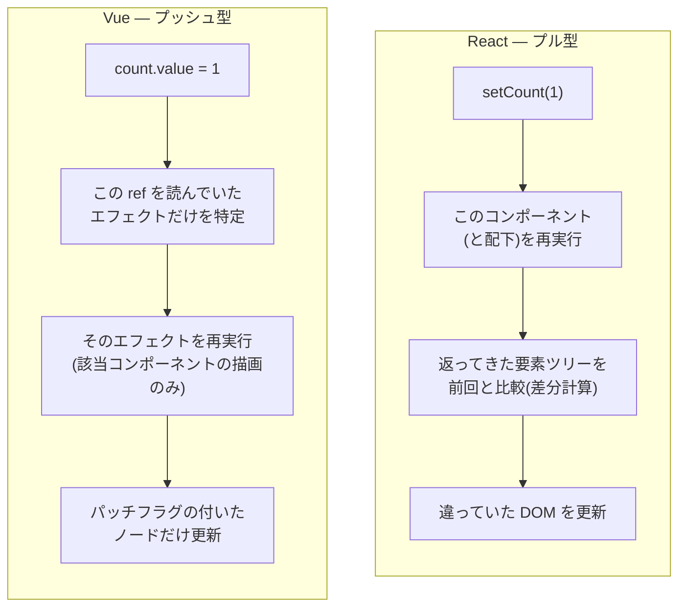

# リアクティビティ — `ref` と `computed` はどう動いているのか

`ref(false)` と書いて `deleting.value = true` と代入すると画面が変わる。この仕組みを、React の `useState` と対比しながら中身まで見るメモ。

`.value` を書き忘れる、`computed` と関数の使い分けが分からない、といったつまずきはすべてここを理解すると消える。

結論を先に言うと:

- **`ref(0)` はただの数値ではなく、`.value` という getter / setter を持つオブジェクトを返す。** 読んだら記録し、書いたら通知する、という仕掛けを差し込むために包んでいる。
- **依存関係は「実行時に読まれたかどうか」で自動的に集まる。** だから依存配列を書かない。書き忘れによるバグも起きない。
- **React は「変わったら関数を再実行して結果を比べる」、Vue は「変わったことを値のほうから知らせる」。** 前者はプル型、後者はプッシュ型。
- **`computed` は結果をキャッシュし、依存が変わったときだけ再計算する。** `useMemo` と違って依存配列が要らず、外しても壊れない。
- **テンプレートの中では `.value` を書かない。** コンパイラが自動で外している。

---

## 1. `ref` の中身

`ref(0)` が返すのは数値ではない。おおよそ次のようなオブジェクト。

```ts
// 実際の実装(RefImpl クラス)を単純化したもの
class RefImpl {
  constructor(value) { this._value = value }

  get value() {
    track(this)          // 「いま実行中の処理がこの ref を読んだ」と記録する
    return this._value
  }

  set value(newValue) {
    this._value = newValue
    trigger(this)        // 「この ref を読んでいた処理」を全部やり直させる
  }
}
```

`.value` を書かされるのはこのため。**プロパティへのアクセスに処理を挟むには、値をオブジェクトで包むしかない。** 数値をそのまま変数に入れていたら、読み書きを検知する手段が存在しない。

```ts
// これでは検知できない
let count = 0
count = 1        // 代入を検知する方法がない

// これなら検知できる
const count = ref(0)
count.value = 1  // setter が呼ばれる
```

React は同じ問題を別の方法で解いている。値の変更を検知するのではなく、**`setCount` という専用の関数を呼ばせて「変わったぞ」と申告させる**。だから React では `count` はただの数値でいられる。

| | React | Vue |
|---|---|---|
| 値の実体 | ただの値(`0`) | オブジェクト(`{ value: 0 }`) |
| 更新方法 | `setCount(1)` を呼ぶ | `count.value = 1` と代入する |
| 検知の仕掛け | 専用 setter 関数 | プロパティの getter / setter |

## 2. オブジェクトや配列を入れたとき

`ref` にオブジェクトや配列を入れると、**中身は Proxy でさらに包まれる**(内部で `reactive()` が呼ばれる)。Proxy は ES2015 の機能で、オブジェクトへの任意の操作に処理を割り込ませられる。

そのおかげで、このリポジトリのこの書き方が動く。

```ts
// app/pages/index.vue
const posts = ref<Post[]>([])

posts.value.push(...timeline.posts)     // 配列を直接いじっても再描画される
posts.value.unshift(post)               // 同上
posts.value = posts.value.filter(...)   // 新しい配列を代入しても再描画される
```

React では上の 2 行は**動かない**。同じ配列オブジェクトを変更しても参照が変わらず、React は変化に気づけないため、常に新しい配列を作る必要があった。

```tsx
// React では必ず新しい配列を作る
setPosts(prev => [...prev, ...timeline.posts])
setPosts(prev => prev.filter(p => p.id !== id))
```

Vue では `push` でも代入でもどちらでも動く。**イミュータブルに書かなければならない制約がない。**

## 3. 依存関係が自動で集まる仕組み

ここが React との一番大きな設計差。

Vue は「いま実行中の処理」をグローバルに 1 つ覚えている。この実行単位を**エフェクト**と呼ぶ。テンプレートの描画処理も `computed` も `watch` も、すべてエフェクトとして実行される。

```
1. エフェクトを実行する前に「実行中はこれ」とグローバルに記録する
2. エフェクトの中で ref の getter が呼ばれる
3. getter は「この ref は、いま実行中のエフェクトに読まれた」と両方向に記録する(track)
4. エフェクトが終わったら「実行中」を解除する
5. 後で ref の setter が呼ばれたら、記録しておいたエフェクトを全部やり直す(trigger)
```

**依存配列を書かないのではなく、実行時に自動で集まる。** 書き忘れが原理的に起こらないかわりに、「読まれなかった値は依存にならない」という性質がある(条件分岐で読まれなかった枝の値は依存に入らず、条件が変わったときに読み直されて依存も付け替わる)。

React と並べると、更新の向きが逆になっているのが分かる。



React は「どこが変わったか分からないので、全部作り直して比べる」。Vue は「変わった値が、自分を使っている処理を知っている」。

この差は実務的な影響を生む。React では親が再描画されると子も再描画されるため `React.memo` が要るが、Vue では**その値を実際に読んでいるコンポーネントしか再描画されない**ので、対応する仕組みが基本的に不要になる。

## 4. `computed` — 依存配列のない `useMemo`

```ts
// app/components/post/Form.vue
const MAX_LENGTH = 280
const body = ref('')

const remaining = computed(() => MAX_LENGTH - body.value.length)

const canSubmit = computed(
  () => body.value.trim().length > 0 && remaining.value >= 0
        && categoryId.value !== null && !submitting.value,
)
```

React で書くとこうなる。

```tsx
const remaining = useMemo(() => MAX_LENGTH - body.length, [body])
const canSubmit = useMemo(
  () => body.trim().length > 0 && remaining >= 0 && categoryId !== null && !submitting,
  [body, remaining, categoryId, submitting],   // 書き漏らすとバグる
)
```

違いは 3 つ。

1. **依存配列がない。** `computed` の中で読まれた ref が自動で依存になる。上の `canSubmit` は 4 つの ref を読んでいるので、その 4 つが依存として登録される。
2. **`computed` の結果も ref。** だから `remaining.value` と `.value` を付けて読む。`canSubmit` の中で `remaining.value` を参照できているのはこのため。`computed` 同士をつなげられる。
3. **読み取り専用。** `remaining.value = 5` と代入するとエラーになる(getter と setter の両方を渡す書き方もあるが、通常は使わない)。

**`useMemo` は最適化のための道具で、外しても動作は変わらない。`computed` は「値を宣言する」ための標準的な道具**で、Vue では派生値はまず `computed` で書く。キャッシュされるのはその副産物という位置づけ。

キャッシュの挙動は次のとおり。

```ts
const doubled = computed(() => {
  console.log('計算した')
  return count.value * 2
})

doubled.value  // 「計算した」が出る
doubled.value  // 出ない(キャッシュを返す)
count.value++
doubled.value  // 「計算した」が出る(依存が変わったので再計算)
```

**メソッドとの使い分け**: テンプレートから `{{ someFunction() }}` と呼ぶこともできるが、その場合は再描画のたびに毎回実行される。値を導出するだけなら `computed`、引数を取ったり副作用があるなら関数、と分ける。

## 5. テンプレートでは `.value` を書かない

```vue
<script setup lang="ts">
const deleting = ref(false)
</script>

<template>
  <button :disabled="deleting">削除</button>   <!-- deleting.value ではない -->
</template>
```

コンパイラが `<script setup>` のトップレベルで宣言された ref を把握していて、テンプレートで使われたときに自動で `.value` を付けている(**アンラップ**)。

**スクリプトの中では `.value` が必要、テンプレートの中では不要**、というのが唯一のルール。この非対称が `.value` 書き忘れの温床になる。

```vue
<script setup lang="ts">
const loading = ref(false)

function start() {
  if (loading) return        // 常に真。ref オブジェクトは truthy
  if (loading.value) return  // 正しい
}
</script>
```

TypeScript を使っていれば `loading.value = true` の書き忘れ(`loading = true`)はコンパイルエラーになるが、上の `if (loading)` のような読み取り側は型エラーにならず通ってしまう。**条件式で ref を直接使っていないか**は意識して見る価値がある。

## 6. `reactive` は使わない

Vue にはもう 1 つ `reactive()` というリアクティブ化の関数がある。オブジェクトを直接 Proxy で包むもので、`.value` が要らない。

```ts
const state = reactive({ count: 0 })
state.count++   // .value なしで書ける
```

一見こちらのほうが楽に見えるが、制限が多い。

- **プリミティブを扱えない。** `reactive(0)` は無効。
- **分割代入するとリアクティビティが切れる。** `const { count } = state` とした時点で、`count` はただの数値になる。
- **丸ごと入れ替えられない。** `state = { count: 5 }` とすると Proxy でない別のオブジェクトになってしまう。

Vue 公式も `ref` を基本として推奨している。**このリポジトリでは `reactive` を使っていない。** ネットの記事には `reactive` を使う例も多いが、`ref` に統一して読み替えればよい。

同じ理由で、**ref を分割代入するときは注意が要る**。

```ts
const count = ref(0)
const { value } = count   // value はただの数値。以降 count と連動しない
```

一方、**ref を「値として」オブジェクトに入れて配る分には切れない**。このリポジトリのコンポーザブルがまさにその形で、`useCategories()` の戻り値を分割代入しても `data` は ref のままなので問題ない。

```ts
// app/pages/index.vue
const { data: categories } = useCategories()   // categories は Ref<Category[] | null>
```

切れるのは「ref から `.value` を取り出したとき」と「`reactive` のプロパティを取り出したとき」。**ref そのものを渡す限り切れない。**

---

## 落とし穴

- **スクリプトで `.value` を忘れる。** 特に `if (loading)` のような読み取り側は型エラーにならない。
- **テンプレートで `.value` を書く。** 逆に不要。書くとエラーになる。
- **ref から値を分割代入する。** `const { value } = someRef` はリアクティビティが切れる。ref のまま渡す。
- **`computed` を関数だと思って呼ぶ。** `remaining()` ではなく `remaining.value`。
- **`computed` の中で副作用を書く。** キャッシュされるため実行回数が読めない。副作用は `watch` へ([lifecycle-and-watch.md](./lifecycle-and-watch.md))。
- **React の癖でイミュータブルに書き続ける。** 間違いではないが、Vue では `push` で足りる場面が多い。
- **`reactive` を混ぜる。** `ref` に統一する。

## 用語集

- **リアクティビティ** — 値の変更を検知して、それに依存する処理を自動で再実行する仕組み
- **`ref`** — 値を `.value` を持つオブジェクトで包み、読み書きを検知できるようにする関数
- **`computed`** — 他のリアクティブな値から導出される値。結果をキャッシュし、依存が変わったときだけ再計算する
- **エフェクト(effect)** — 依存を追跡しながら実行される処理の単位。テンプレートの描画・`computed`・`watch` がこれにあたる
- **依存追跡(track)** — エフェクトの実行中に読まれた ref を、そのエフェクトの依存として記録すること
- **トリガー(trigger)** — ref が書き換えられたとき、それを依存に持つエフェクトを再実行させること
- **Proxy** — ES2015 の機能。オブジェクトへの読み書きに処理を割り込ませられる。`reactive` と、ref に入れたオブジェクトの中身に使われている
- **アンラップ** — テンプレート内で ref の `.value` を自動的に補うこと
- **プル型 / プッシュ型** — 変化を「聞きに行く」か「知らせに来る」か。React が前者、Vue が後者

## 関連

- 全体像と対応表 → [vue-vs-react-overview.md](./vue-vs-react-overview.md)
- テンプレート側で値がどう使われるか → [sfc-and-template-syntax.md](./sfc-and-template-syntax.md)
- 副作用と値の変化への反応 → [lifecycle-and-watch.md](./lifecycle-and-watch.md)
- リアクティブな値をまとめて再利用する → [composables.md](./composables.md)
- Vue 公式「リアクティビティーの探求」 https://ja.vuejs.org/guide/extras/reactivity-in-depth
