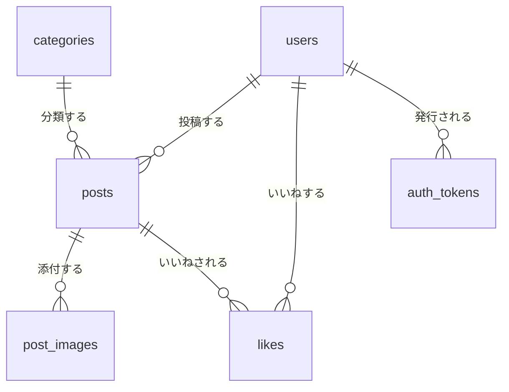

# 投稿アプリ 設計概要(アプリ像とテーブル構成)

日付: 2026-07-19
ステータス: 承認済み

用語の定義はリポジトリ直下の [CONTEXT.md](../../../CONTEXT.md) を正とする。

## 1. アプリ概要

**X(旧Twitter)風のミニ投稿アプリ。** ユーザーは最大280文字の投稿(画像を任意で最大4枚添付可)を行い、全ユーザーの投稿が新しい順に流れる1本のタイムラインを閲覧する。投稿には運営が用意したカテゴリーがちょうど1つ付き、タイムラインをカテゴリーで絞り込める。

このアプリは学習用であり、**題材そのものより「学習要件が自然に入ること」を優先して設計した**。

### 学習要件との対応

| 学習要件 | アプリでの実現 |
|---|---|
| SES メール送信 | 会員登録時のメールアドレス確認、パスワードリセット |
| S3 + CloudFront 画像 | 投稿画像(最大4枚)、プロフィール画像 |
| オフセット / カーソルページネーション | タイムライン(カーソル + 無限スクロール)、検索ラボ(両方式を切り替えて比較) |
| index が効く検索 | 検索ラボ(前方一致 / 部分一致 / FULLTEXT を EXPLAIN 付きで比較) |
| JOIN | 投稿 × ユーザー × カテゴリー × 投稿画像 × いいね |
| Google + メール/パスワードログイン | 認証機能そのもの(統合型アカウント) |

## 2. 機能一覧

| 機能 | 内容 |
|---|---|
| 投稿 | 最大280文字 + 画像最大4枚(任意)。カテゴリー必須。編集不可、削除は物理削除(添付画像も S3/MinIO から削除) |
| タイムライン | 全ユーザーの投稿を新しい順に表示。カテゴリー絞り込み可。カーソルページネーション + 無限スクロール |
| いいね | トグル式(付け外し可)。投稿ごとにいいね数と自分のいいね状態を表示。誰がいいねしたかの一覧は作らない。いいね数はカウンタキャッシュを持たず毎回集計(v1) |
| 検索ラボ | アプリ内で唯一の検索ページ(詳細は §5) |
| プロフィール | ユーザー情報(表示名・bio・プロフィール画像)+ そのユーザーの投稿一覧。自分のプロフィールは編集可 |
| 認証 | Google ログイン + メールアドレス/パスワードログイン。同じメールなら同一アカウントに統合(統合型)。セッションは Cookie + Spring Session JDBC(MySQL 保存) |
| メール送信 | ① メール/パスワード登録時の確認メール(確認完了までログイン不可)、② パスワードリセット。Google 登録は確認済み扱いでスキップ。イベント通知メールは v1 では送らない |

### 認証の要点

- ログインの識別子はメールアドレス。`username` は表示・検索用の一意な英数字名(@xxx 相当)
- Google 連携は OIDC の `sub`(不変ID)をキーにする。メールをキーにしない
- メール/パスワード登録済みユーザーが同じメールで Google ログインした場合、同一アカウントに `google_sub` を紐づける(アカウントリンク)
- 使用ライブラリ: Spring Security(`spring-boot-starter-security` + `spring-boot-starter-oauth2-client`)+ Spring Session(`spring-session-jdbc`)。パスワードは BCrypt

## 3. 画面一覧

| 画面 | パス(想定) | 備考 |
|---|---|---|
| タイムライン | `/` | 無限スクロール、カテゴリー絞り込み、投稿フォーム |
| 投稿詳細 | `/posts/[id]` | SSG のためデータはクライアント側で `/api/posts/{id}` を取得して描画 |
| 検索ラボ | `/search-lab` | §5 参照 |
| プロフィール | `/users/[username]` | ユーザー情報 + 投稿一覧。本人なら編集導線 |
| ログイン | `/login` | メール/パスワード + Google ボタン |
| 会員登録 | `/signup` | 登録 → 確認メール送信 |
| パスワードリセット | `/password-reset` ほか | 申請 → メール → 再設定 |

## 4. テーブル構成

### users(ユーザー)

| カラム | 型 | 制約 | 備考 |
|---|---|---|---|
| id | BIGINT | PK, AUTO_INCREMENT | |
| username | VARCHAR(30) | UNIQUE, NOT NULL | 英数字。@xxx 相当。ログインIDではない |
| display_name | VARCHAR(50) | NOT NULL | 日本語可 |
| email | VARCHAR(255) | UNIQUE, NOT NULL | ログインの識別子 |
| password_hash | VARCHAR(255) | NULL可 | Google のみのユーザーは NULL。BCrypt |
| google_sub | VARCHAR(255) | UNIQUE, NULL可 | Google OIDC の不変ID |
| bio | VARCHAR(160) | NULL可 | 自己紹介文 |
| avatar_image_key | VARCHAR(255) | NULL可 | プロフィール画像の S3/MinIO オブジェクトキー |
| email_verified_at | DATETIME | NULL可 | メール確認完了日時。NULL はログイン不可 |
| created_at / updated_at | DATETIME | NOT NULL | |

### categories(カテゴリー・マスタ)

| カラム | 型 | 制約 | 備考 |
|---|---|---|---|
| id | BIGINT | PK | |
| name | VARCHAR(30) | UNIQUE, NOT NULL | |
| display_order | INT | NOT NULL | |

運営管理のマスタデータ。ユーザーは作成できない。**Flyway マイグレーションで投入する**(§7)。

### posts(投稿)

| カラム | 型 | 制約 | 備考 |
|---|---|---|---|
| id | BIGINT | PK, AUTO_INCREMENT | カーソルページネーションのカーソルに使う |
| user_id | BIGINT | FK → users, NOT NULL | |
| category_id | BIGINT | FK → categories, NOT NULL | 1投稿 = 1カテゴリー必須 |
| body | VARCHAR(280) | NOT NULL | 本文必須(画像のみの投稿は不可) |
| created_at | DATETIME | NOT NULL | 編集不可のため updated_at は持たない |

削除は物理削除。削除時に post_images の実体(S3/MinIO オブジェクト)も削除する。

### post_images(投稿画像)

| カラム | 型 | 制約 | 備考 |
|---|---|---|---|
| id | BIGINT | PK, AUTO_INCREMENT | |
| post_id | BIGINT | FK → posts, NOT NULL | 投稿削除に連動して削除 |
| image_key | VARCHAR(255) | NOT NULL | S3/MinIO オブジェクトキー(URL は保存しない) |
| display_order | INT | NOT NULL | |

UNIQUE(post_id, display_order)。1投稿につき最大4枚(アプリ側で制限)。

### likes(いいね)

| カラム | 型 | 制約 | 備考 |
|---|---|---|---|
| id | BIGINT | PK, AUTO_INCREMENT | |
| user_id | BIGINT | FK → users, NOT NULL | |
| post_id | BIGINT | FK → posts, NOT NULL | |
| created_at | DATETIME | NOT NULL | |

UNIQUE(user_id, post_id)。いいね数は毎回 COUNT 集計(v1。カウンタキャッシュは v2 候補)。

### auth_tokens(認証トークン)

| カラム | 型 | 制約 | 備考 |
|---|---|---|---|
| id | BIGINT | PK, AUTO_INCREMENT | |
| user_id | BIGINT | FK → users, NOT NULL | |
| token | VARCHAR(255) | UNIQUE, NOT NULL | URL に載せるランダム値 |
| purpose | VARCHAR(30) | NOT NULL | `EMAIL_VERIFICATION` / `PASSWORD_RESET` |
| expires_at | DATETIME | NOT NULL | |
| used_at | DATETIME | NULL可 | 使用済み判定 |
| created_at | DATETIME | NOT NULL | |

メール確認とパスワードリセットは「有効期限付き使い捨てトークン」として構造が同一のため、1テーブルを `purpose` で共用する。

### SPRING_SESSION / SPRING_SESSION_ATTRIBUTES

Spring Session JDBC の公式 DDL(MySQL 用)を Flyway で作成する。アプリからは直接触らない。

### 画像キーの方針

DB に保存するのは S3/MinIO の**オブジェクトキーのみ**。配信 URL は環境ごとのドメイン(CloudFront / MinIO)とキーから組み立てる。環境が変わってもデータが壊れない。

## 5. 検索ラボと index 実験の方針

### 検索ラボの仕様

アプリ内で唯一の検索ページ。ログインユーザー全員が使える。**検索条件をセットしただけでは実行せず、検索実行ボタンを押したときに検索する。**

| 設定項目 | 選択肢 |
|---|---|
| キーワード | 任意(空でも実行可) |
| 検索対象 | ユーザー名 / 投稿本文 |
| 一致方法 | 前方一致 / 部分一致 |
| カテゴリー絞り込み | なし / カテゴリー選択 |
| ページネーション方式 | オフセット / カーソル(カーソルは新しい順固定のときのみ選択可) |
| 1ページ件数 | 数値。**空ならページネーションなし**(サーバー側の安全上限 10,000 件・設定で変更可。超過時は「上限に達した」旨を返す) |
| EXPLAIN | 有効 / 無効 |

- 結果一覧はページネーション付きで表示し、クリックで投稿詳細 / プロフィールを開ける
- 計測表示: SQL 実行時間、EXPLAIN 有効時は実行計画(使用 index 名、`type`、走査行数 `rows` など)。EXPLAIN は検索クエリとは別に発行し、実行時間には含めない
- **プリセット**: よく使う条件の組み合わせ(例: 「部分一致」「カーソルページネーション」)をワンクリックでフォームにセットできる。プリセットはフロントエンドのコードに直接定義し、アプリ上からの追加・編集機能は作らない

### index の方針: 「実験用 index は最初から張らない」

| index | 作成タイミング | 学習の狙い |
|---|---|---|
| PK / FK / UNIQUE 制約に伴う index | Flyway で最初から | 基本の整合性 |
| `posts(category_id, created_at)` 複合 index | **実験時に手動 ALTER** | カテゴリー絞り込みタイムラインの高速化を before/after で比較 |
| `posts(user_id, created_at)` 複合 index | **実験時に手動 ALTER** | プロフィールの投稿一覧。カテゴリー版と同型の復習 |
| `posts(body)` FULLTEXT index(ngram) | **実験時に手動 ALTER** | 部分一致 LIKE では B-tree が効かない → 専用 index で解決、を体験 |

検証シナリオ例:

1. ユーザー名の**前方一致**(`LIKE 'ada%'`)→ UNIQUE index が効く(`EXPLAIN` で `range`)
2. ユーザー名の**部分一致**(`LIKE '%ada%'`)→ index が効かずフルスキャン
3. 本文の部分一致を投稿100万件で実行 → 遅い → FULLTEXT index を張って比較
4. オフセットページネーションで深いページ(`LIMIT 900000, 20`)→ 遅い → カーソル方式と比較
5. ページネーションなし(件数空)で大量取得 → 描画の重さを体験

## 6. ページネーションの方針

| 場所 | 方式 | UI |
|---|---|---|
| タイムライン | カーソル(カーソルは `id`) | 無限スクロール(IntersectionObserver) |
| 検索ラボ | オフセット / カーソルを切り替え | オフセット時はページ番号、カーソル時は「さらに読み込む」 |

「カーソル = 無限スクロール、オフセット = ページ番号」という実務での典型的な対応関係をそのまま体験する。

## 7. シードデータの方針

### categories(マスタデータ)

Flyway マイグレーション(`V__insert_categories.sql`)で投入する。マイグレーションが走ればどの環境にも必ず入る。Laravel の seeder に相当する仕組みは Spring Boot に標準では無く、不変マスタは Flyway に含めるのが定石。

### 実験用の大量データ

| テーブル | 件数 | 狙い |
|---|---|---|
| users | 1万 | ユーザー名検索の題材 |
| posts | 100万 | オフセットの深いページ・index 実験の規模 |
| likes | 約300万(投稿あたり平均3) | COUNT 集計の重さ |
| post_images | 投入しない | 実画像を大量には作れないため。画像は手動投稿で検証 |

- 投入方法: **Spring Boot のタスクモード**。同じ jar を引数付き・Web サーバー無効で実行する(`java -jar app.jar --app.task=seed --app.posts=1000000 --spring.main.web-application-type=none`)。実装は `CommandLineRunner`/`ApplicationRunner`
- 内部はセットベースの SQL(`INSERT ... SELECT` + 再帰CTE)を JdbcTemplate で発行。Java のループ INSERT はしない(100万件でも数十秒で完了させるため)
- 本文はランダムな日本語文字列に固定キーワード(例: 「東京」「Spring」)を混ぜ、本文検索の実験をしやすくする
- ローカル: `docker compose exec backend` で実行。AWS(RDS): **ECS Run Task** を GitHub Actions(`db-task.yml`、workflow_dispatch)から起動し、containerOverrides でコマンドを差し替える。migrate(Flyway)/ seed / 任意 shell を選べる構成(既存の Laravel 学習リポジトリの db-task.yml と同型)。ワークフローの詳細設計はインフラ実装時に行う

## 8. スコープ外(v2 候補)

意図して**入れない**と決めたもの。将来の学習段差として取ってある。

| 項目 | 見送った理由 / v2 での学習価値 |
|---|---|
| フォロー | 「フォロー中タイムライン」はカーソルページネーションの難易度が跳ね上がる。全体タイムラインで基礎を固めてから |
| リプライ・リポスト | 学習要件への寄与が薄い割に設計が複雑 |
| いいね通知などのイベントメール | SES サンドボックス制限・非同期送信の複雑さ。v2 の題材 |
| いいね数のカウンタキャッシュ(非正規化) | まず毎回集計の重さを体感してから、v2 で導入して速度差を見る |
| 投稿の編集 | 編集済み表示・並び順の考慮が増える割に学習効果がない |
| 誰がいいねしたか一覧 | 画面が増えるだけで学習効果が薄い |
| 管理者ロール | 認可設計が膨らむ。カテゴリー管理は当面 Flyway で足りる |
| 投稿カテゴリーの多対多化 | 多対多はいいねで学べる。中間テーブル JOIN が index 検証のノイズになる |

## 9. 関連ドキュメント

- 用語集: [CONTEXT.md](../../../CONTEXT.md)
- バックエンド構成の参考: [docs/development/backend-structure-best-practices.md](../../development/backend-structure-best-practices.md)(パッケージ構成は**機能別**を採用: `auth` / `user` / `post` / `like` / `category` / `searchlab` / `seed` + `config` / `common`)
- フロントエンド構成の参考: [docs/development/frontend-structure-best-practices.md](../../development/frontend-structure-best-practices.md)
