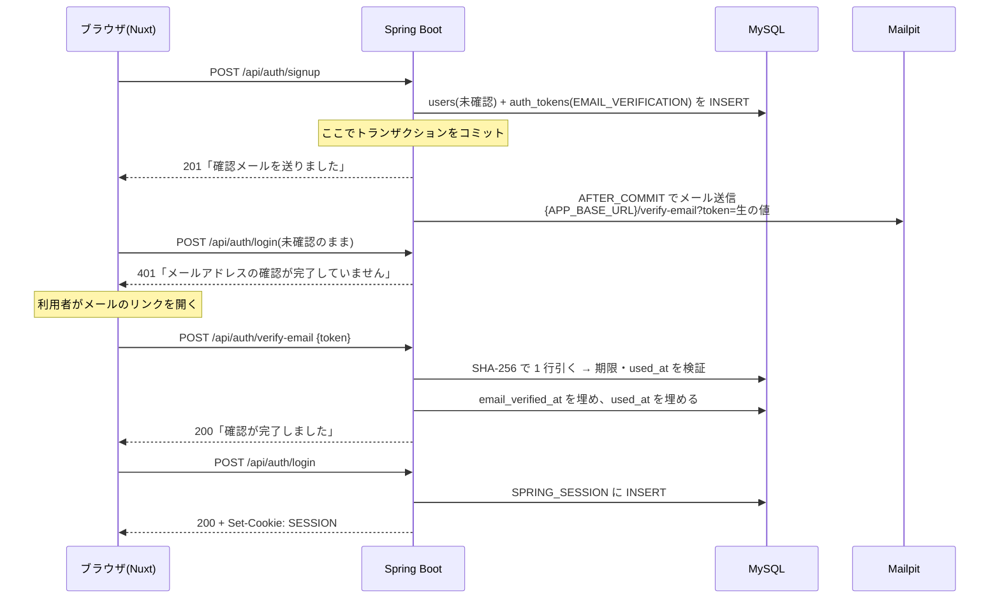
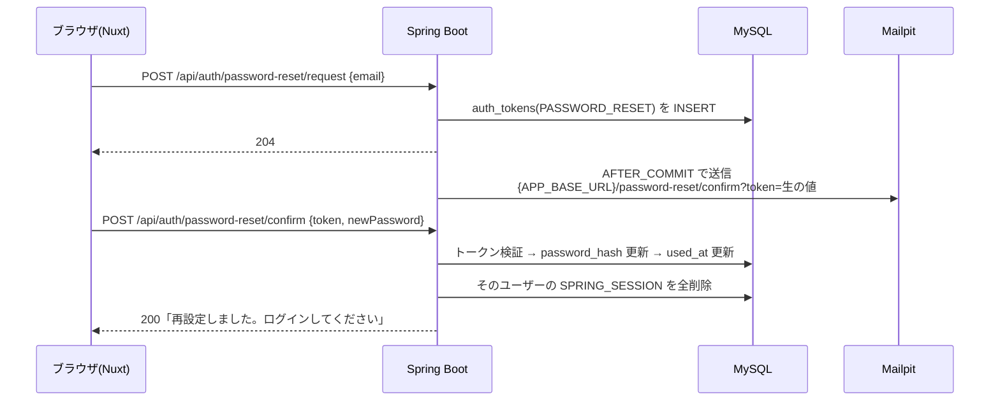

# フェーズ3 設計: パスワード認証(会員登録・メール確認・ログイン・パスワードリセット)

日付: 2026-08-05
ステータス: 承認済み(未実装)

[実装フェーズ計画](../../development/implementation-progress.md) のフェーズ3 の設計。全体像は [設計概要](./2026-07-19-app-design-overview.md)、用語は [CONTEXT.md](../../../CONTEXT.md) を正とする。

## 1. スコープ

### 作るもの

| 機能 | 内容 |
|---|---|
| 会員登録 | username / 表示名 / メールアドレス / パスワードを受け取り、未確認ユーザーを作って確認メールを送る |
| メール確認 | メールのリンクからトークンを検証し、`email_verified_at` を埋めてログイン可能にする |
| 確認メール再送 | 「メールが届かない」「期限が切れた」からの復帰 |
| ログイン / ログアウト | メールアドレス + パスワード。セッションは MySQL に保存 |
| パスワードリセット | 未ログイン状態から、メールの使い捨てリンクで新しいパスワードを設定 |
| パスワード変更 | ログイン中に現在のパスワードを確認して差し替え |
| 既存 API の保護 | 投稿の作成・削除を認証必須にし、`CurrentUserProvider` を廃止する |

**パスワード変更は設計概要 §2 のフェーズ3 スコープに対する追加**。パスワードリセット時のセッション無効化を実装するなら、同じ仕組みがそのまま使えるため一緒に入れる判断をした。

### 作らないもの

- Google ログイン(フェーズ4)
- ロール・権限(設計概要 §8 のとおり管理者ロールは v2 候補)
- `rememberMe`(「ログイン状態を保持する」チェックボックス)
- ログイン失敗回数によるアカウントロック
- 二要素認証

## 2. 決定一覧

| # | 決定 | 理由の要約 |
|---|---|---|
| 1 | **閲覧は公開、書き込みは認証必須** | 設計概要 §5 の「検索ラボはログインユーザー全員が使える」という書き方が、ログインしていない利用者の存在を前提にしている。タイムラインをログイン前に見せられる |
| 2 | **ログインは `formLogin()` に乗せる** | Spring Security の標準機構。セッション固定攻撃対策と `SecurityContext` の保存をフレームワークに任せられる → [ADR-0002](../../adr/0002-session-cookie-over-jwt.md) |
| 3 | **CSRF は有効。`XSRF-TOKEN` Cookie → `X-XSRF-TOKEN` ヘッダ** | Cookie セッション方式に必ず付いてくる対策。`SameSite` だけに頼らない。**実装は Spring Security 7 の `csrf(csrf -> csrf.spa())` 1 行で済んだ**(設計時に想定していた XOR ハンドラの差し替えと初回 Cookie 発行の自作フィルタは不要) |
| 4 | **セッションは Spring Session JDBC(MySQL)** | Redis コンテナを増やさず、`SELECT` でログイン状態を目視できる。`PRINCIPAL_NAME` の index が決定11 を可能にする → [ADR-0002](../../adr/0002-session-cookie-over-jwt.md) |
| 5 | **メールのリンクはフロントのページに向ける** | 成功 / 期限切れ / 使用済みの UI をフロントで統一でき、副作用のある処理を POST に置ける。「画面は全て Nuxt、Spring は `/api/**` のみ」というアーキテクチャ決定にも沿う |
| 6 | **`auth_tokens.token` には SHA-256 ハッシュを保存** | DB が漏れてもトークンを復元できない。検索キーとして UNIQUE index で 1 行引く必要があるため、決定的ハッシュでなければならない(パスワードと違って BCrypt は使えないし不要) |
| 7 | **メール送信は登録のコミット後**(`@TransactionalEventListener(AFTER_COMMIT)`) | DB トランザクションを SMTP の往復時間だけ開けたままにしない。メールサーバー障害で登録自体が失敗しない。送信失敗は再送で救う。**受容しているもの**: リスナーはリクエストと同じスレッドで**同期実行**されるためレスポンスは SMTP を待つ(実測 → [application-events-vs-queues.md](../../notes/java/spring/application-events-vs-queues.md))。またコミット直後にプロセスが停止するとメールはリトライされず失われる(キューではないため)。どちらも再送で復旧できる範囲と判断した |
| 8 | **確認済みメールの重複登録は 400、未確認は作り直し** | pre-hijacking 対策と、打ち間違いからの復帰経路の確保 → [ADR-0003](../../adr/0003-account-enumeration-and-unverified-signup.md) |
| 9 | **現在ユーザーは `@AuthenticationPrincipal`。`CurrentUserProvider` は廃止** | Spring Security の標準的な書き方。現在ユーザーが引数として明示的に流れ、Service のテストがモック不要になる |
| 10 | **フロントの認証状態は Pinia** | ヘッダ・middleware・各ページが共有する状態であり、[frontend-structure-best-practices.md](../../development/frontend-structure-best-practices.md) の「複数画面で共有する状態 → Pinia」に当てはまる |
| 11 | **パスワードリセット完了で既存セッションを全削除** | 「パスワードを盗まれたかもしれないからリセットした」のに攻撃者のセッションが生き残る穴を塞ぐ。リセット機能の目的の半分がこれ |
| 12 | **`dev_user` はそのまま残す** | `password_hash` が NULL なのでパスワードログインできない(フェーズ4 の Google 専用ユーザーと同じ状態)。「他人の投稿は削除できない」の 403 検証に使える |
| 13 | **テストは境界 + ハッピーパス結合 1 本** | 全フェーズ共通方針(案A)。認証は手で確認するのが一番面倒なので、一連の流れを通すテスト 1 本の費用対効果が高い |
| 14 | **`GET /api/auth/me` は公開。未ログインは 200 + `user: null`** | 未ログインはエラーではなく正常な答え。フロントの 401 共通処理に例外を作らずに済み、この GET で CSRF Cookie も発行できる |

### 固定した細部

- **username**: 英数字と `_`、3〜30 文字、一意。ユーザー自身に入力させる(検索ラボでユーザー名検索を扱うため、意味のある値が必要)
- **パスワード**: 8〜72 文字。BCrypt は 72 バイトを超えた分を無視する仕様なので上限をそこに合わせる。複雑さ要求(記号必須など)は課さない
- **トークン**: `SecureRandom` で 32 バイト → Base64URL(43 文字)。有効期限は確認メール 24 時間 / パスワードリセット 1 時間。`used_at` で使い捨てを担保
- **セッションタイムアウト**: 1 日。「切れる体験」は `DELETE FROM SPRING_SESSION` で作れるので、開発中に勝手に切れて煩わしくない値にする
- **`password_hash` が NULL のユーザーへのログイン試行**: `UserDetailsService` から `UsernameNotFoundException` を投げる。Spring Security の `DaoAuthenticationProvider` が ① 既定の `hideUserNotFoundExceptions` でメッセージを「資格情報が不正」に統一 ② ダミーハッシュとの照合を走らせて応答時間を揃える(タイミング攻撃対策)を自動で行うため、**対策を自分で書かない**
- **未確認メールでのログイン試行**: `AppUserDetails.isEnabled()` を `false` にして `DisabledException` を発生させ、401 で「メールアドレスの確認が完了していません」という区別されたメッセージを返す。決定8 でユーザー列挙を許容する側に振っているので、ここで隠すと一貫性がなくユーザーが詰む
- **匿名アクセス時の principal**: Spring Security は未ログインでも `AnonymousAuthenticationToken` を割り当て、その principal は `"anonymousUser"` という**文字列**になる。`@AuthenticationPrincipal AppUserDetails principal` と型を指定していると型が合わないので `null` が入る。公開エンドポイントで受ける場合(フェーズ5 のいいね)はこの `null` を前提にする
- **登録直後の画面**: 遷移せず、同じページで「確認メールを送りました」表示に切り替える(画面を増やさない)
- **ログイン後の遷移**: middleware が付けた `?redirect=` があればそこへ、なければトップへ

## 3. データモデル

### 追加(V3)

`SPRING_SESSION` / `SPRING_SESSION_ATTRIBUTES` の 2 テーブル。**`spring-session-jdbc` の jar に入っている公式 DDL(`org/springframework/session/jdbc/schema-mysql.sql`)を実物から取り出して V3 に取り込む**(記憶で書かない)。

- 自動生成には頼らない。`spring.session.jdbc.initialize-schema` の既定値は `embedded`(組み込み DB のときだけ作る)なので MySQL では何も作られず、テーブルが無いまま起動すると最初のセッション書き込みで落ちる。「スキーマ変更はすべて Flyway」の方針どおり V3 で作る
- **この 2 テーブルに JPA エンティティは作らない**(アプリから直接触らない)。`ddl-auto: validate` はエンティティに対応するテーブルだけを検査するので、検証対象外で問題にならない
- 期限切れセッションの掃除は Spring Session JDBC が内蔵する定期 `DELETE` に任せる

### 既存テーブルの使い方

`users` と `auth_tokens` は V1 で既に必要な形になっており、**スキーマ変更は不要**。

| カラム | フェーズ3 での役割 |
|---|---|
| `users.password_hash` | BCrypt ハッシュ。NULL = パスワードログイン不可(Google 専用ユーザーと `dev_user`) |
| `users.email_verified_at` | NULL = 未確認。ログイン不可 |
| `auth_tokens.token` | 生の値の SHA-256 ハッシュ(決定6) |
| `auth_tokens.purpose` | `EMAIL_VERIFICATION` / `PASSWORD_RESET` |
| `auth_tokens.used_at` | 使い捨ての担保 |

**不変条件**: 未確認ユーザー(`email_verified_at IS NULL`)はログインできないので、投稿もいいねも持ち得ない。だから決定8 で行を削除しても他のテーブルが壊れない(`auth_tokens` は `ON DELETE CASCADE` で付随して消える)。

## 4. API

| メソッド | パス | 認証 | 内容 |
|---|---|---|---|
| POST | `/api/auth/signup` | 不要 | 会員登録 |
| POST | `/api/auth/verify-email` | 不要 | トークンでメール確認を完了 |
| POST | `/api/auth/verification/resend` | 不要 | 確認メール再送 |
| POST | `/api/auth/login` | 不要 | `formLogin` の `loginProcessingUrl`。**form-urlencoded**(決定2 の帰結) |
| POST | `/api/auth/logout` | 不要 | 標準の `logout()` |
| GET | `/api/auth/me` | 不要 | 現在ユーザー。未ログインは 200 + `user: null`。CSRF Cookie 発行も兼ねる |
| POST | `/api/auth/password-reset/request` | 不要 | リセット申請 |
| POST | `/api/auth/password-reset/confirm` | 不要 | 新パスワード設定 + 全セッション削除 |
| PUT | `/api/auth/password` | **必要** | パスワード変更 + 自分以外のセッション削除 |

既存 4 エンドポイントのうち `POST /api/posts` と `DELETE /api/posts/{id}` が認証必須になる。エラーは既存の `ErrorResponse` + `GlobalExceptionHandler` の形に揃え、未認証は `AuthenticationEntryPoint` をカスタムして 401 + `ErrorResponse` を返す。

**ボディを返さないものはすべて 204**(`signup` だけは 201)。エンドポイントごとの詳細は `docs/api/` に 1 ファイルずつある(→ [docs/api/README.md](../../api/README.md))。

### 各フローの分岐

**会員登録**

| 状況 | レスポンス |
|---|---|
| 新規 | 201。未確認ユーザーを作成 → 確認メール |
| メールが既に存在し**確認済み** | 400 + `fieldErrors.email` |
| メールが既に存在し**未確認** | 201。既存行を削除して最新の入力で作り直し → 確認メール(決定8) |
| username が既に存在 | 400 + `fieldErrors.username`。**作り直しの前に検証する**(未確認の作り直しでも username 重複は弾く) |

**パスワードリセット申請**

| 状況 | レスポンス |
|---|---|
| 確認済みユーザー | 200 → リセットメール |
| 未確認ユーザー | 400。「まず確認メールから有効化してください」+ 再送導線 |
| 未登録のメール | 400 + `fieldErrors.email`(決定8 と同じトレードオフ) |

`password_hash` が NULL のユーザー(`dev_user` やフェーズ4 の Google 専用ユーザー)は、`email_verified_at` が入っていればリセットフローで**パスワードを新規に設定できる**。`dev_user` のメールは Mailpit 宛なので、開発時に `dev_user` でログインしたくなったらこの経路が使える。

## 5. フロー

### 会員登録 → メール確認 → ログイン



### パスワードリセット



## 6. バックエンドの構成

機能別パッケージの方針どおり `com.example.app.auth` に集約する。

```
com/example/app/
├── auth/
│   ├── AuthController.java            … signup / verify-email / resend / me / password-reset / password
│   ├── AuthService.java               … 登録・確認・リセット・変更の業務ロジック
│   ├── AuthTokenService.java          … トークンの発行と検証(SHA-256・期限・used_at)
│   ├── AuthToken.java                 … エンティティ(auth_tokens)
│   ├── AuthTokenRepository.java
│   ├── AppUserDetails.java            … UserDetails 実装(users.id を保持)。CredentialsContainer も実装し、
│   │                                     認証後にパスワードハッシュを消す(セッションに残さないため)
│   ├── AppUserDetailsService.java     … メールアドレスで users を引く
│   ├── UserSessionManager.java        … 特定ユーザーのセッションを削除する(決定11 の実装)
│   ├── AuthResponseWriter.java        … Spring Security のリダイレクト/空レスポンスを JSON に差し替える役
│   ├── AuthMailRequestedEvent.java    … AFTER_COMMIT でメールを送るためのイベント(用途で本文を切り替える)
│   ├── AuthMailSender.java            … 確認メール / リセットメールの本文組み立てと送信
│   └── dto/
│       ├── SignupRequest.java
│       ├── VerifyEmailRequest.java
│       ├── ResendVerificationRequest.java
│       ├── PasswordResetRequest.java
│       ├── PasswordResetConfirmRequest.java
│       ├── ChangePasswordRequest.java
│       └── MeResponse.java
├── config/
│   ├── SecurityConfig.java            … filterChain / formLogin / logout / csrf / PasswordEncoder
│   └── AppProperties.java             … app.base-url / app.mail.from(Application に @ConfigurationPropertiesScan が必要)
└── common/exception/
    ├── InvalidRequestException.java   … 業務ルール違反 → 400(メッセージのみ)
    ├── FieldValidationException.java  … 項目に紐づく業務ルール違反 → 400 + fieldErrors
    └── GlobalExceptionHandler.java    … 上記 2 つの変換を追加

メールのテンプレートエンジンは導入しない(`MailConfig` も不要で、`application.yml` の `spring.mail.*` だけで足りた)。
```

メール本文はプレーンテキストを Java のテキストブロックで組み立てる。テンプレートエンジン(Thymeleaf)は導入しない — フェーズ3 で送るのは 2 種類だけで、`templates/` を増やす価値がない。

### 既存コードへの影響

| ファイル | 変更 |
|---|---|
| `user/CurrentUserProvider.java` | **削除** |
| `user/DevCurrentUserProvider.java` | **削除** |
| `post/PostService.java` | `create(request, userId)` / `delete(id, userId)` にシグネチャ変更。**当初 `getReferenceById()` で SELECT を省く想定だったが、これは誤りだった** — `PostResponse` に username と displayName を含めるので結局ユーザーの実体が必要になり、遅延読み込みが走るだけで得がない。`create` は `findById`、`delete` はそもそもユーザーを引かず `post.getUser().getId()`(外部キーの値なので SELECT が発生しない)と比較する |
| `post/PostController.java` | `@AuthenticationPrincipal AppUserDetails` を引数に追加 |
| `post/PostControllerTest.java` | principal のモック対応。未ログイン 401 のテストを 1 本追加 |
| `application.yml` | セッション・メール・`app.base-url` の設定を追加 |
| `build.gradle` | **確認済みの artifact 名**: `spring-boot-starter-security` / `spring-boot-starter-session-jdbc`(素の `spring-session-jdbc` ではない。自動設定は starter 側)/ `spring-boot-starter-mail` / test に `spring-boot-starter-security-test`。入るのは Spring Security 7.1.0 / Spring Session 4.1.0 / Framework 7.0.8、**Jackson は 3 系で `ObjectMapper` の import が `tools.jackson.databind` になる** |
| `.env.example` / `.env` | `APP_BASE_URL=http://localhost:3000`、`MAIL_FROM` を追加 |

## 7. フロントエンドの構成

```
frontend/app/
├── stores/auth.ts              … ログインユーザー(Pinia)
├── composables/useAuth.ts      … signup / login / logout / verifyEmail / resetPassword …
├── plugins/auth.client.ts      … 起動時に 1 回 /api/auth/me(CSRF Cookie の発行も兼ねる)
├── plugins/api.ts              … $fetch 共通ラッパ。XSRF-TOKEN を X-XSRF-TOKEN ヘッダに載せる + 401 共通処理
├── middleware/auth.ts          … 未ログインなら /login?redirect=... へ
└── pages/
    ├── login.vue
    ├── signup.vue
    ├── verify-email.vue
    ├── password-reset/index.vue
    ├── password-reset/confirm.vue
    └── settings/password.vue
```

`layouts/default.vue` のヘッダに表示名とログイン / ログアウト導線を追加する。

### SSG 特有の注意点

1. **route middleware はプリレンダ時にも走る。** `nuxt generate` はビルド時に各ルートをサーバー側でレンダリングするので、認証ガードをそのまま書くと「ビルド時は常に未ログイン」と判定され、**全ページが `/login` へのリダイレクトとして静的化される**。`if (import.meta.server) return` で早期 return するのが必須
2. **ログイン必須ページの HTML 自体は誰でも取得できる**(静的ファイルなので)。middleware は UX のためのもので、実際の防御は API 側の 401 だけが担う
3. 認証状態はクライアントで確定するので、ヘッダは**確定前に何も出さない**(ログイン導線とログアウト導線が一瞬入れ替わるのを防ぐ)

## 8. テスト

| テスト | スライス | 本数 | 内容 |
|---|---|---|---|
| `AuthTokenServiceTest` | `@DataJpaTest` + 実 MySQL(`app_test`) | 7 | 正常に 1 回使えること / DB に生の値が残っていないこと / 期限切れ / 使用済み / 存在しない値 / 別 purpose の流用 / 再発行で古いトークンが無効化されること |
| `AuthControllerTest` | `@WebMvcTest` | 7 | username 形式・パスワード長・メール形式のバリデーションと `fieldErrors`、`/api/auth/me` が未ログインでも 200、`PUT /api/auth/password` が認可で弾かれること |
| `AuthFlowTest` | `@SpringBootTest` + MockMvc | 2 | 登録 → 未確認ではログイン不可 → 確認 → ログイン成功 / 未ログインでは投稿できない。`JavaMailSender` は `@MockitoBean` で差し替え、送られた本文からトークンを取る |
| `PostControllerTest` | `@WebMvcTest` | 既存 4 + 1 | principal の id が Service に渡ること、他人の投稿の削除が 403 になること |

Spring Boot 4 はテストアノテーションのパッケージが移動している(`@WebMvcTest` → `org.springframework.boot.webmvc.test.autoconfigure` など)。`@MockBean` は廃止で `@MockitoBean`。詳細は [implementation-progress.md](../../development/implementation-progress.md) のフェーズ2 完了メモを参照。

**`@WebMvcTest` には `@Import(SecurityConfig.class)` が必要。** 付けないと Spring Boot の「既定のセキュリティ設定」(全リクエスト認証必須)が適用され、公開しているはずの `GET /api/posts` や `GET /api/categories` が 401 になる。読み込む場合は `SecurityConfig` が要求する `AuthResponseWriter` を `@MockitoBean` で用意する必要があり、その副作用として **401 / 403 のステータスコード自体はこのスライスでは検証できない**(ステータスを書くのがモックにした `AuthResponseWriter` のため)。本物のステータスは `AuthFlowTest` で確認する。

`AuthFlowTest` はクラスに `@Transactional` を付けてはいけない。付けるとコミットされず、`AFTER_COMMIT` のメール送信が発火しないためトークンが取れない。作ったデータは `@BeforeEach` / `@AfterEach` で自分で消す。

## 9. 実装順序

1. **依存追加 + V3 + SecurityConfig の骨格** — この時点では全リクエストを許可したまま、起動できることと `SPRING_SESSION` が作られることだけ確認する
2. **ログインできる状態にする** — `AppUserDetails` / `AppUserDetailsService` / `formLogin` / `logout` / `GET /api/auth/me` / CSRF。ユーザーは手で INSERT して curl で確認
3. **会員登録・メール確認・再送** — Mailpit の Web UI(http://localhost:8025)でメールを確認
4. **パスワードリセット・パスワード変更・セッション削除** — `SELECT * FROM SPRING_SESSION` で消えることを目視
5. **既存エンドポイントの保護** — `@AuthenticationPrincipal` 化、`CurrentUserProvider` 削除、既存テスト修正。curl で 401 / 403 を確認
6. **フロントエンド** — Pinia / `useAuth` / `$fetch` ラッパ / 各ページ / ヘッダ / middleware
7. **テスト追加 + `docs/api/` 更新 + 完了メモ**

各ステップの終わりに `docker compose exec backend sh ./gradlew classes` で反映する(CLAUDE.md)。

## 10. 関連ドキュメント

- 全体設計: [2026-07-19-app-design-overview.md](./2026-07-19-app-design-overview.md)
- 用語: [CONTEXT.md](../../../CONTEXT.md)
- ADR: [0002 セッション Cookie 方式](../../adr/0002-session-cookie-over-jwt.md) / [0003 ユーザー列挙と未確認アカウントの再登録](../../adr/0003-account-enumeration-and-unverified-signup.md)
- 進捗: [implementation-progress.md](../../development/implementation-progress.md)
