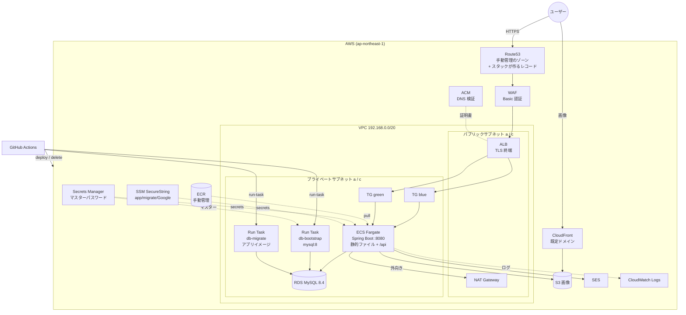

# フェーズ13 設計: CloudFormation テンプレートと構築・撤収ワークフロー

日付: 2026-08-19
ステータス: 設計確定(実装前)

進捗表の**フェーズ13(インフラコード)** の設計。あわせて、設計を詰める過程で**フェーズ12 の一部が必須化した**ため取り込んでいる(→ [決定9](#決定9-db-のユーザーを-3-つに分離する)の帰結)。

前提: [ADR-0001](../../adr/0001-cloudformation-yaml-over-terraform.md)(素の CloudFormation YAML)、[docs/infrastructure/README.md](../../infrastructure/README.md)(AWS 構成と運用方針)、[github-actions-oidc.md](../../infrastructure/github-actions-oidc.md)(フェーズ11 で作った OIDC の手順)。

参考にしたもの: 別リポジトリの Terraform コード(`terraform/` に一時コピー)。**変数化の粒度と「共通部分 + 環境ごとの値」の分け方**を写し取っている。SQS / X-Ray / Firehose / Lambda 通知 / CloudFront によるフロント配信は、このリポジトリでは使わないので採っていない。

---

## 1. スコープ

**やること**

- CloudFormation テンプレート `cloudformation/app.yml` と環境ごとのパラメータファイル
- GitHub Actions のワークフロー 3 本(構築 / DB タスク / 撤収)
- 上記に必要なアプリ側の変更(actuator、SES 送信、Flyway の切り離し)
- 手動で作るもの(IAM ロール 2 つ、SSM パラメータ、Google Console の設定)の手順書

**やらないこと**

- prod 環境を実際に建てること(**prod が存在する前提の構造だけ作る**)
- フェーズ5〜10 のアプリ機能(いいね・画像・プロフィール・検索ラボ・シード・index 実験)
- オートスケーリングの負荷試験(仕組みは入れるが、負荷はかけない)

---

## 2. 決定一覧

### 決定1: ファイルは 1 テンプレート、環境差分はパラメータファイル

```
cloudformation/
├── app.yml            # 共通(全リソース定義)
├── params/
│   ├── stg.json       # 環境差分 = Terraform の tfvars 相当
│   └── prod.json      # 将来。app.yml は無修正で追加できる
└── README.md
```

**CloudFormation には Terraform の module に相当する仕組みがない。** テンプレートは 1 ファイルで自己完結する必要があり、同じディレクトリの YAML を連結する機能もない。ファイルを分ける唯一の手段はネストスタック(子テンプレートを S3 に置く)か、スタック自体の分割。

ネストスタックを採らなかった理由:

- 子テンプレート置き場の S3 バケットが**手動管理の常駐リソースとして増える**(ECR・ホストゾーンと同じ扱いになる)
- デプロイ手順に `aws cloudformation package` が挟まる
- 親子間の値の受け渡し(子の `Outputs` → 親 → 別の子の `Parameters`)を全部手書きすることになる
- Change Set が親子で入れ子になり読みにくい
- **このリポジトリはライフサイクルが 1 つしかない**(全部まとめて建てて全部まとめて消す)。AWS 公式が示す分割基準(ライフサイクルと所有者で分ける)に照らしても分ける理由が弱い

代償: `app.yml` が 700〜900 行の単一ファイルになる。実際に運用して読みにくさが問題になったら、そのときネストスタックへの分割を別フェーズでやる。

### 決定2: 環境差分は全部 `Parameters` に平坦化する

Terraform 側は `rds_config = { instance_class, multi_az, ... }` のように**構造化した型**で渡していたが、**CloudFormation の `Parameters` は String / Number / List など平坦な型しか持てない**。そのため各フィールドを個別のパラメータに開く(→ [§5 パラメータ一覧](#5-パラメータ一覧))。

`Mappings`(テンプレート内に stg/prod 両方の値を書く)を採らなかったのは、**「共通テンプレート」に prod の値が直書きされ、prod を追加するときに共通部分を編集することになる**ため。「テンプレートは共通・値は外」の分離を保つほうを優先した。

### 決定3: ECS タスクはプライベートサブネット + NAT Gateway 1 台

Terraform 側と同じ構成。prod にそのまま伸ばせる形を優先した。

料金の比較(東京・概算):

| 構成 | 時間あたり |
|---|---|
| NAT Gateway 1 台 | 約 $0.062 + 転送量 |
| Interface エンドポイント(ECR api/dkr + logs + ssm)× 2AZ | 約 $0.112 |
| パブリックサブネット直置き | 約 $0.005 |

**Interface エンドポイントは NAT より高くつく**(1 エンドポイント × 1 AZ ごとに課金されるため、4 種類 × 2 AZ で 8 個分)。数時間の検証なら NAT は ¥30 程度で、隔離の学習価値に見合う。

**VPC エンドポイントは S3 のゲートウェイ型 1 つだけ作る**(Terraform 側の `aws_vpc_endpoint.s3_gateway` と同じ)。理由は Interface 型と課金の仕組みが違うこと。

- **ゲートウェイ型は無料**(時間課金もデータ処理課金もない)。ENI ではなくプライベートサブネットのルートテーブルにルートが入るだけ
- ゲートウェイ型が使えるのは **S3 と DynamoDB だけ**。ECR の API・CloudWatch Logs・SSM はいずれも Interface 型しかないので、これらの通信は NAT を通る
- 画像アップロード(フェーズ6)の S3 通信がインターネットに出なくなる。加えて **ECR のイメージレイヤーの実体は S3 にあるため、イメージ pull の転送量も NAT を経由しなくなる**(ECR の API 呼び出しそのものは NAT 経由のまま)

### 決定4: メール送信は SES の API 経路(SDK)。SMTP は使わない

現状は `spring-boot-starter-mail` の `JavaMailSender`(SMTP・認証なし)で Mailpit に送っている。SES はどちらの経路でも設定追加が必要。

- **SMTP 経路** — SMTP パスワードは IAM ユーザーのシークレットキーから HMAC で導出する値で、**CloudFormation では生成できない**。つまり IAM ユーザーの長期クレデンシャルが手動常駐リソースとして増える
- **API 経路** — タスクロールに `ses:SendEmail` を付けるだけ。**長期クレデンシャルが不要**

API 経路を採る。アプリ側は `org.springframework.mail.MailSender` の実装クラスを 1 つ足し、プロパティで Mailpit(SMTP)と切り替える。`AuthMailSender` の依存を `JavaMailSender` → `MailSender` に変えるだけで本体は無修正。

### 決定5: SES のドメインアイデンティティと DKIM はスタックに含める

「スタック 1 本で全部揃う」を優先した。**この選択の代償を明記しておく。**

- 撤収すると DKIM の CNAME も消える。再構築時、**検証が通るまでの数分〜十数分はメールが飛ばない**
- **`AWS::SES::EmailIdentity` は検証完了を待たずに `CREATE_COMPLETE` になる。** つまり「スタックは成功したのに会員登録のメールだけ来ない」状態を毎回踏む。**スタック成功 ≠ メール送信可能**
- 同じドメインでアイデンティティを作り直したとき DKIM トークンが同じになるかは、**AWS のドキュメントに明記がない**(未検証)。同じなら 2 回目以降は速い可能性がある。初回の構築 → 撤収 → 再構築で実測して完了メモに残す

対比: **ACM は Terraform より楽になる。** `DomainValidationOptions` に `HostedZoneId` を書くと、CloudFormation が検証用 CNAME を自動で作り、発行完了まで待つ。Terraform 側の `for_each` で検証レコードを作る 20 行が不要。

SES はサンドボックスのまま使う(本番アクセス申請はしない)。受信に使うアドレスを手動で検証しておく。

### 決定6: ALB のヘルスチェックは actuator の liveness(DB を含まない)

フェーズ11 の申し送りどおり、現状ヘルスチェックに使えるのは `/`(SSG の index.html)だけ。しかしこれは**静的ファイルを返すだけで、DB に一切つながらなくても 200 を返す**。

`spring-boot-starter-actuator` を追加し、**`/api/actuator/health/liveness`** を ALB に使う。DB を含む `/api/actuator/health` は手元からの確認用に残す。

DB を含むエンドポイントを ALB に使わないのは、**RDS が一時的に落ちたときに全タスクが unhealthy になって入れ替わり続ける**事態を避けるため(復旧しても起動途中のタスクしかない状態になりうる)。

`/api/**` は既定で認証必須なので、`SecurityConfig` に liveness の `permitAll` を 1 行足す。

### 決定7: 秘密は「性質」で置き場を分ける

| 値 | 置き場 | 誰が作る |
|---|---|---|
| RDS マスターユーザーのパスワード | **Secrets Manager**(RDS が生成・保持) | RDS(`ManageMasterUserPassword: true`) |
| `app` / `migrate` の DB パスワード | SSM Parameter Store(SecureString) | 手動(常駐) |
| Google のクライアント ID / シークレット | SSM Parameter Store(SecureString) | 手動(常駐) |
| Basic 認証の資格情報 | GitHub の Environment secret → `NoEcho` パラメータ | 手動 |

`ManageMasterUserPassword: true` にすると、**RDS がランダムなパスワードを生成して Secrets Manager にシークレットを作る。** テンプレートにも SSM にも手元にも値が現れない。参照は `!GetAtt Db.MasterUserSecret.SecretArn`。

RDS ユーザーガイドで確認した挙動:

- **既定で 7 日ごとにローテーションする。** このリポジトリはスタックが数時間しか生きないので発火しない
- **DB インスタンスを削除するとシークレットも一緒に削除される。** 撤収に取り残しが出ない

なお `{{resolve:ssm-secure:...}}` は `AWS::RDS::DBInstance` の `MasterUserPassword` でも使える(対応リソースの表に載っている)。今回は使わないが、SSM 方式に切り替える余地はある。

**ローテーションの原理的な穴**: ECS の `secrets` はタスク起動時に 1 回だけ注入するので、ローテーションが起きても動いているタスクの環境変数は古いまま。既存の接続は生きたまま新しい接続だけ失敗する、という分かりにくい壊れ方をする。7 日間動かし続ける運用をするなら対策が必要。

### 決定8: Basic 認証は WAF で実装する

検証環境を外部から隔離する。Terraform 側は CloudFront Functions で実装していたが、**この構成は CloudFront を経由しない**ので同じ手は使えない。

**ALB のリスナールールだけでは成立しない。** `Authorization` ヘッダーの一致判定はできるが、不一致のときに返す `fixed-response` は**`WWW-Authenticate` ヘッダーを付けられない**(ステータス・本文・Content-Type だけ)。このヘッダーが無いとブラウザは認証ダイアログを出さない。

**WAF のカスタムレスポンスは任意のヘッダーを付けられる**(`content-type` 以外)。これを使う。

```yaml
Statement:
  NotStatement:
    Statement:
      ByteMatchStatement:
        FieldToMatch: { SingleHeader: { Name: authorization } }
        PositionalConstraint: EXACTLY
        SearchString: !Sub
          - "Basic ${b64}"
          - b64: !Base64 !Ref BasicAuthCredential   # Terraform の base64encode() に対応
        TextTransformations: [{ Priority: 0, Type: NONE }]
Action:
  Block:
    CustomResponse:
      ResponseCode: 401
      ResponseHeaders:
        - { Name: www-authenticate, Value: 'Basic realm="restricted"' }
```

- `EnableBasicAuth` パラメータ + `Condition` で、Web ACL と関連付けをまるごと作らない選択ができる(Terraform の `enable_basic_auth` と同じ。stg=true / prod=false)
- **マネージドルールは入れない。** フェーズ8 の検索ラボが SQL に似たキーワードを投げるので、SQLi のルールに引っかかって検証が壊れる。Terraform 側は WAF にマネージドルールを入れていたが、あちらに検索ラボはない
- **ALB のヘルスチェックは WAF を通らない**(ALB 自身が生成するリクエストなので)。liveness が 401 になる心配は不要
- **`SearchString` は `wafv2:GetWebACL` の権限があれば読める。** Basic 認証は「公開を防ぐ薄い蓋」であって秘密の保護ではない
- 料金は Web ACL 月 $5 + ルール 月 $1(いずれも時間割り)。数時間なら数円

### 決定9: DB のユーザーを 3 つに分離する

| ユーザー | 権限 | 使う場所 |
|---|---|---|
| マスター(Secrets Manager 管理) | 全部 | ブートストラップと人間の調査だけ |
| `migrate` | `CREATE / ALTER / DROP / INDEX / REFERENCES` + DML | Flyway を走らせる Run Task |
| `app` | `SELECT / INSERT / UPDATE / DELETE` | ECS サービス |

**この分離の利益は「ローテーション対応」ではなく「最小権限」。** `app` / `migrate` のパスワードは SSM に置く静的な値なので、ローテーションは回避しているだけ。得られるのは「SQL インジェクションが通っても `DROP TABLE` はできない」という性質。

ローテーションを本当に解決する手段は **RDS の IAM データベース認証**(15 分有効のトークン、パスワードが存在しない)だが、HikariCP に接続ごとにトークンを取り直す実装が必要になるので採らない。

**この決定がフェーズ12 を必須化した。** ユーザーを作る Run Task を回さないとアプリが起動できないので、タスク定義とワークフローを今回作る。

### 決定10: ブートストラップは mysql イメージの Run Task

`CREATE USER` と `GRANT` を実行する主体。**アプリのコードもイメージも触らない**のが利点で、「マスター資格情報を使うのはこのタスクだけ」という境界がタスク定義の単位ではっきり分かれる(アプリのイメージにマスターの権限が一切渡らない)。

- イメージは `public.ecr.aws/docker/library/mysql:8`(Docker Hub は匿名 pull にレート制限があるため AWS のミラーを使う)
- `CREATE USER IF NOT EXISTS` + `GRANT` なので何度流しても安全
- `command` に SQL を文字列で埋め込むと引用符と改行のエスケープで壊れるので、**`environment` に渡してコンテナ側で `mysql -e "$SQL"` で受ける**

RDS はプライベートサブネットにいるので GitHub Actions のランナーからは接続できない。**VPC の中でコマンドを 1 回実行する手段**として Run Task を使う(踏み台 EC2 や Session Manager のポートフォワードより、常駐しない・スタックに書ける・1 コマンドで叩ける点で運用に合う)。

### 決定11: マイグレーションは別の Run Task で走らせる

アプリイメージを `SPRING_MAIN_WEB_APPLICATION_TYPE=none` で起動し、Flyway だけ実行して終了させる。ECS サービス側は `SPRING_FLYWAY_ENABLED=false` + `app` ユーザーのみ。

`spring.flyway.user` / `password` を使って「アプリの接続は `app`、Flyway だけ `migrate`」を同一プロセスでやる案もあった(Spring Boot 4.1 でも健在なことを設定メタデータで確認済み)。採らなかったのは:

- アプリコンテナに DDL 権限の資格情報も載る(最小権限の効果が半減する)
- タスク数を増やすと起動時に全タスクが Flyway のロックを争う
- 実務のデプロイ手順(migrate → 新バージョンを展開)と一致しない

**実装上の注意**: Dockerfile の `ENTRYPOINT` は `["sh", "-c", "exec java $JAVA_OPTS -jar /app/app.jar"]` で、`sh -c` の後ろに引数を渡しても `$0` になるだけで java には届かない。**起動オプションは `command` ではなく環境変数で指定する**(Spring のリラックスバインディング)。

**未検証**: Web を立てない起動で JVM が確実に終了するか(Spring Session の掃除スケジューラなど非デーモンスレッドが残ると終わらない)。終わらない場合は `SpringApplication.exit` を呼ぶ小さな `ApplicationRunner` を足す。

### 決定12: 順序は 2 段階デプロイ(`DesiredCount` 0 → N)

必要な順序は `RDS 作成 → ユーザー作成 → マイグレーション → サービス起動`。**CloudFormation には「このタスクを実行してからサービスを起動する」を表現する手段がない。**

「サービスを最初から N で作り、起動できずクラッシュループしても後で自然回復させる」案は**使えない。** CloudFormation は ECS サービスが安定するまで `DescribeServices` を**最大 3 時間**ポーリングし、安定しなければ `Service ARN did not stabilize` で失敗してロールバックする。

そこで `DesiredCount` をパラメータにし、ワークフローが 2 回スタック操作する。**0 タスクならサービスは即座に安定する**ので待たされない。

```
1. cfn deploy  --parameter-overrides DesiredCount=0
2. ecs run-task  db-bootstrap    # CREATE USER / GRANT
3. ecs run-task  db-migrate      # Flyway
4. cfn deploy  --parameter-overrides DesiredCount=1
```

カスタムリソース(Lambda が run-task して完了を待ち、サービスが `DependsOn`)なら 1 回で済むが、Lambda・`cfn-response` の自前実装・削除時に実行しない分岐・失敗時に `DELETE_FAILED` で詰まるリスクを負う。今回は採らない。

### 決定13: ワークフローは 3 本。`db-task.yml` は再利用可能にする

```
cfn-deploy.yml   (workflow_dispatch)          構築・更新
  job deploy-0   : cfn deploy DesiredCount=0
  job bootstrap  : uses ./.github/workflows/db-task.yml  with action=bootstrap
  job migrate    : uses ./.github/workflows/db-task.yml  with action=migrate
  job deploy-n   : cfn deploy DesiredCount=<params の値>

db-task.yml      (workflow_dispatch + workflow_call)   DB 操作
  inputs: env, action = bootstrap | migrate | sql, sql, sql_user

cfn-destroy.yml  (workflow_dispatch)          撤収。**stg 専用**
  1. aws s3 rm --recursive   (画像バケットを空にする)
  2. delete-stack + wait
```

`db-task.yml` を `workflow_call` にも対応させることで、**構築は 1 回のディスパッチで完結し、あとから任意 SQL や再マイグレーションを単体で叩ける。** run-task の待ち合わせ処理も 1 か所で済む。

**`aws ecs run-task` は起動するだけで完了を待たない。** `aws ecs wait tasks-stopped` で待ち、`describe-tasks` の `containers[0].exitCode` を見て 0 以外ならワークフローを失敗させる。これを書かないと「マイグレーションが失敗したのにワークフローは緑」になる。

`run-task` に必要な `networkConfiguration`(サブネット ID・セキュリティグループ ID)は、**`describe-stacks` の `Outputs` から取る。** Terraform 側は SSM パラメータに保存して受け渡していたが、CloudFormation ではその中継が不要。

### 決定14: 撤収ワークフローは stg 専用。バケットは削除前に空にする

**素の CloudFormation に Terraform の `force_destroy` に相当する機能はない。** ドキュメントに明記されている(「S3 バケットについては、削除を成功させるには全オブジェクトを削除しておく必要がある」)。CDK の `autoDeleteObjects` も内部はカスタムリソース。

カスタムリソースで実装すればテンプレート側で環境ごとに切り替えられるが、**本番のスタックを消すワークフローは実務では作らない**(消すなら人が手で、承認を伴って)。撤収ワークフローが stg 専用である以上、環境差分がワークフローに漏れる問題は最初から発生しない。Lambda は書かない。

### 決定15: Change Set は通常使わず、`dry_run` の input で見られるようにする

通常は `aws cloudformation deploy` 一発(中で Change Set を作って即実行している)。`dry_run: true` のときだけ `--no-execute-changeset` で作成し、`describe-change-set` の結果をジョブサマリに出して終わる。

毎回 Change Set の承認を挟むと 1 回建てるのに 2 回必要になり、しかも**新規作成時の差分は「全リソース Add」で見る価値が乏しい**。差分が意味を持つのは既存スタックを更新するときだけ。

### 決定16: IAM は CloudFormation サービスロール方式

| ロール | 権限 | 作り方 |
|---|---|---|
| `nuxt-java-practice-gha-ecr-push` | ECR push(既存) | 手動・常駐 |
| `nuxt-java-practice-gha-cfn-stg` | `cloudformation:*` / `iam:PassRole` / `ecs:RunTask` / `ecs:DescribeTasks` / `s3` 削除 / `cloudformation:DescribeStacks` | 手動・常駐(新規) |
| `nuxt-java-practice-cfn-service-stg` | リソース作成権限(実質管理者相当) | 手動・常駐(新規) |

```
Actions ロール = cloudformation:* + iam:PassRole だけ
  ↓ CFn に「このロールで作れ」と指示(deploy --role-arn)
CloudFormation サービスロール = 管理者相当
  ↓
AWS リソース
```

**Actions の一時クレデンシャルが漏れても、テンプレートに書かれていないことはできない**(直接 EC2 を立てたりできない)。`iam:PassRole` という IAM の重要な概念を実例で学べる。

サービスロールには `secretsmanager:CreateSecret` / `secretsmanager:TagResource` / `kms:DescribeKey` が必要(`ManageMasterUserPassword` のため。RDS ユーザーガイドに明記)。

### 決定17: 信頼ポリシーは Environment + `ref` クレームで縛る

**GitHub Environment と Environment secrets は使える**(プライベート + Free でも設定できることを実機で確認)。使えないのは protection rules(required reviewers・ブランチ制限)だけ。

```json
{
  "Condition": {
    "StringEquals": {
      "token.actions.githubusercontent.com:sub":
        "repo:0000masa@134136756/nuxt-java-practice@1303585339:environment:stg"
    },
    "StringLike": {
      "token.actions.githubusercontent.com:ref": "refs/heads/main"
    }
  }
}
```

- **`environment:` を指定すると `sub` の末尾が `ref:...` ではなく `environment:...` に変わる。** ブランチ制限は `sub` ではなく**別クレーム `ref` の条件**で掛ける(Terraform 側の `github_allowed_branches` がこの形だった)
- protection rules が使えないぶん、ブランチ制限は AWS 側で持つ
- **Environment secrets を使うと、ロール ARN を環境ごとに同じ名前で持てる。** ワークフローは `secrets.AWS_CFN_DEPLOY_ROLE_ARN` と書くだけで `environment: stg` / `prod` に応じて値が変わる
- `main` のみに限定する。ワークフローを別ブランチから試したいときは、一時的に信頼ポリシーへブランチを足して終わったら戻す

### 決定18: 任意 SQL は stg 限定、実行ユーザーを選べる

`db-task.yml` の `action: sql` は **`env` が stg のときだけ許し、prod が選ばれたらワークフローを失敗させる。** 実行ユーザーは input で `app`(既定)/ `master` から選ぶ。

調査の 9 割は `SELECT` なので、既定を DDL 不可の `app` にして、危険な側を選んだときだけ意識させる。required reviewers が使えない分をこの制約で埋める。

流した SQL は CloudWatch Logs と Actions の実行ログの両方に残る(監査には有利、秘密を含む SQL には不利)。

### 決定19: ECS はネイティブ Blue/Green + オートスケーリング

CloudFormation は ECS ネイティブ Blue/Green に完全対応している(`DeploymentConfiguration.Strategy: BLUE_GREEN` / `BakeTimeInMinutes` / `LoadBalancers[].AdvancedConfiguration`)。公式に CodeDeploy からの移行ガイドもある。

必要なリソース:

- ターゲットグループ 2 つ(blue / green)
- 本番用リスナールール(`ProductionListenerRule` に渡す)
- `AmazonECSInfrastructureRolePolicyForLoadBalancers` を持つ IAM ロール

**Terraform の `ignore_changes = [action]` に相当するものは CloudFormation では不要。** 理由が重要で、**CloudFormation は実リソースの状態を読み直さない。** 更新時に比較するのは「前回のテンプレート」と「今回のテンプレート」だけ。ECS が重みを 0/1 に入れ替えても、テンプレートに変更がなければそのリソースに触らない。Terraform は `refresh` で実物を読んでから差分を出すので `ignore_changes` が必要だった。**この非対称が両者の設計思想の違い。**

**ただし注意**: 後でリスナールールの定義自体を編集すると、そのとき重みも一緒にテンプレートの値へ戻される(green が本番なのに blue に流れる)。

オートスケーリングは stg でも入れる。1 点調整が必要:

- `DesiredCount=0` の段階でスケーラブルターゲットの `MinCapacity` が 1 だと、Application Auto Scaling が 1 に戻してしまう
- **スケーラブルターゲットとポリシーは `DesiredCount` が 0 でないときだけ作る `Condition`** を付ける

---

## 3. 構成図



---

## 4. 管理範囲

### 手動管理(常駐)

| リソース | 理由 |
|---|---|
| Route53 ホストゾーン `mylabinfra.com` | 作り直すと NS が変わり、X-Server 側の再設定と DNS 伝播待ちが発生する。**別プロジェクト(Terraform 側の `stg.www` / `stg.api`)とゾーンを共用**するので、レコード名がぶつからないようにする |
| ECR リポジトリ `nuxt-java-practice-ecs` | スタックより先に存在していないと push もデプロイもできない |
| OIDC プロバイダ | アカウントに 1 つ。ECR push 用と共用 |
| IAM ロール `...-gha-ecr-push` | フェーズ11 で作成済み |
| IAM ロール `...-gha-cfn-stg` | 循環依存を避けるため(→ [決定16](#決定16-iam-は-cloudformation-サービスロール方式)) |
| IAM ロール `...-cfn-service-stg` | 同上 |
| SSM SecureString 4 つ | `app_db_password` / `migrate_db_password` / `google_client_id` / `google_client_secret` |
| SES のサンドボックス用に検証した受信アドレス | 手動検証 |

### CloudFormation 管理(作り捨て)

VPC / サブネット / ルートテーブル / NAT Gateway / S3 ゲートウェイエンドポイント / セキュリティグループ 3 つ / ACM 証明書 / Route53 の A レコードと DKIM の CNAME / ALB / リスナー 2 つ / リスナールール / ターゲットグループ 2 つ / WAF Web ACL と関連付け / ECS クラスタ / タスク定義 3 つ / ECS サービス / オートスケーリング / IAM ロール 4 つ(実行・タスク・ELB 操作・RDS 拡張モニタリング) / RDS インスタンスとサブネットグループとパラメータグループ / CloudWatch ロググループ 3 つ / S3 画像バケットとバケットポリシー / CloudFront ディストリビューションと OAC / SES アイデンティティ

**リソース数は 45〜55 個の見込み**(1 テンプレートの上限 500 に遠く届かない)。

---

## 5. パラメータ一覧

`params/stg.json` に置くもの(= Terraform の tfvars 相当)。

| パラメータ | 型 | stg の値 | 説明 |
|---|---|---|---|
| `EnvName` | String | `stg` | リソース名とタグに使う。`AllowedValues: [stg, prod]` |
| `ProjectName` | String | `nuxt-java-practice` | 名前の接頭辞 |
| `DomainName` | String | `mylabinfra.com` | 手動管理のホストゾーンのドメイン |
| `AppSubdomain` | String | `njp` | アプリの階層。FQDN は `<EnvName>.<AppSubdomain>.<DomainName>` |
| `HostedZoneId` | String | (手動作成の値) | ゾーンを引くデータソースが無いので渡す |
| `EcrRepositoryName` | String | `nuxt-java-practice-ecs` | イメージ URI は account/region から組み立てる |
| `SsmParameterPath` | String | `/nuxt-java-practice/stg/` | SecureString の置き場 |
| **ネットワーク** | | | |
| `VpcCidr` | String | `192.168.0.0/20` | |
| `PublicSubnetACidr` / `CCidr` | String | `192.168.3.0/24` / `192.168.4.0/24` | |
| `PrivateSubnetACidr` / `CCidr` | String | `192.168.1.0/24` / `192.168.2.0/24` | |
| **RDS** | | | |
| `DbInstanceClass` | String | `db.t4g.micro` | prod は `db.t4g.medium` 以上 |
| `DbAllocatedStorage` | Number | `20` | |
| `DbMultiAZ` | String | `false` | prod は `true` |
| `DbBackupRetentionDays` | Number | `0` | 0 で自動バックアップ無効。prod は 7 以上 |
| `DbPerformanceInsights` | String | `false` | **t4g.micro / small は非対応。** true にすると `InvalidParameterCombination` で失敗する(選択ではなく制約) |
| `DbMonitoringInterval` | Number | `60` | 拡張モニタリングの間隔。0 で無効。60 秒なら取り込み量が無料枠に収まる |
| `DbName` | String | `app` | 開発と同じ |
| `DbMasterUsername` | String | `admin` | |
| `DbAppUsername` | String | `app` | |
| `DbMigrateUsername` | String | `migrate` | |
| **ECS** | | | |
| `ImageTag` | String | (ワークフローが渡す) | `ecr-push.yml` のサマリに出る短縮 SHA |
| `WebCpu` | String | `512` | |
| `WebMemory` | String | `1024` | `MaxRAMPercentage=75` でヒープ約 768 MB。256/512 では起動が厳しい |
| `WebDesiredCount` | Number | `1` | **ワークフローが 1 段目で 0 を上書きする** |
| `WebCapacityProvider` | String | `FARGATE_SPOT` | 約 70% 安い。中断は検証環境なら許容。prod は `FARGATE` |
| `WebMinCapacity` / `MaxCapacity` | Number | `1` / `2` | オートスケーリング |
| `WebCpuTarget` / `MemoryTarget` | Number | `60` / `70` | 目標使用率(%) |
| `BakeTimeInMinutes` | Number | `0` | Blue/Green で blue を残す時間。prod は 30〜60 |
| `ContainerInsights` | String | `enhanced` | 費用が気になれば `disabled` |
| **その他** | | | |
| `LogRetentionDays` | Number | `7` | prod は 30 以上 |
| `EnableBasicAuth` | String | `true` | prod は `false` |

ワークフローが `--parameter-overrides` で渡すもの(params ファイルに置かない):

| パラメータ | 理由 |
|---|---|
| `ImageTag` | デプロイのたびに変わる |
| `WebDesiredCount` | 2 段階デプロイで 0 → N と変える |
| `BasicAuthCredential` | `NoEcho`。GitHub の Environment secret から渡す |

---

## 6. アプリ側の変更

| 変更 | 内容 |
|---|---|
| actuator 追加 | `spring-boot-starter-actuator`、`management.endpoints.web.base-path: /api/actuator`、liveness / readiness グループの設定、`SecurityConfig` に liveness の `permitAll` |
| SES 送信 | `software.amazon.awssdk:sesv2` 依存、`MailSender` の SES 実装、プロパティで Mailpit と切り替え、`AuthMailSender` の依存を `MailSender` に変更 |
| Flyway の切り離し | `SPRING_FLYWAY_ENABLED` / `SPRING_FLYWAY_USER` / `SPRING_FLYWAY_PASSWORD` を環境変数で受けられることの確認。サービスは `false`、migrate タスクは `true` |
| `.env.example` | 追加した変数の記載 |

**手作業も残る**:

- IAM ロール 2 つと SSM の SecureString 4 つ
- Google Cloud Console の承認済みリダイレクト URI に `https://stg.njp.mylabinfra.com/api/login/oauth2/code/google` を追加
- SES サンドボックスで受信アドレスを検証

---

## 7. 建てる手順 / 撤収手順

```
[建てるとき]
1. ecr-push.yml を実行し、ジョブサマリのイメージタグを控える
2. cfn-deploy.yml を実行(inputs: env=stg, image_tag=<控えたタグ>, dry_run=false)
   ├─ スタック作成/更新(DesiredCount=0)
   ├─ db-bootstrap の Run Task(CREATE USER / GRANT)
   ├─ db-migrate の Run Task(Flyway)
   └─ スタック更新(DesiredCount=params の値)
3. SES の検証が通るのを待つ(初回。スタック成功≠メール送信可能)
4. Basic 認証を通してブラウザで確認

[撤収するとき]
1. cfn-destroy.yml を実行(env=stg 固定)
   ├─ 画像バケットを空にする
   └─ delete-stack + wait
   ホストゾーン・ECR・IAM・SSM は手動管理なので残る
```

---

## 8. CloudFormation 固有の注意点(学びの記録)

実装中に踏むと詰まる箇所。`docs/infrastructure/README.md` にも反映する。

1. **`DeletionPolicy` の既定は `Delete` だが RDS だけ `Snapshot`。** 明示しないとスタックを消してもスナップショットが残って課金される。`UpdateReplacePolicy` も併せて `Delete` にする(作り直しが起きたときも同じ)
2. **S3 バケットは空でないと削除に失敗する。** 撤収ワークフローで空にする
3. **ECS サービスの安定を最大 3 時間待つ。** タスクが起動できない状態で作ると 3 時間後に失敗する
4. **`AWS::SES::EmailIdentity` は検証完了を待たない**
5. **CloudFront のマネージドポリシー ID をデータソースで引けない。** Terraform の `data "aws_cloudfront_cache_policy"` に相当するものが無いので ID を直書きする(CachingOptimized / CORS-S3Origin)
6. **ホストゾーンもデータソースで引けない。** パラメータで渡す
7. **`count` / `for_each` が無い。** DKIM の CNAME 3 本はべた書きする
8. **`locals` が無い。** FQDN の組み立ては `!Sub` で都度書く
9. **スタックは 1 リージョンに閉じる。** CloudFront に独自ドメインを付けない判断(us-east-1 の証明書が必要になる)はこの制約が理由
10. **スタックレベルのタグは全リソースに自動で伝播する。** リソースごとに `Tags` を書かなくてよい
11. **状態を読み直さないので `ignore_changes` が要らない**(→ [決定19](#決定19-ecs-はネイティブ-bluegreen--オートスケーリング))
12. **RDS のロググループは先に作って `DependsOn` させる。** 先に消えると RDS が削除処理中の最終書き込みで同名のロググループを作り直し、管理外の孤児(保持期間 無期限)が残る(Terraform 側のコメントにあった知見。CloudFormation でも同じ)

---

## 9. 実装順序

1. **設計書(このファイル)** と ADR 2 本、既存ドキュメントの更新
2. **アプリ側の変更**(actuator → SES の `MailSender` → Flyway の環境変数)。`docker compose` で動作確認
3. **`cloudformation/app.yml`** をネットワークから順に書く(VPC → SG → RDS → ALB/WAF → ECS → S3/CloudFront → SES → Outputs)
4. **`params/stg.json`** と `params/prod.json`
5. **ワークフロー 3 本**
6. **手順書**(`docs/infrastructure/` に IAM とパラメータの作成手順)
7. 実機で構築 → 撤収 → 再構築を通し、完了メモに実測を残す

## 10. 実測で確かめること

設計時点で確度が低く、実物で確かめる必要がある項目。

- Web を立てない起動で JVM が終了するか(→ [決定11](#決定11-マイグレーションは別の-run-task-で走らせる))
- 同じドメインで SES アイデンティティを作り直したとき DKIM トークンが変わるか(→ [決定5](#決定5-ses-のドメインアイデンティティと-dkim-はスタックに含める))
- リスナーの `DefaultActions` を `fixed-response` にして、Blue/Green の重み入れ替えがリスナールール側だけで成立するか(公式の移行ガイドは `DefaultActions` も両ターゲットグループの forward にしている)
- Basic 認証を通した状態で Google ログインのコールバックが成立するか(ブラウザが Basic 資格情報を再送するか)
- `FARGATE_SPOT` の中断が検証中にどのくらい起きるか
